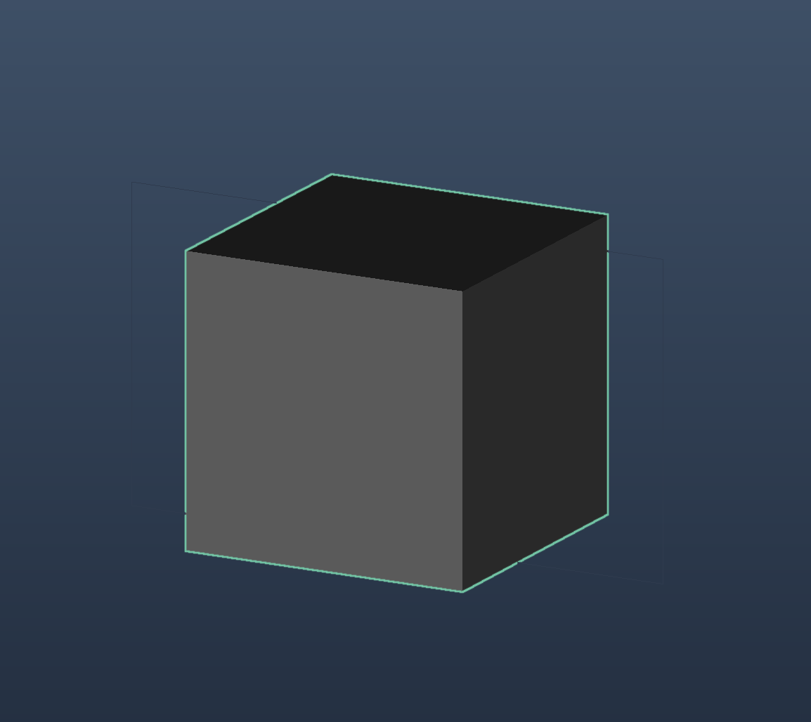
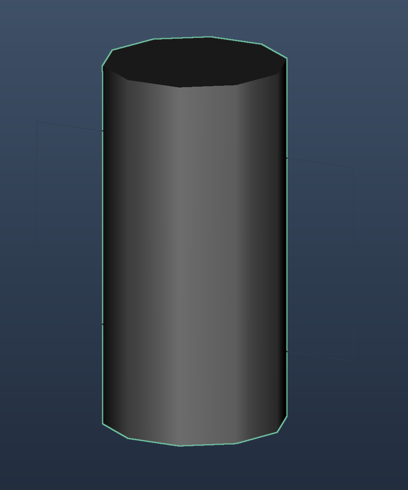
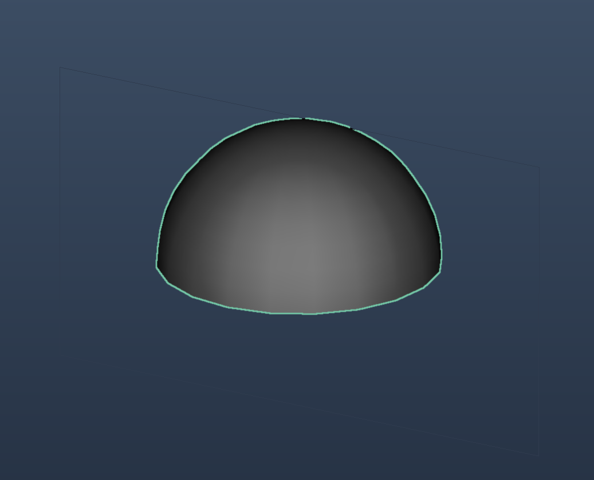
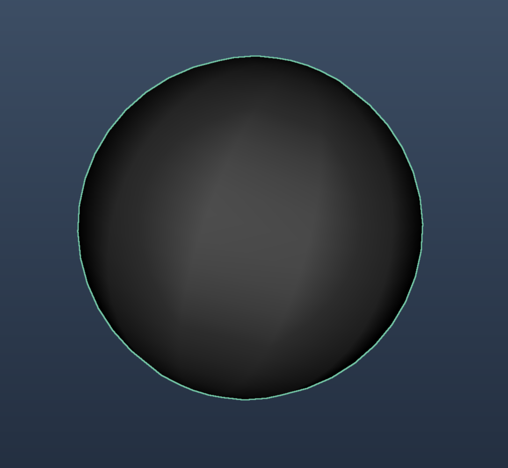
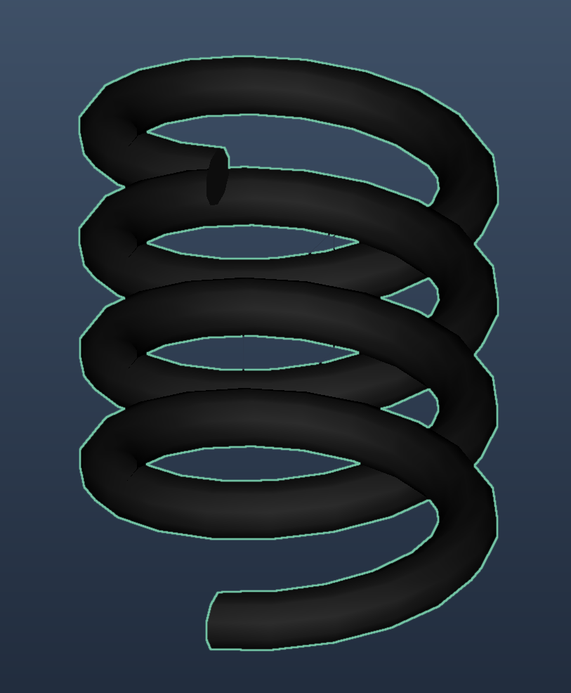
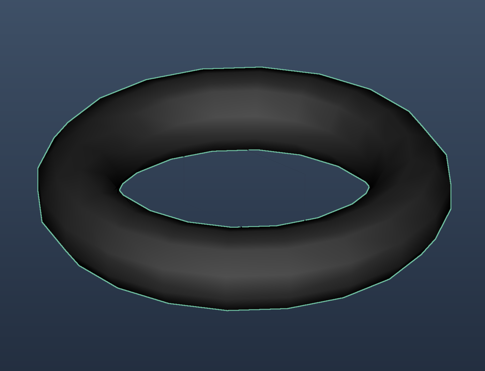

# Primitives

_Incari_ has several types of **Primitives**, which are three-dimensional **Objects** that can add a realistic, immersive experience to a **User Interface**. They are found in the **Scene Outliner** and show up after the `+` button is _clicked_.

## Primitives

### Cube

The **Cube**, a simple 3D geometric shape, has several **Attributes**.

| Attribute | Description |
| :--- | :--- |
| `Object` | This section shows the name and type of the **Object**, in this case a **Cube**, as well as its `Opacity`, which determines how transparent or opaque the **Object** is. |
| `Transformation` | The features under this **Attribute** are `Position`, `Rotation`, and `Scale`. Each one of them can alter the location, rotation, and size of the **Cube Object** within 3D space respectively. |
| `Rotation Pivot` | Sets the point of rotation. |
| `Cube` | This section covers `Axis Division`, which segments the **Cube** into equal parts. While not visible, these segments would, for example, create a 1x1x1 **Cube** or 2x2x2 **Cube** and so on. |
| `Material` | The user can choose a **Material** file to customize the look of the **Cube**. |

### Cylinder

The **Cylinder**, a simple 3D geometric shape, has several **Attributes**.

| Attribute | Description |
| :--- | :--- |
| `Object` | This section shows the name and type of the **Object**, in this case a **Cylinder**, as well as its `Opacity`, which determines how transparent or opaque the **Object** is. |
| `Transformation` | The features under this **Attribute** are `Position`, `Rotation`, and `Scale`. Each one of them can alter the location, rotation, and size of the **Cylinder Object** within 3D space respectively. |
| `Rotation Pivot` | Sets the point of rotation. |
| `Cylinder` | This section covers several editable aspects of a **Cylinder's** appearance. `Rows` set the number of rows, which segment the **Cylinder** horizontally. Essentially, this allows the user to choose how many edges/vertices there will be. For example, `Rows` = 3 would give a base shape of a triangle. The sample image has `Rows` = 10. At a certain point, around 22, the vertices are indeterminate and the base shape appears as a circle. `Columns` set the number of columns, which segment the **Cylinder** vertically. `Radius` changes the radius of the bottom face, while `Top Radius` changes the radius of the top face. These essentially expand and retract the faces. `Height` changes the **Object's** length, elongating or shortening the **Cylinder**. |
| `Material` | The user can choose a **Material** file to customize the look of the **Cylinder**. |

### Dome

The **Dome**, a piece of a sphere with a flat bottom face, has several **Attributes**.

| Attribute | Description |
| :--- | :--- |
| `Object` | This section shows the name and type of the **Object**, in this case a **Dome**, as well as its `Opacity`, which determines how transparent or opaque the **Object** is. |
| `Transformation` | The features under this **Attribute** are `Position`, `Rotation`, and `Scale`. Each one of them can alter the location, rotation, and size of the **Dome Object** within 3D space respectively. |
| `Dome` | This section covers several editable aspects of a **Dome's** appearance. `Rows` sets the number of rows, which segment the **Dome** horizontally. In the sample image there are 10. If 1 was chosen, the **Dome** would appear as a pyramid with the top vertex representing the apex of the pyramid. It is easier to notice the different rows when `Rows` = 1-4, but for any higher number the **Dome Objects**, although would definitely increase in detail, would become indistinguishable from one another. `Columns` sets the number of columns, which segment the **Dome** vertically. Essentially, these define the number of vertices of the bottom face, so `Columns` = 4 would set the bottom face as a square and so on. `Radius` changes the radius of the bottom face. |
| `Material` | The user can choose a **Material** file to customize the look of the **Dome**. |

### Plane

A **Plane** is a flat rectangular **Object** that can still be moved along the Z axis in 3D space.

| Attribute | Description |
| :--- | :--- |
| `Object` | This section shows the name and type of the **Object**, in this case a **Plane**, as well as its `Opacity`, which determines how transparent or opaque the **Object** is. |
| `Transformation` | The features under this **Attribute** are `Position`, `Rotation`, and `Scale`. Each one of them can alter the location, rotation, and size of the **Plane Object** within 3D space respectively. |
| `Rotation Pivot` | Sets the point of rotation. |
| `Plane` | This section covers several editable aspects of a **Plane's** appearance.`Rows` sets the number of rows, which segment the **Plane** horizontally. `Columns` sets the number of columns, which segment the **Plane** vertically. |
| `Material` | The user can choose a **Material** file to customize the look of the **Plane**. |

### Sphere

The **Sphere**, a simple 3D geometric shape, has several **Attributes**.

| Attribute | Description |
| :--- | :--- |
| `Object` | This section shows the name and type of the **Object**, in this case a **Sphere**, as well as its `Opacity`, which determines how transparent or opaque the **Object** is. |
| `Transformation` | The features under this **Attribute** are `Position`, `Rotation`, and `Scale`. Each one of them can alter the location, rotation, and size of the **Sphere Object** within 3D space respectively. |
| `Rotation Pivot` | Sets the point of rotation. |
| `Sphere` | This section covers several editable aspects of a **Sphere's** appearance. `Rows` sets the number of rows along the longitude, like the segments of a colored beach ball. The sample image has `Rows` = 10. `Columns` sets the number of columns, essentially segments oriented along the latitude. The sample image has `Columns` = 10. The higher the numbers for each, the smoother the **Sphere** appears. `Radius` increases the radius of the **Sphere**, thus scaling it up or down. |
| `Material` | The user can choose a **Material** file to customize the look of the **Sphere**. |

### Spring

The **Spring**, a three-dimensional coil-shaped **Object**, has several **Attributes**.

| Attribute | Description |
| :--- | :--- |
| `Object` | This section shows the name and type of the **Object**, in this case a **Spring**, as well as its `Opacity`, which determines how transparent or opaque the **Object** is. |
| `Transformation` | The features under this **Attribute** are `Position`, `Rotation`, and `Scale`. Each one of them can alter the location, rotation, and size of the **Spring Object** within 3D space respectively. |
| `Rotation Pivot` | Sets the point of rotation. |
| `Spring` | This section covers several editable aspects of a **Spring's** appearance. `Rows` sets the number of rows, which segment the **Spring** horizontally. The sample image has `Rows` = 10 and this can be further visualized by setting `Rows` = 3, which would show a **Spring** with triangular ends. `Columns` sets the number of columns, which sets how many 'kinks' the **Spring** has. This is better seen from a bird's eye view. For example, if `Columns` was set to 5 the shape from the top would be a pentagram. `Radius` increases or decreases the radius of the **Spring** ends, which is visualized as the **Spring** becoming thicker and thinner. `Height` elongates or shortens the space between the number of coils, or `Segments`. `Segments` sets the number of coils the **Spring** has. `Inner Radius` sets the radius of the internal space of the **Spring**, widening and compressing the coil. |
| `Material` | The user can choose a **Material** file to customize the look of the **Spring**. |

### Torus

The **Torus**, a three-dimensional donut-shaped **Object**, has several **Attributes**.

| Attribute | Description |
| :--- | :--- |
| `Object` | This section shows the name and type of the **Object**, in this case a **Torus**, as well as its `Opacity`, which determines how transparent or opaque the **Object** is. |
| `Transformation` | The features under this **Attribute** are `Position`, `Rotation`, and `Scale`. Each one of them can alter the location, rotation, and size of the **Torus Object** within 3D space respectively. |
| `Rotation Pivot` | Sets the point of rotation. |
| `Torus` | This section covers several editable aspects of a **Torus's** appearance. `Rows` sets the number of rows, which segment the **Torus** horizontally. The higher the number, the smoother the surface. `Columns` sets the number of columns, which segment the **Torus** vertically. For example, if `Columns` were set to 4, then the number of sections would be 4 and the **Torus** would take a square-like shape. `Radius` increases or decreases the radius of the **Torus**. If one thinks of the **Torus** as many circular pieces patched together, it is the radius of these circles that is changed. This is visualized as the **Torus** becoming thicker or thinner. `Inner Radius` sets the radius of the internal space of the **Torus**. |
| `Material` | The user can choose a **Material** file to customize the look of the **Torus**. |

## See also

* [**Material Editor**](../../modules/material-editor.md)

## External Links

* [_Cube_](https://en.wikipedia.org/wiki/Cube) on Wikipedia.
* [_Cylinder_](https://en.wikipedia.org/wiki/Cylinder) on Wikipedia.
* [_Dome_](https://en.wikipedia.org/wiki/Spherical_cap), or Spherical Cap, on Wikipedia
* [_Plane_](https://en.wikipedia.org/wiki/Plane_%28geometry%29) on Wikipedia.
* [_Sphere_](https://en.wikipedia.org/wiki/Sphere) on Wikipedia.
* [_Torus_](https://en.wikipedia.org/wiki/Torus) on Wikipedia.

