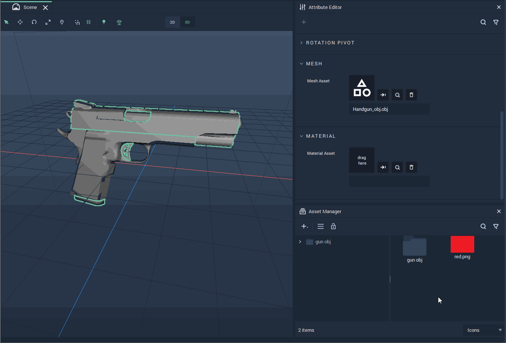

# What's New

Many new features have been added to the release of **Incari Studio** 2021.5. Here is a list of the features you need to know.

* **Asset Database**

  The new **Asset Database** allows the user to easily access internal resources and reuse them. With this, it is possible to keep track of which **Assets** are being used and where in the **Project** they are.

* **Camera Input for Video Objects**

  Now it is possible to directly control cameras and virtual cameras. New **Nodes** for controlling the playback have been introduced. Thus, this allows, for example, for the user to control a rear-view camera in **Incari** and the video that is being obtained from it.

* **Masking**

  **Sprite Objects** can now have **Vectors** (or any other **Sprite Object**) as masks.

* **Materials Improvements**

    New features for working with **Materials** have been introduced. A **Material** can be created by simply dropping a texture **Asset** on a [**Mesh**](scene-objects/mesh.md). Moreover, a preview of the Material on a [**Mesh**](scene-objects/mesh.md) is shown when dragging the texture **Asset** over.

  

* **Render to Texture**

  A [**Scene**](project-objects/scene.md) can be rendered to a [**Sprite**](scene-objects/sprite.md) from the same [**Scene**](project-objects/scene.md) or another. This gives the possibility to create an image [**Object**](scene-objects/README.md) of the current state of a [**Scene**](project-objects/scene.md).

* **New Nodes**

  Several new **Nodes** have been introduced with this release. These include:
  
  * **String Manipulation Nodes**
    * [**Capitalize**](../toolbox/string/capitalize.md)
    * [**CharCodeAt**](../toolbox/string/charcodeat.md)    
    * [**EndsWith**](../toolbox/string/endswith.md)
    * [**CryptoHash**](../toolbox/string/create-hash.md)
    * [**Flatten**](../toolbox/string/flatten.md)
    * [**Format**](../toolbox/string/format.md)
    * [**IndexOf**](../toolbox/string/indexof.md)
    * [**Join**](../toolbox/string/join.md) 
    * [**LastIndexOf**](../toolbox/string/lastindexof.md)
    * [**IsLower**](../toolbox/string/islower.md)
    * [**MatchRegex**](../toolbox/string/match-regex.md)
    * [**PaddingLeft**](../toolbox/string/paddingleft.md)
    * [**PaddingRight**](../toolbox/string/paddingright.md)    
    * [**RandomString**](../toolbox/string/random.md)
    * [**RemoveCharacters**](../toolbox/string/remove-characters.md)    
    * [**Reverse**](../toolbox/string/reverse.md)
    * [**StartsWith**](../toolbox/string/startswith.md)
    * [**Trim**](../toolbox/string/trim.md)
    * [**TrimLeft**](../toolbox/string/trimleft.md)
    * [**TrimRight**](../toolbox/string/trimright.md)    
    * [**IsUpper**](../toolbox/string/isupper.md)    
  * **Command-line arguments Node**
    * [**Get Command Line Option**](../toolbox/utilities/get-command-line-option.md)
  * **Runtime Object creation Node**
    * [**Create Object**](../toolbox/utilities/create-object.md)
  * **Binary manipulation**
     * [**Binary to Int**](../toolbox/utilities/conversion.md) (an update to the **Conversion Node**. Please note that one must use a **Binary (Hex) Value Node** rather than a **Binary Variable** for this to work.)

