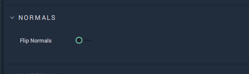

# What's New

Many new features have been added to the release of **Incari Studio** 2022.1. Here is a list of the features you need to know.

* [**Local Transformations**](attributes/common-attributes/transformation/local.md) 

    In previous versions of **Incari**, **Object** transformations could only be made in **Global space** – that is, with respect to a **Global** origin. This new release adds a new mode of transformations: **Local**. With **Local** transformations, it is possible to rotate and translate **Objects** with respect to their own axes, where previously this was only possible with respect to the **Global** axis.

    This new feature gives the user more freedom and control over the positioning and rotation of **Objects**. It is particularly useful in large **Projects**, where it is easier to compartmentalize and work in smaller scopes than having to deal with transformations with respect to the entire **Project**.
    
    
    <!-- 
    Switch the toggle `LocalMode` to enable and disable this feature. 
    
    There are several new **Nodes** attached to this new feature:

    * [**Set Local Position**](../toolbox/incari/object/set-local-position.md)
    * [**Get Local Position**](../toolbox/incari/object/get-local-position.md)
    * [**Set Local Rotation**](../toolbox/incari/object/set-local-rotation.md)
    * [**Get Local Rotation**](../toolbox/incari/object/get-local-rotation.md)
    * [**On Local Position Change**](../toolbox/events/object/on-local-position-change.md)
    * [**On Local Rotation Change**](../toolbox/events/object/on-local-rotation-change.md) -->
  

* **Flip Normals** 
  
      
    The new feature `Flip Normals` helps to provide a more immersive experience. It is located under `Normals` for an **Object** in the **Attribute Editor**. When the toggle is switched on, it is possible to see an applied **Material** from within an **Object**. The user can rotate, move, and scale as usual.

   

* **glTF files**

    **Incari** now supports glTF files, which can be imported and rendered. glTF is a file format for efficient transmission and loading of _3D_ scenes and models. It packages all features, such as geometry, textures and shaders, into one file. The preferred version in **Incari** is glTF 2.0.

    This new supported file type makes it easier to incorporate external _3D_ designs that are ready to use without retouching them.

* [**New PBR Material**](../modules/material-editor/extended-pbr-model.md)
  
     The [**Material Editor**](../modules/material-editor/README.md) now offers a new **PBR Material**, the [**Extended PBR Material**](../modules/material-editor/extended-pbr-model.md). This **Material** offers more customizable options than in previous versions. These new options include: two texture maps – one for occlusion and one for metallic roughness; optional overlay of metallic and roughness values; and a more advanced shading model that generates results with greater accuracy.

* [**Prefabs**](prefabs/README.md)

    [**Prefabs**](prefabs/README.md) are now available in **Incari**. This feature is useful in allowing the user to create multiple instances of combination of **Objects** in a *User Interface*. Users can make changes to and choose characteristics for either all instances or each one separately. As such, one can easily create several **Objects** with the same functionality that also retain unique properties via overrides. Moreover, **Prefabs** have their own [**Logic**](../modules/logic-editor.md) encapsulated within them. Any alterations in the **Prefab** properties or its **Logic** affect them across all of their instances.

    <!-- For example, **Prefabs** can be used to create several buttons that change color when a mouse hovers over it. For this, right-click the group of **Objects** and select `Make prefab`, and duplicate as many types as necessary. To make edits to the **Prefab**, simply locate it in the **Asset Manager** and double-click to open up a special **Prefab** window. These edits will override the properties changed, but unique properties will remain. It is easy to share with others or between projects with the `Export prefab` option in the **Asset Manager**. All **Assets** inside a **Prefab** will be put together into a directory on export.

    Within the **Prefab** **Logic** window, there are two **Nodes** which allow the user to apply **Logic** to a **Prefab**:

    * **Prefab Input**
    * **Prefab Output**

    This **Prefab Logic** can then be used in the **Scene Logic** with its corresponding **Prefab Node**. -->

* **Plugins** 
  
    <!--The [**Plugins Editor**](../modules/plugins-editor.md) holds the ability to activate or deactivate **Communication** in **Incari**. For example, **Serial Manager Communication** can be toggled on and off from the **Editor**. When deactivated, **Incari Player** will not load anything related to **Serial Communication** in order to improve performance and stability.  -->

    The [**Plugins**](../modules/plugins-editor.md) has the ability to activate or deactivate components in **Incari**. At the moment this applies to **Communication** only. For example, **Serial Manager Communication** can be toggled on and off from the **Plugins Module** with the **SerialManager** option. Deactivating **Serial Communication** stops **Incari Player** from loading anything related to it.  

* **Format Nodes**

    The new [**Format**](../toolbox/string/format.md) and [**FormatArray**](../toolbox/string/formatarray.md) **Nodes** allow one to use the [*printf format string*](https://en.wikipedia.org/wiki/Printf_format_string) functionality.

* **HTTP Client Node Update**

    The [**HTTP Client Node**](../toolbox/communication/http/httpclient.md) has been overhauled and now uses an external library. In addition, it can now support *HTTPS*.