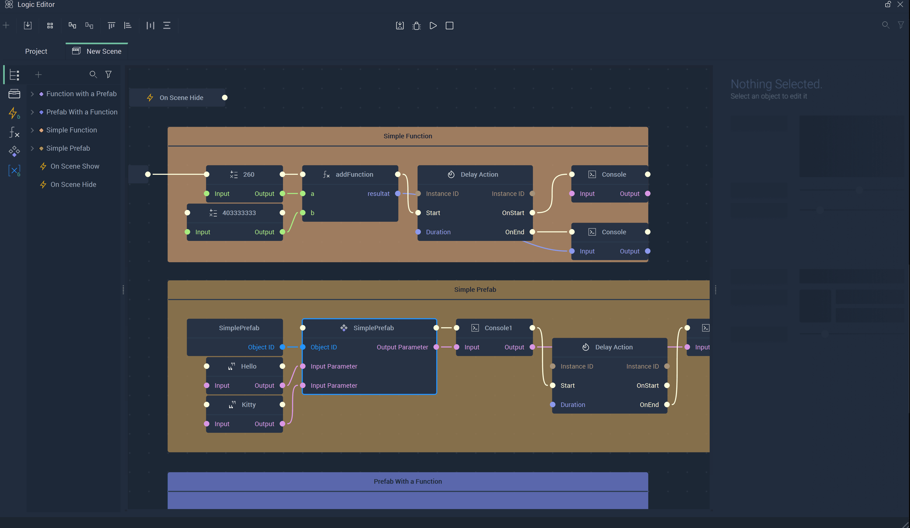
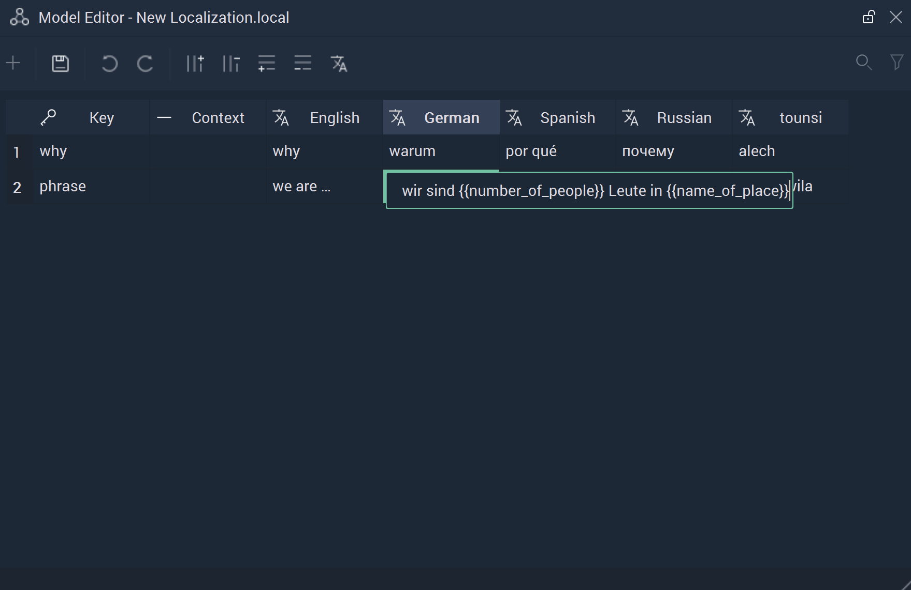
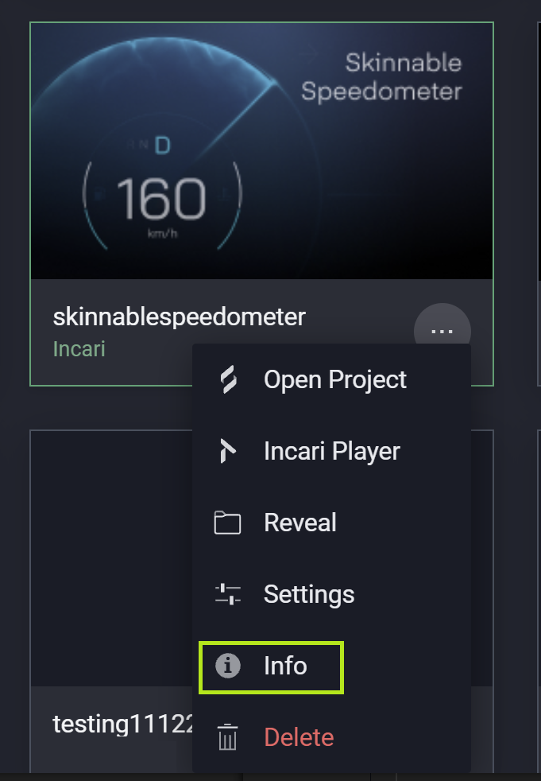
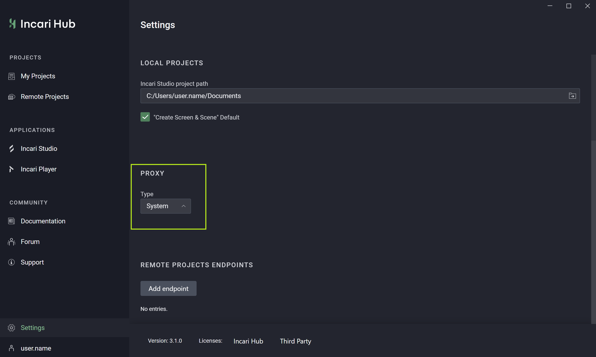
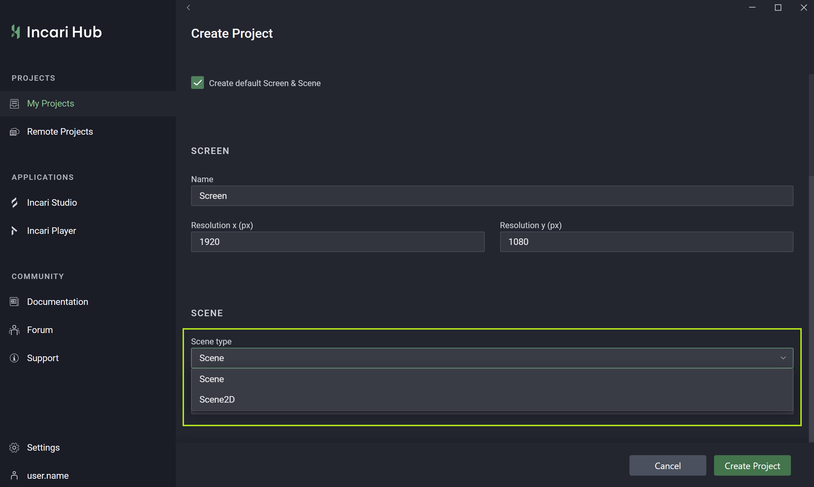

# What's New

Many new features have been added to the release of **Incari Studio** 2024.1. Here is a list of the features you need to know.

## Logic Debugging

With **Incari Studio's** new [**Debugging Simulation**](../modules/logic-editor/logic-debugging.md) in the **Logic Editor**, following the flow of the **Logic** and finding errors has never been easier. This powerful improvmenet of **Incari's** interface allows the user to gain even more control over their **Projects** and aims to aid their creative process. 

## Localization

An exciting new feature in **Incari Studio** is localization. This provides a means for the user to incopororate translation seamlessly within a **Project**. 

The update in the [**Project Settings**](../modules/project-settings/localization.md) starts the process, where a **Localization** file can be added. These are created in the [**Model Editor**](../modules/model-editor.md#localizations). With this, the user can access and change the data based on the *keys* and *translation attributes* using the new **Nodes**:

* [**Events**](../toolbox/events/localization/README.md)
  * [**On Localization Language Change**](../toolbox/events/localization/onlocalizationlanguagechange.md)
* [**Localizaton**](../toolbox/localization/README.md)
  * [**Get All Languages**](../toolbox/localization/getalllanguages.md)
  * [**Get Language**](../toolbox/localization/getlanguage.md)
  * [**Get Translation**](../toolbox/localization/gettranslation.md)
  * [**Get Translation Key**](../toolbox/localization/gettranslationkey.md)
  * [**Set Language**](../toolbox/localization/setlanguage.md)
  * [**Set Translation Attribute**](../toolbox/localization/settranslationattribute.md)
  * [**Set Translation Key**](../toolbox/localization/settranslationkey.md)

## Environment Lighting

There is now more customizability available for a **Scene's** background. Not only can the user change its color, but they can use an [**Environment Map**](../objects-and-types/project-objects/scene.md#environment-lighting). This provides a multitude of opportunities for creativity. 

### Hub Update

**Incari Hub** has also received a few tweaks! Now it is possible to inspect a **Project's** info, select a proxy type in the **Hub's** settings, and create a default **Scene2D**

## New Scene2D Objects and Features

This release introduces [**Audio**](../objects-and-types/scene2d-objects/audio2d.md), [**Video**](../objects-and-types/scene2d-objects/video.md), and [**Overlay**](../objects-and-types/scene2d-objects/overlay.md) **Objects** in **Scene2Ds**, strengthening the capabilities of *2D* aspects in **Incari**. 

There have also been some updates to some **Attributes** of **Scene2D Objects**. **Incari Studio** now supports *Figma* **Effects** in [**Vector Objects**](../objects-and-types/scene2d-objects/figma/README.md), which allow the user to add *drop shadows*, *inner shadows*, *background blurs*, and *layer blurs*. In addition, the capabilities of *gradients* in the **Fill** and **Stroke** **Attributes** have been extended, now supporting *radial* and *diamond gradients*. 

The 2024.1 release also incorporates *variable fonts*. This lets the user add files for these types of fonts in the [**Project Settings**](../modules/project-settings/fonts.md) and certain **Objects** in **Scenes** and **Scene2Ds** can have the properties of these font types manipulated in the **Attribute Editor**. **Variable Fonts** in **Incari** improve the user experience. 

## CANopen Integration

**Incari** has added to the different communication protocols it supports with [**CANopen**](../toolbox/communication/canopen/README.md). It is a form of communication that extends the functionality of the *CAN* (Controller Area Network) protocol and provides a standardized framework for defining communication and application layer protocols for devices and systems employing *CAN* as their underlying physical layer. 

Besides new **Nodes**, this includes an update to [**Plugins**](../modules/plugins/communication/canopen.md) and [**Project Settings**](../modules/project-settings/CANopen.md).

* [**Events**](../toolbox/communication/canopen/events/README.md)
  * [**On CANopen Receive**](../toolbox/communication/canopen/events/oncanopenreceive.md)
  * [**On CANopen Start**](../toolbox/communication/canopen/events/oncanopenstart.md)
  * [**On CANopen Stop**](../toolbox/communication/canopen/events/oncanopenstop.md)
* [**CANopen Send**](../toolbox/communication/canopen/canopensend.md)
* [**CANopen Start**](../toolbox/communication/canopen/canopenstart.md)
* [**CANopen Stop**](../toolbox/communication/canopen/canopenstop.md)

## UTF-8 Support

**Incari Studio** now supports *UTF-8* characters. This enables the user to incorporate special characters such as `é`, `ä`, `π` and `¿`. Consequently, file systems using *UTF-8* characters can be handled by **Incari**, like a **Project's** path name.

## New Nodes and Node Updates

Besides the **Nodes** related to new features that are specified above, there is one new **Node**. This applies to both **Scenes** and **Scene2Ds**. 

* [**Set Overlay Scene**](../toolbox/incari/object/set-overlay-scene.md)
