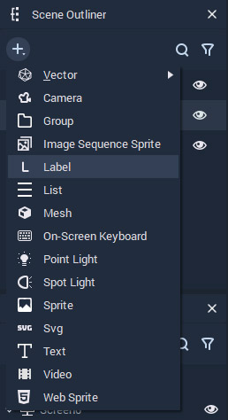
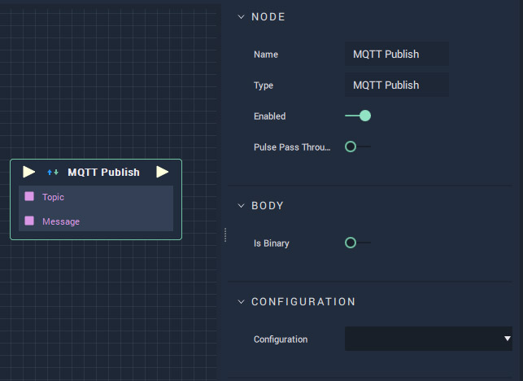
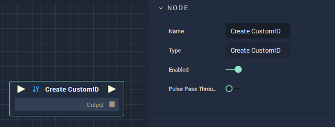
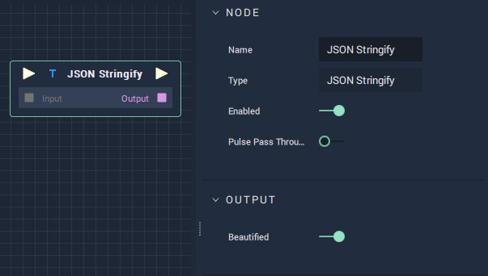
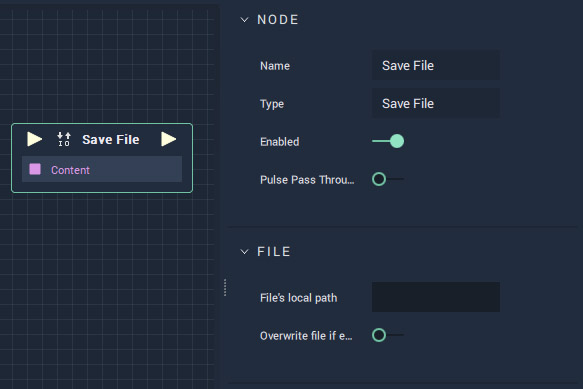
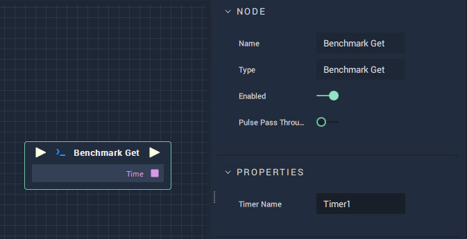
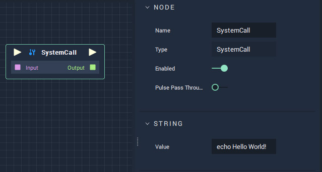

# What's New

With the release of **Incari Studio** 2021.1, there appeared a number of new features. Here is a list of the features you need to know.

* **New compiled Logic backend**

  **Incari** 2021.1 now comes with an integrated compiler. The logic gets converted into C++ code and then compiled into machine code before the user runs the project. In practice, this means a dramatic increase in the speed of logic execution, with some benchmarks showing a speed increase of 120 times compared to the previous version.

* **New Vector objects and vector nodes in the Logic Editor**

  There are a number of new vector objects to create custom graphics for your projects. One of the powerful implications of these new оbjects is that you can now control their attributes using the Logic Editor, providing more possibilities for data-driven graphics and user interaction.

* **New Label object**

  You can now use a new object Label among all others.

* **New SVG import and SVG object** **Incari** 2021.1 now lets you import SVG files into the **Incari** documents.
* **New Video object and Video Player controls in the Logic Editor** It is possible now to use videos directly in **Incari** via the Video Objects. This new addition comes with a new set of Nodes and Events to link your control graphics with the Logic of your application.
* **New MQTT Publish node in the Logic Editor**

  This is a communication protocol, with the help of which you can communicate, for example, between two programs created in **Incari**.

* **New CustomId node**

  There is a new CustomId node available in Logic Editor. If the user needs to create a unique identifier to combine all his objects and scenes, he can do this in CustomID node.

* **New JSON Stringify node**

  We have added a new JSON Stringify node in Logic Editor. JSON Stringify allows you to read key value pairs.

* **SDK for the logic to generate the C++ code for the Logic**

  Previously, interpretation logic was used. Now you can use the standard compiler. 

* **New Gestures \(Swipe/Tap\) nodes in Logic Editor**

  Now you can use such navigation gestures as Swipe and Tap for the elements. 

* **New Load File node in Logic Editor**

  This node allows you to load any file with commands.

* **New Save File node in Logic Editor**

  With this new node there is a possibility to save your files.

* **New Benchmark node in the Logic Editor**

  Benchmark node allows you to measure time between two \(or more\) nodes. Thus, it is possible to determine the nodes performance.

* **New Mouse Enter/Leave event nodes in the Logic Editor**

  The Mouse Enter event occurs when the mouse hovers over an element you choose, and Mouse Leave occurs when it leaves.

* **New Get Dictionary Keys/Values nodes in the Logic Editor**

  The usage of keys to get the corresponding values in the dictionary as a list.

* **New Previous/Next frame nodes for image sequences in the Logic Editor**

  This node enables you to control the image sequence. You can download the images and play them in a specific order.

* **New SystemCall in the Logic Editor**

  You can now call different commands in the system.

* **New Render to texture maps**
* **Animate Materials in the Animation Editor** There was already a list of what could be animated. Now we have added material to it, which can be animated too.
* **Animate Vector properties in the Animation Editor**
* **Add lock axis while dragging in the Animation Editor** By holding the shift key while dragging an animation key, the movement of the animation key is restricted either horizontally or vertically. The direction depends on the movement when you started the dragging operation.
* **Start IncariPlayer in fullscreen or windowed without decoration** Now you can have a much better representation of your screen.

