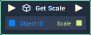

# Get Scale

## Overview

**Get Scale** returns the _scale_ of an **Object** in a **Scene**. The **Object ID** is given as input to the **Node**.

## Attributes

| Attribute | Type | Description |
| :--- | :--- | :--- |
| `Object` | **ObjectID** | The target **Object** that you wish to return the `scale` of if one is not provided in the `Object ID` **Socket** |

## Inputs

| Input | Type | Description |
| :--- | :--- | :--- |
| _Pulse Input_ \(►\) | **Pulse** | A standard **Input Pulse**, to trigger the execution of the **Node**. |
| `Object ID` | **ObjectID** | The ID of the target **Object** whose _scale_ value you wish to return. |

## Outputs

| Output | Type | Description |
| :--- | :--- | :--- |
| _Pulse Output_ \(►\) | **Pulse** | A standard **Output Pulse**, to move onto the next **Node** along the **Logic Branch**, once this **Node** has finished its execution. |
| `Scale` | **Vector3** | A 3-dimensional vector that contains the scale of the **Object** along its x, y, and z axes. |

## See Also

* [**Get Rotation**](get-rotation.md) 
* [**Get Position**](get-position.md)

## External Links

* \[_Scaling_\]\([https://en.wikipedia.org/wiki/Scaling\_\(geometry](https://en.wikipedia.org/wiki/Scaling_%28geometry)\)\) in geometry.

