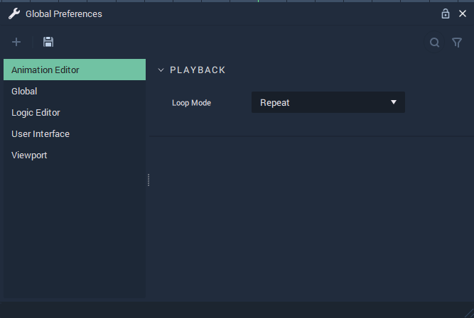
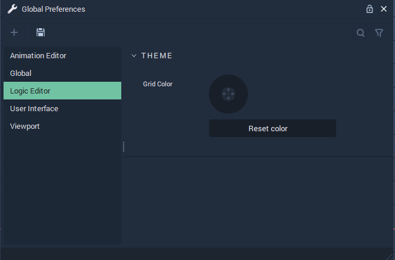

# Global Preferences 
**Global Preferences** allow us to apply default settings to aspects of Incari. These aspects are discussed below:





## Playback
### Loop Mode 
`Loop Mode` determines if an animation should play forward or alternate between playing forward and backward in a **Scene**. It can be set in the following ways:
* `Alternate`: The animation is played forward and backward in each animation cycle.
  

* `None`: The animation is played forward once in each animation cycle.

* `Repeat`: The animation is played forward in repeated cycles without reversing direction.





## Projects
### Projects Path
The default directory on a user's computer where Incari **Projects** are saved. 




## Theme
### Grid Color 
The `Grid color` of the **Logic Editor** can be set here. The *color* can be set by manually adjusting the the **HSB** / **RGBA** values or inserting a **Hex Code**, using their corresponding [**Color Attribute**](../_archive/attributes/attribute-types/color-attributes.md).

Also, the `Reset color` button sets the `Grid color` back to its default value.





## Layout 
### Reset layout
The `Reset Layout` button resets all **Module**s found in Incari to their default positions.





## Theme
### Bottom and Top Gradient Color
`Bottom` and `Top Gradient Color` sets a *color gradient* that starts at the *bottom* and *top* positions of the **ViewPort** respectively. The *color gradient* can be set by manually adjusting the the **HSB** / **RGBA** values or inserting a **Hex Code**, using their corresponding [**Color Attribute**](../_archive/attributes/attribute-types/color-attributes.md).

### Grid Color
`Grid Color` sets the color of the *grid* found in the **Viewport**. The color is set in the same way as `Bottom` and `Top Gradient Color` **Attributes**.

`Reset colors` sets the `Bottom` and `Top Gradient Color` as well as the `Grid Color` of the **Viewport** back to their default colors. 




In order to open the **Global Preference** **Module**, *right-click* on the *menu bar* in Incari and *click* on **Global Preference** from the drop-down list. Please the see the illustration below:

 