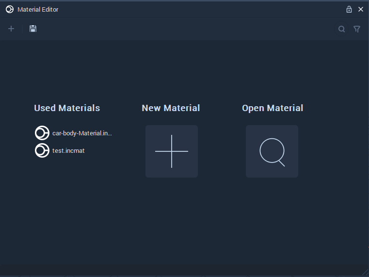
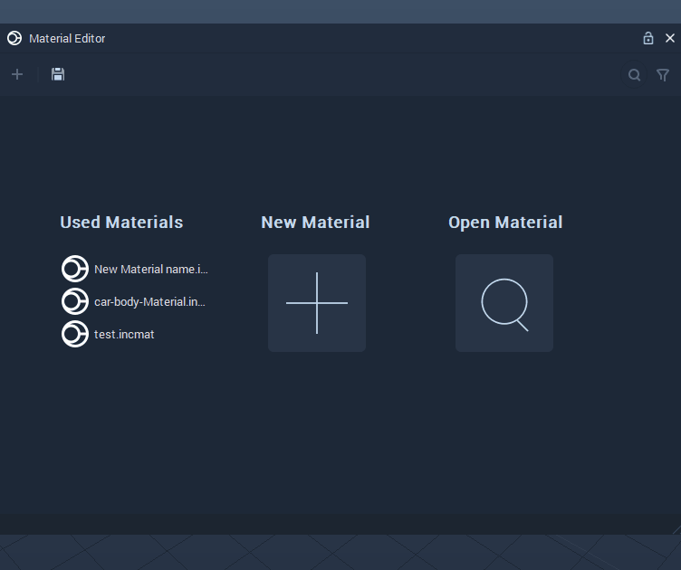

# Material Editor
The **Material Editor** allows us to create a **Material** that gives a **Mesh** a specific visual appearance, when it comes into contact with **Light** in a **Scene**. The **Material** files have a *.incmat* as their filename extension.

In order to open the **Material Editor**, *double-click* on a **Material** file in the **Asset Manager** or *right-click* on the *Menu bar* in Incari and *click* on **Material Editor** from the drop-down list. This can be seen in the illustration below:

The sections defined in the **Material Editor** are discussed below:

Note: These sections will not be opened if a **Material** file has already been opened in the **Material Editor**.

`Used Materials` section, you will find **Materials** that have previously applied to a **Mesh** in a **Scene**. These **Materials** can be edited by *clicking* on them.

`New Material` as its name suggests allows us to create new **Materials**. The illustration below depicts its behavior when *clicked*.

`Open Material` opens a window that allows us to select an existing **Material** file. An example of the window is shown below:

