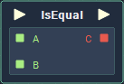

# Overview

**IsEqual** is a **Relational Expression Node**, which compares two **Input Values**, and returns a **Boolean**, based on whether or not they are *equal* to one another.

**Relational Expressions** are frequently used alongside **Branch Nodes** and **Logical Operator Nodes** to manipulate the flow of logic and are essential when building any complex applications.

# Examples

Below is an insight into the behaviour of of the **IsEqual Node**. Note that when comparing **Strings**, the evaluation of equality is *case-sensitive*.  

| `A` | `B` | `C` |
| :--- | :--- | :--- |
| 123 | 123 | *True* |
| 85.05 | 85.06 |  *False* |
| "Cat" | "Dog" | *False* |
| False | False | *True* |
| "Mr. Smith" | "mr. smith" | *False* |

# Attributes

|Attribute|Type|Description|
|---|---|---|
|`Data Type`|**Drop-down**|The type of data that will be plugged into the `A` and `B` **Sockets**.|

# Inputs

|Input|Type|Description|
|---|---|---|
|*Pulse Input* (►)|**Pulse**|A standard **Input Pulse**, to trigger the execution of the **Node**.|
|`A`|*Defined in the* `Data Type` ***Attribute**.*|The **Value** to be compared with `B`.|
|`B`|*Defined in the* `Data Type` ***Attribute**.*|The **Value** to be compared with `A`.|
# Outputs

|Output|Type|Description|
|---|---|---|
|*Pulse Output* (►)|**Pulse**|A standard **Output Pulse**, to move onto the next **Node** along the **Logic Branch**, once this **Node** has finished its execution.|
|`C`|**Bool**|Returns *true* if `A` is equal to `B`. If not, then it returns *false*.|

# External Links

[*Relational operator*](https://en.wikipedia.org/wiki/Relational_operator) on Wikipedia.