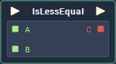

# Overview

**IsLessEqual** is a **Relational Expression Node**, which compares two **Input Values**, and returns a **Boolean**, based on whether or not the **Value** of **Input** `A` is less than **Input** `B`. If it is, the returned **Value** will be *true*, and if not, it will return *false*.

Depending on the setting in the `Mode` **Attribute**, the **Node** may also return *true* if the **Values** are equal.

Because the **IsGreaterEqual** and **IsLessEqual** compare the difference in **Value**, these **Nodes** can only be used with **Numerical Types**.

**Relational Expressions** are frequently used alongside **Branch Nodes** and **Logical Operator Nodes** to manipulate the flow of logic and are essential when building any complex applications.

# Attributes

|Attribute|Type|Description|
|---|---|---|
|`Data Type`|**Drop-down**|The type of data that will be plugged into the `A` and `B` **Sockets**.|
|`Mode`|**Drop-down**|Determines whether equal **Values** will return *true* (`IsLessEqual`), or they will return *false* (`IsLess`).|

# Inputs

|Input|Type|Description|
|---|---|---|
|*Pulse Input* (►)|**Pulse**|A standard **Input Pulse**, to trigger the execution of the **Node**.|
|`A`|*Defined in the* `Data Type` ***Attribute**.*|The **Value** to be compared with `B`.|
|`B`|*Defined in the* `Data Type` ***Attribute**.*|The **Value** to be compared with `A`.|

# Outputs

|Output|Type|Description|
|---|---|---|
|*Pulse Output* (►)|**Pulse**|A standard **Output Pulse**, to move onto the next **Node** along the **Logic Branch**, once this **Node** has finished its execution.|
|`C`|**Bool**|Returns *true* if `A` is less (or equal, depending on `Mode`) than `B`. If not, then it returns *false*.|

# Examples

Below, in the top two examples, we can see the difference between the `IsLessEqual` and `Isless` modes and how even small differences in **Value** affect the outcome of the evaluation.

| `Mode` | `A` | `B` | `C` |
| :--- | :--- | :--- | :--- |
| `IsLess` | 123 | 123 | *False* |
| `IsLessEqual` | 123 | 123 |  *True* |
| `IsLess` | 384 | 384.0001 | *True* |
| `IsLess` | 365 | 180 |  *False* |

# External Links

[*Relational operator*](https://en.wikipedia.org/wiki/Relational_operator) on Wikipedia.