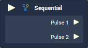
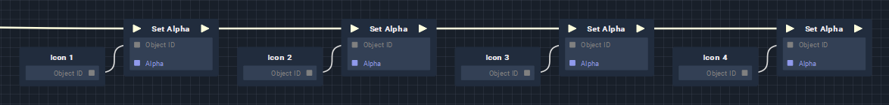
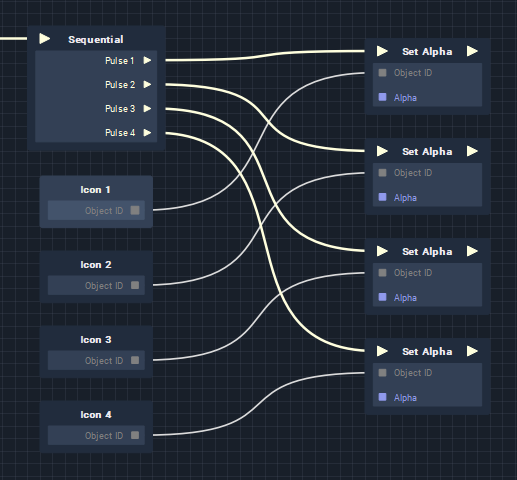
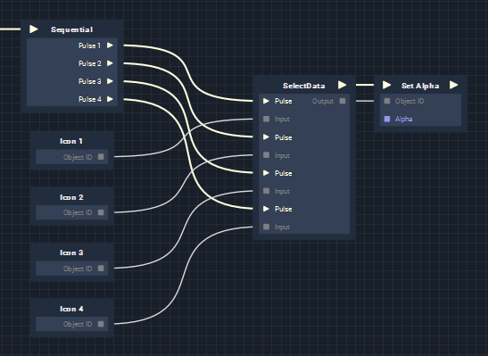
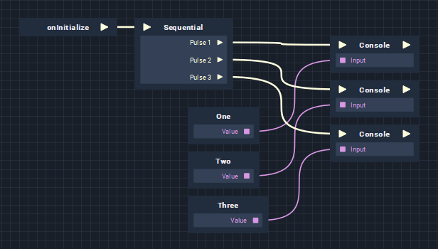
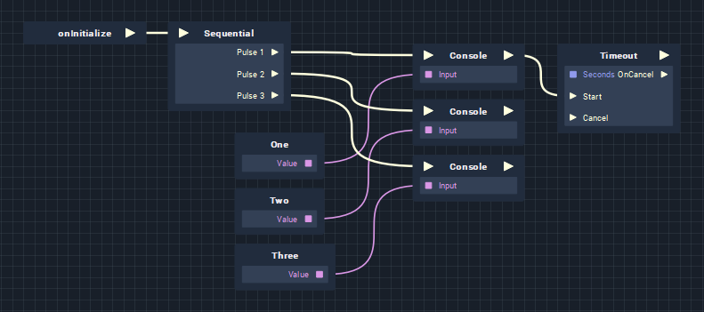
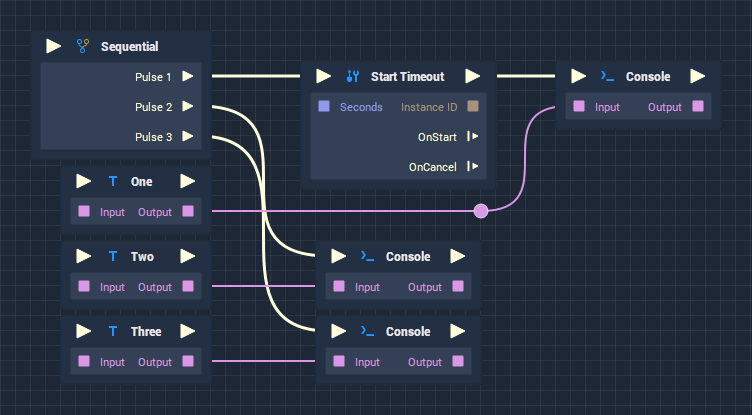

# Overview



The **Sequential Node** generates a user-defined number of **Output Pulses**, and executes their **Logic** sequentially (one after the other), with the top-most **Pulses** being executed first. The one caveat to this is, that if any **Nodes** that pause, or delay the flow of **Logic** are used, they will only affect that particular **Branch**, not the other **Output Pulses** (See **Execution Order** below).

They are commonly used to organise **Logic** in a more readable way, or to execute multiple actions independently of one another.

# Examples

In all of the examples below, the results are the same. We are simply setting four icons to be invisible. What's different is how this **Logic** is *implemented*.

Normally, **Logic Branches** execute from left-to-right, and all **Nodes** are *connected* to each other, even if they aren't directly *related* to each other. This can not only *imply* that they are dependent on each other, but if for some reason, part of the **Logic** fails or is incorrect, subsequent **Nodes** may never be executed, meaning that the execution of each **Node** is *actually* dependent on the successful execution of its preceding **Node**. 



By using a **Sequential Node**, we can list these individual execution orders as separate, independant **Branches**. This solves our dependance problem, and visually shows that they are separate actions.



In this particular example, a better solution would be to combine the **Sequential** and **SelectData Nodes**, to perform the same action on multiple **Objects**.



# Attributes

|Attribute|Type|Description|
|---|---|---|
|`Pulse Count`|**Int**|The number of **Output Pulses** that will be executed in the sequence.|

# Inputs

|Input|Type|Description|
|---|---|---|
|*Pulse Input* (►)|**Pulse**|A standard **Input Pulse**, to trigger the execution of the **Node**.|

# Outputs

|Output|Type|Description|
|---|---|---|
|`Pulse [n]`|**Pulse**|A **Pulse** which is executed sequentially from top-to-bottom. The total number of **Pulses** is defined in the `Pulse Count` **Attribute**.|

# Execution Order

Here, we output three written numbers to the console, using the **Sequential Node**. As you might expect, the numbers are show immediately after each other, in the correct order:



```text
One   [0 seconds]
Two   [0 seconds]
Three [0 seconds]
```

No, when we add a **Timeout **Node****, which delays the execution of **Branch**, you might expect the numbers, to be output in order, with a delay between "One" and "Two". This, however, is not the case, as **Timeout Nodes** only affect the **Branch** that they're on. You will instead see the following output, exactly as before.



```text
One   [0 seconds]
Two   [0 seconds]
Three [0 seconds]
```

This becomes much clearer, when we insert a **Timeout Node** *before* the **Console Node** is executed. Now we see that "Two" and "Three" are shown immediately, while there is a delay before "One" being shown.



```text
Two   [0 seconds]
Three [0 seconds]
One   [1 second]
```

# External Links