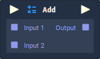

# Overview

**Add** returns the sum of all of the **Values** provided in the **Input Sockets**.

# Attributes

|Attribute|Type|Description|
|---|---|---|
|`Data Type`|**Drop-down**|The type of **Data** that will be plugged into the `Input` **Sockets**.|
|`Count`|**Int**|The number of **Data Input Sockets** the **Node** will have.|

# Inputs

|Input|Type|Description|
|---|---|---|
|*Pulse Input* (►)|**Pulse**|A standard **Input Pulse**, to trigger the execution of the **Node**.|
|`Input [n]`|*Defined in the* `Data Type` ***Attribute***.|The **Values** to be added together.|

# Outputs

|Output|Type|Description|
|---|---|---|
|*Pulse Output* (►)|**Pulse**|A standard **Output Pulse**, to move onto the next **Node** along the **Logic Branch**, once this **Node** has finished its execution.|
|`Output`|*Defined in the* `Data Type` ***Attribute***.|The sum of all of the **Values** provided in the **Input Sockets**.|