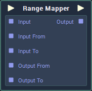

# Overview

**Range Mapper** takes a **Value**, calculates its position in relation to a reference range, and transforms the **Value** to its same relative position within a target range.

The `Output` **Value** can optionally be *clamped* using the `Clamp` **Attribute**. When enabled, it will be constrained to the output range; if it isn't then it will be transformed realtively, even if the `Input` **Value** is outside of the input range.

It is also possible to have the start of a range be higher in **Value** to the end of the range. This allows you to map a **Value** from within an *ascending* range, to a *descending* one, and vice versa.

|`Input`|Input Range|Output Range|`Clamp`|`Output`|
|---|---|---|---|---|
|0.5|0-1|0-100|✔ or ✖|50|
|20|0-100|100-0|✔ or ✖|80|
|1.5|0-1|0-360|✔|360|
|1.5|0-1|0-360|✖|540|
|0.75|0-1|0-60|✔ or ✖|45|
|1.5|0-1|0-60|✖|90|

# Attributes

### Inputs
|Attribute|Type|Description|
|---|---|---|
|`Data Type`|**Drop-down**|The type of **Data** that will be plugged into the `Input` **Sockets**.|
|`From`|*Defined in **Inputs*** > `Data Type` ***Attribute**.*|The default **Value** of the beginning of the reference range, if there is nothing attached to the `Input From` **Input Socket**.|
|`To`|*Defined in **Inputs*** > `Data Type` ***Attribute**.*|The default **Value** of the end of the reference range, if there is nothing attached to the `Input To` **Input Socket**.|

### Outputs
|Attribute|Type|Description|
|---|---|---|
|`Data Type`|**Drop-down**|The type of **Data** that will be plugged into the `Output` **Sockets**.|
|`From`|*Defined in **Outputs*** > `Data Type` ***Attribute**.*|The default **Value** of the beginning of the target range, if there is nothing attached to the `Output From` **Input Socket**.|
|`To`|*Defined in **Outputs*** > `Data Type` ***Attribute**.*|The default **Value** of the end of the target range, if there is nothing attached to the `Output To` **Input Socket**.|
|`Clamp`|**Bool**|Determines whether or not the `Output` **Value** is clamped within the output range.|

# Inputs

|Input|Type|Description|
|---|---|---|
|*Pulse Input* (►)|**Pulse**|A standard **Input Pulse**, to trigger the execution of the **Node**.|
|`Input`|*Defined in **Inputs*** > `Data Type` ***Attribute**.*|The **Value** that will be mapped for the reference range, to the target range.|
|`Input From`|*Defined in **Inputs*** > `Data Type` ***Attribute**.*|The **Value** of the beginning of the reference range.|
|`Input To`|*Defined in **Inputs*** > `Data Type` ***Attribute**.*|The **Value** of the end of the reference range.|
|`Output From`|*Defined in **Outputs*** > `Data Type` ***Attribute**.*|The **Value** of the beginning of the target range.|
|`Output To`|*Defined in **Outputs*** > `Data Type` ***Attribute**.*|The **Value** of the end of the target range.|

# Outputs

|Output|Type|Description|
|---|---|---|
|*Pulse Output* (►)|**Pulse**|A standard **Output Pulse**, to move onto the next **Node** along the **Logic Branch**, once this **Node** has finished its execution.|
|`Output`|*Defined in **Outputs*** > `Data Type` ***Attribute**.*|The **Value** of `Input`, mapped from the reference range, to the target range.|

# Related Pages

- [*The Clamp Node*](clamp.md)