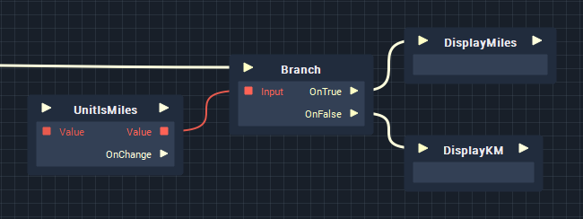
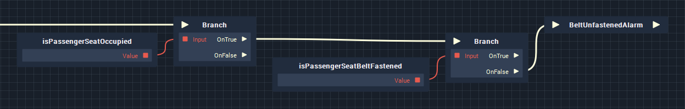

# Branch

## Overview

Like a branch on a tree, the Branch node splits a single path into two diverging paths. Which branch of logic is executed depends on a single condition, which can itself be composed of multiple conditions. At a high level it basically means "_If this is true, do this; if not, do this._" which sounds relatively simplistic, however, branching is a foundational concept of creating interactive logic, similar to using _if statements_ in programming, and when combined with [_Relational Expression_](../relational-expression-nodes.md), [_Pulse Flow_ ](./)and [_Logical Operator_](../logical-operator-nodes.md) nodes, we can build incredibly complex systems.

## Inputs and Outputs

The Branch node has a single input pulse and a single [i](../../../data-types/bool.md)nput:

* **Input** - A Boolean-type input, representing a condition.

Additionally it has two output pulses, which are triggered depending on the input condition:

* **OnTrue** - This pulse of logic is executed if **Input** is _True_.
* **OnFalse** - This pulse of logic is executed if **Input** is _False_.

## Uses

There are infinite uses for the Branch node, however a very basic example would be a single input condition, which triggers one of two functions. In the example below we use a variable to represent whether the unit of measurement for distance is set to _km/h_ or _mph_ and trigger functions to display data in the corresponding format.

By utilising various other nodes, we can define logical outcomes based on multiple conditions. In the example below we have four variables, representing whether or not each of four car doors are open. By using the [Logical Operator](../logical-operator-nodes.md) node [OR](../logical-operator-nodes.md#or) and triggering them all using a [Sequential ](sequential.md)node, we can trigger an alarm if any of the doors are open.

