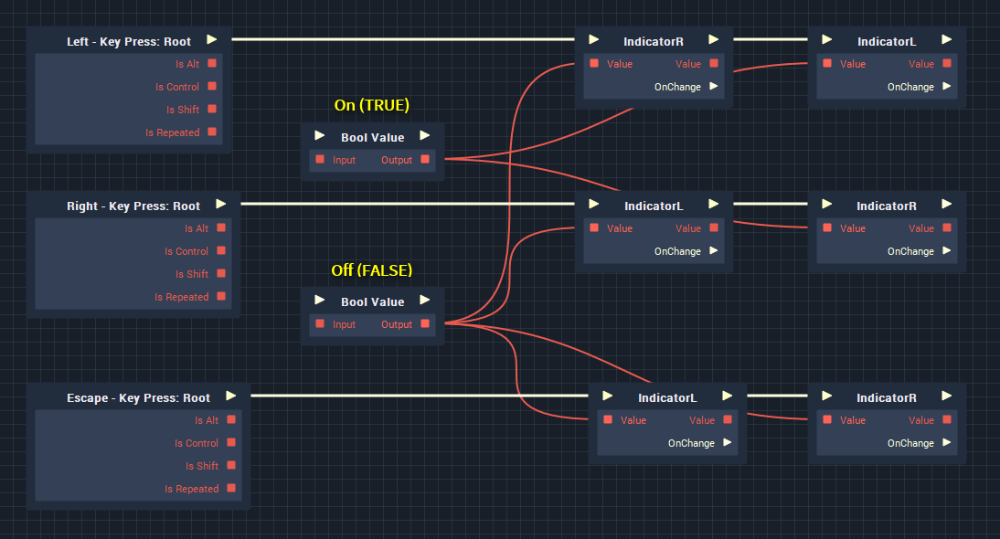
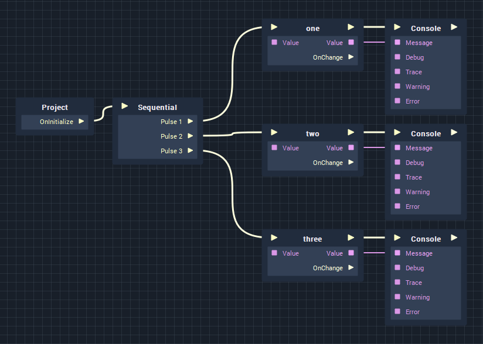
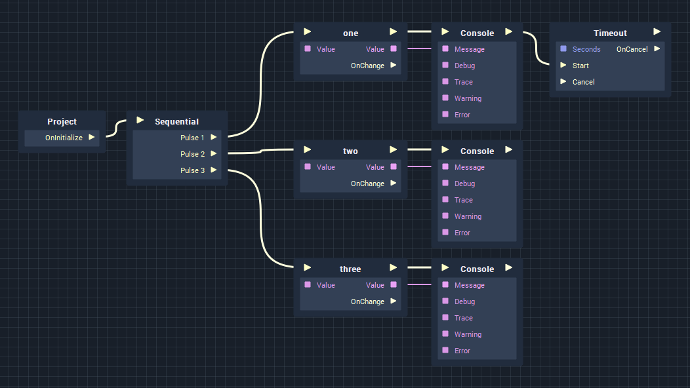
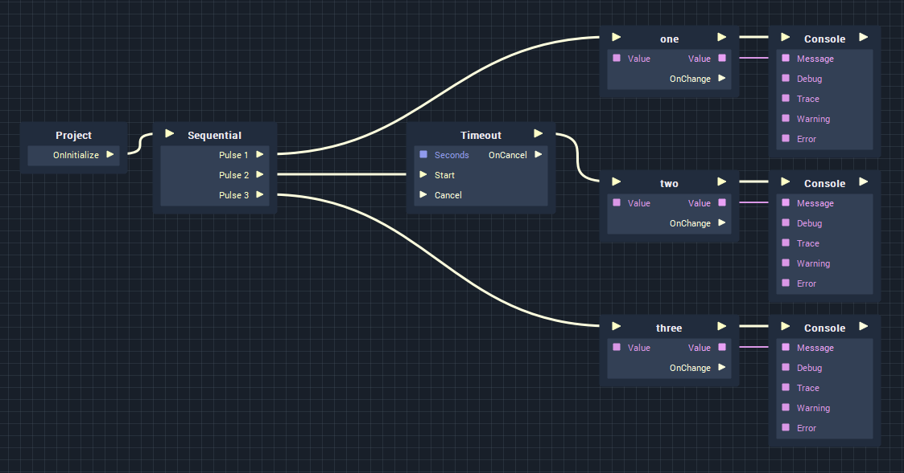

# Sequential

## Overview

Used as a way of splitting a single logic pulse into multiple sets of instructions in a more rational and readable way. Each output pulse is executed one after the other, however, nodes that trigger things like delays, only affect a single pulse \(see **Execution Order** below\).

## Usage

For example, say that we have two variables:

1. IndicatorR
2. IndicatorL

Each variable contains the current state of our turn signals/indicators and represents whether they are currently on or off. We _could_ add our logic from left-to-right as shown below, and it would work perfectly fine, however there are downsides to this approach, as discussed below.



Although it isn't much of an issue when changing two variables, it would become very hard to follow if we were simultaneously adjusting the values of a large amount of variables or triggering several sets of logic based on a single pulse. By adding a sequential node we can organise sets of execution instructions in a more manageable manner.


## Execution Order

Each output pulse of the node is triggered in order, however, Timeouts, Tickers and Intervals won't delay the execution of subsequent pulses, only delay the logic in that particular single pulse.

Below, we see a simple example, outputting numbers to the console. As expected, the console will output:

```text
One   [0 seconds]
Two   [0 seconds]
Three [0 seconds]
```



When we add a Timeout node to the end of one of those logic pulses, one might anticipate that there would be a delay between outputting numbers, however the output would be the same as above, because the Timeout is only applied to a single pulse \(Pulse 1 in this case\):

```text
One   [0 seconds]
Two   [0 seconds]
Three [0 seconds]
```



If we then move the Timeout node to be _before_ the string is printed to the console we would get the following:

```text
One   [0 seconds]
Three [0 seconds]
Two   [1 second]
```



