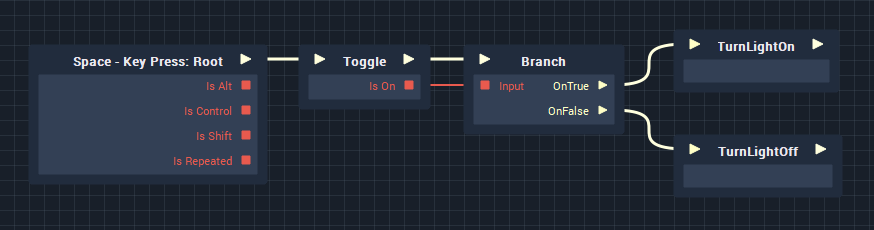

# Toggle

**Toggle** simply inverses the value of a Boolean every time a pulse passes through the node. Unlike **Negate**, it doesn't take an input value and is initialised at whatever value is defined in the node's Attributes within the Logic Editor.

## Usage

A very simple use case, would be turning on a light. Initially the light is off, and then whenever Toggle is triggered, it switches between on and off as shown below.

