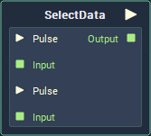
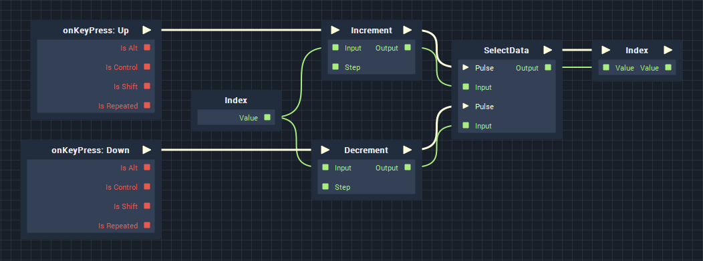

# Overview

When you want to evaluate a **Data Value** in one or more different ways, depending on some conditions, **SelectData** is used to converge **Branches** of **Logic** into a single **Branch**, regardless of how the **Data** was calculated.

# Attributes

|Attribute|Type|Description|
|---|---|---|
|`Data Type`|**Drop-down**|The type of data that will be plugged into the `Input` **Sockets**.|
|`Count`|**Int**|The number of **Input Pulses** and **Data Values** the **Node** will receive.|

# Inputs

|Input|Type|Description|
|---|---|---|
|`Pulse [n]`|**Pulse**|The **Pulse** corresponding to the **Data** in the **Socket** below.|
|`Input [n]`|*Defined in the* `Data Type` ***Attribute***.|The **Data Value** corresponding to the above **Pulse**.|

# Outputs

|Output|Type|Description|
|---|---|---|
|*Pulse Output* (►)|**Pulse**|A standard **Output Pulse**, to move onto the next **Node** along the **Logic Branch**, once this **Node** has finished its execution.|
|`Output`|*Defined in the* `Data Type` ***Attribute***.|The `Input` **Value** corresponding to whichever `Pulse` triggered the execution of the **Node**.|

# Examples

Below is a very simple example of the usage of the **SelectData Node**. We have two **OnKeyPress Nodes**, which increment/decrement the **Value** of a **Variable**, when the `Up` / `Down` arrows are pressed. By using **SelectData**, we only need to assing the **Value** once.

<!-- Say for example, that we have the temperature of a car's interior in Celcius (°C), but we want to display the temperature in °C or °F, depending on the user's preference. We would only need to perform a conversion of the initial value *if* the user prefers the Fahrenheit (°F) format. This would mean using **Branch** to split the logic into two **Branches**, depending on preference, but we only want to set the display value once. This is where **SelectData** comes into play, because we can assign the value in one place, regardless of how the **Value** was evaluated. -->