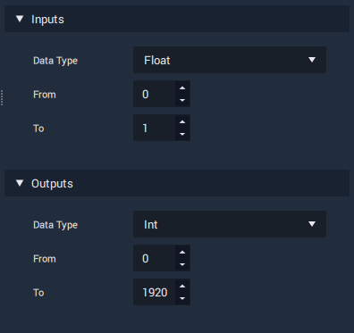

# Advanced Math Nodes

## RangeMapper

**RangeMapper** takes a value within a numerical range and returns the transformed relative value within a second range. The output value is _clamped_ within the output range, therefore if the input value isn't within the input range, the output value will be clamped to the upper/lower bound of the output range.

### Input and Output

As well has having a Pulse input and output, **RangeMapper** also has five data inputs and one data output.

The five inputs provide a value to be transformed and define the limits of the input and output ranges:

* **Input** - The value to be transformed.
* **Input From** - The lower limit of the input range.
* **Input To** - The higher limit of the input range.
* **Output From** - The lower limit of the output range.
* **Output To** - The higher limit of the output range.

The output simply gives us the result of the calculation.

* **Output** - The evaluated value of the input being mapped to the provided ranges.

### Attributes

The input variables can be split into two categories: input and output.

**Input**, **Input From** and **Input To** relate to the data being provided to the node, whereas **Output From** and **Output To** define the range that the input data will be mapped to. This means that the input and output categories can be different \(numerical\) [types](../../data-types/).

### Behaviour

| Input | Input From | Input To | Output From | Output To | Output |
| :--- | :--- | :--- | :--- | :--- | :--- |
| 0.5 | 0 | 1 | 0 | 360 | 180 |
| 200 | 0 | 255 | 0 | 1 | ~0.78 |
| 1.5 | 0 | 1 | 0 | 360 | 360 |
| 0.65 | 0 | 1 | 0 | 100 | 65 |
| 0 | -50 | 50 | 0 | 100 | 50 |

### Usage

A common use for **RangeMapper** is translating raw data from an input device into values relevant to the visual interface. For example, say that we want to position a cursor on a screen, using a touchpad. Our touchpad hardware may output two float values between 0-1, representing the X and Y position of the user's finger,

If you have a trackpad for user interaction. It is typical that you will get two values within a range, between 0 and 1, representing the x and y positions of the user's finger. For this to translate to screen space, the xy coordinates of the trackpad would be transformed to the x and y ranges of the screen

Clamping means constraining a value to within a certain range.

If the input value is greater than the maximum value of the range, the output will be equal to the maximum value of the range.

Similarly, if the input value is lower than the minimum value of the range, the output will be equal to the minimum value of the range.

If the input value falls within the range, the output value will be equal to the input value.

We can perform a Clamp operation in INCARI by using the RangeMapper and setting both the output and input ranges to be the same.

