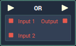

# Overview

The **OR** is a *logical operator* **Node** which takes two or more **Booleans** and returns a single **Boolean**.

The **Node** checks whether or not *any* of the **Inputs** are *true*. If *one* of them is true, then the `Output` **Value** will be true. If, however, *none* of the **Inputs** are *true*, `Output` will be *false*.

| Input 1 | Input 2 | Output |
| :--- | :--- | :--- |
| True | True | True |
| True | False | True |
| False | True | True |
| False | False | False |

# Attributes

|Attribute|Type|Description|
|---|---|---|
|`Count`|**Int**|The number of **Data Input Sockets** the **Node** will have.|

# Inputs

|Input|Type|Description|
|---|---|---|
|*Pulse Input* (►)|**Pulse**|A standard **Input Pulse**, to trigger the execution of the **Node**.|
|`Input [n]`|**Bool**|The **Boolean Values** to be checked.|

# Outputs

|Output|Type|Description|
|---|---|---|
|*Pulse Output* (►)|**Pulse**|A standard **Output Pulse**, to move onto the next **Node** along the **Logic Branch**, once this **Node** has finished its execution.|
|`Output`|**Bool**|Whether or not any of the **Inputs** are *true*.|