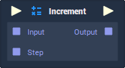

# Overview

**Increment** increases an **Input Value** by a specified amount (step).

# Attributes

|Attribute|Type|Description|
|---|---|---|
|`Data Type`|**Drop-down**|The type of data that will be used for `Input`, `Output` and `Step`.|
|`Step`|*Defined in the* `Data Type` ***Attribute***.|The default amount to increment `Input` by, if there is nothing plugged into the `Input` **Socket**.|

# Inputs

|Input|Type|Description|
|---|---|---|
|*Pulse Input* (►)|**Pulse**|A standard **Input Pulse**, to trigger the execution of the **Node**.|
|`Input`|*Defined in the* `Data Type` ***Attribute***.|The **Value** to be incremented.|

# Outputs

|Output|Type|Description|
|---|---|---|
|*Pulse Output* (►)|**Pulse**|A standard **Output Pulse**, to move onto the next **Node** along the **Logic Branch**, once this **Node** has finished its execution.|
|`Output`|*Defined in the* `Data Type` ***Attribute***.|The incremented **Value**.|