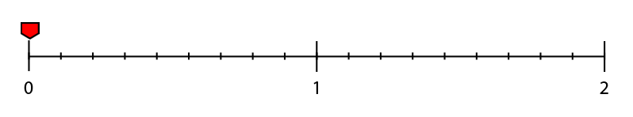

# Overview

The **Interpolate Node** is used primarily for animating the **Attributes** of **Objects**.

The **Node** calculates the intermediate **Values** between a *start* (`From`) and *end* (`To`) **Value**. These transitional **Values** are calculated a number of times per second, defined in the `Frame Rate (fps)` **Attribute**, over a certain length of time, defined in the duration `Duration (s)` **Attribute**.

Every time a new **Value** is calculated, the **Output Pulse** is also triggered.

# Attributes

## Input

|Attribute|Type|Description|
|---|---|---|
|`Data Type`|**Drop-down**|The numerical **Type** of **Data** that will interpolated.|
|`Duration (s)`|**Float**|The length of time that the **Value** will be interpolated over, in seconds.|
|`From`|*Defined in the* `Data Type` ***Attribute**.*|The initial **Value**.|
|`To`|*Defined in the* `Data Type` ***Attribute**.*|The end **Value**.|

## Interpolation

|Attribute|Type|Description|
|---|---|---|
|`Type`|**Drop-down**|The easing method, used to calculate the intermediate **Values** (see below).|
|`Mode`|**Drop-down**|The playback setting for repeated animations (see below).|
|`Count`|**Int**|The amount of times the interpolation will run (not available in `Once` mode or when `Infinite` is enabled).|
|`Infinite`|**Bool**|If enabled, the animation repeats, or alternates indefinitely.|
|`Frame Rate (fps)`|**Float**|The amount of times per second that the **Value** is calculated.|

## More about the Mode Attribute





`Once` means that the animation will play only once and then stop any further evaluation:





`Repeat` allows us to repeat the animation a set number of times, defined in the `Count` **Attribute**. Note that this will only work if `Infinite` is set to *false*. If `Infinite` is turned on, the animation will repeat indefinitely.





Lastly, we have the `Alternate` option. This causes the interpolation to animate forwards and then backwards. As with the `Repeat` option, this will repeat forever if `Infinite` is enabled, or until it has played the amount of times defined in `Count`.

Note that backwards animations also count as an animation in themselves, so odd `Count` **Values** will cause the animation to stop at the `To` position, while an *even* **Value** will terminate the animation at the initial `From` position.

Also note that alternating animations will also reverse the `easing function`. If it *eases in* from the start to end position, then it will *ease out* from the end, back to the start position.





## More about the Type Attribute

**INCARI** offers many different interpolation types, which determine the way that the transition between `To` and `From` is calculated, and the easing of the animation.

### Non-easing Interpolation Types

- `Linear` - interpolates between the **Values** linearly at a constant pace.
- `Constant` - like `Linear` except that the **Value** is *rounded down* to the nearest *whole* number.

### Easing Interpolation Types

Although linear interpolation does have its uses, a more stylised effect is often required to make an animation more interesting. This is often achieved using an acceleration and/or deceleration  of the animation speed over time. In animation, this is often referred to as *easing*.

The easing functions in **INCARI** are named, based on a naming convention, which offers some insight into how the interpolation is calculated.

First we have the prefixes, which represent different "levels" of easing. Some are very strong, while others are more subtle. The prefixes are `Circ`, `Cube`, `Exp`, `Quad` and `Sin`.

Then we have the suffixes, which show whether the animation eases in (`EaseIn`), eases out (`EaseOut`), or both (`EaseInOut`).





`ExpEaseIn`:





`ExpEaseOut`:





`ExpEaseInOut`:





# Inputs

|Input|Type|Description|
|---|---|---|
|`Duration (s)`|**Float**|The length of time that the **Value** will be interpolated over, in seconds.|
|`Count`|**Int**|The amount of times the interpolation will run (not available in `Once` mode or when `Infinite` is enabled).|
|`From`|*Defined in the* `Data Type` ***Attribute**.*|The initial **Value**.|
|`To`|*Defined in the* `Data Type` ***Attribute**.*|The end **Value**.|
|`Start`|**Pulse**|Initiates the interpolation.|
|`Reset`|**Pulse**|Reverts the `Value` to the initial `From` **Value** and cancels any further **Pulse Outputs**.|

# Outputs

|Output|Type|Description|
|---|---|---|
|*Pulse Output* (►)|**Pulse**|Fires every time `Value` is evaluated (defined in the `Frame Rate (fps)` **Attribute**.|
|`Value`|*Defined in the* `Data Type` ***Attribute**.*|The current intermediate **Value** between `From` and `To`.|
|`OnReset`|**Pulse**|Fired once the interpolation has been reset by a **Pulse** plugged into the `Reset` **Input Socket**.|
|`OnEnd`|**Pulse**|Triggers once all of the interpolations are complete (never triggers is `Infinite` is enabled).|

# External Links

[*Easing Function Cheat Sheet*](https://easings.net/en#) on Easings.net.