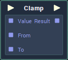

# Clamp

## Overview

**Clamp** limits a _numerical value_ to a given range, so that it isn't lower than the lower boundary, or higher than the upper boundary.

| `Value` | `From` | `To` | `Result` |
| :--- | :--- | :--- | :--- |
| 50 | 0 | 100 | 50 |
| 120 | 0 | 100 | 100 |
| -20 | 0 | 100 | 0 |
| -270 | -180 | 180 | -180 |
| -20, 1100 | 0, 0 | 1920, 1080 | 0, 1080 |

## Attributes

| Attribute | Type | Description |
| :--- | :--- | :--- |
| `Data Type` | **Drop-down** | The type of data that will be plugged into the `Input` **Sockets**. |
| `From` | _Defined in the `Data Type` **Attribute**_. | The default lower boundary of the range, if there is nothing attached to the `From` **Socket**. |
| `To` | _Defined in the `Data Type` **Attribute**_. | The default upper boundary of the range, if there is nothing attached to the `To` **Socket**. |

## Inputs

| Input | Type | Description |
| :--- | :--- | :--- |
| _Pulse Input_ \(►\) | **Pulse** | A standard input **Pulse**, to trigger the execution of the **Node**. |
| `Value` | _Defined in the `Data Type` **Attribute**_. | The value to be clamped within the range defined in `From` and `To`. |
| `From` | _Defined in the `Data Type` **Attribute**_. | The lower boundary of the range. |
| `To` | _Defined in the `Data Type` **Attribute**_. | The upper boundary of the range. |

## Outputs

| Output | Type | Description |
| :--- | :--- | :--- |
| _Pulse Output_ \(►\) | **Pulse** | A standard output **Pulse**, to move onto the next **Node** along the _logic branch_, once this **Node** has finished its execution. |
| `Result` | _Defined in the `Data Type` **Attribute**_. | The value of `Value`, restricted to fall within the boundary defined by `From` and `To`. |

