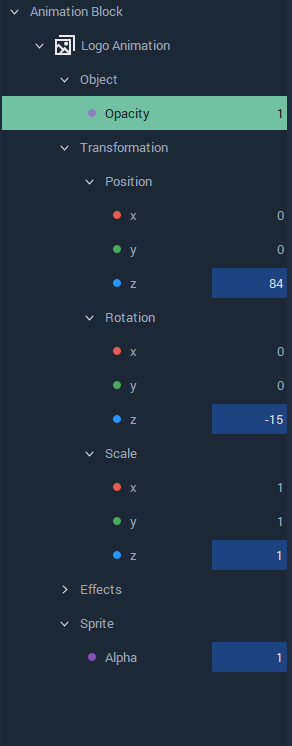
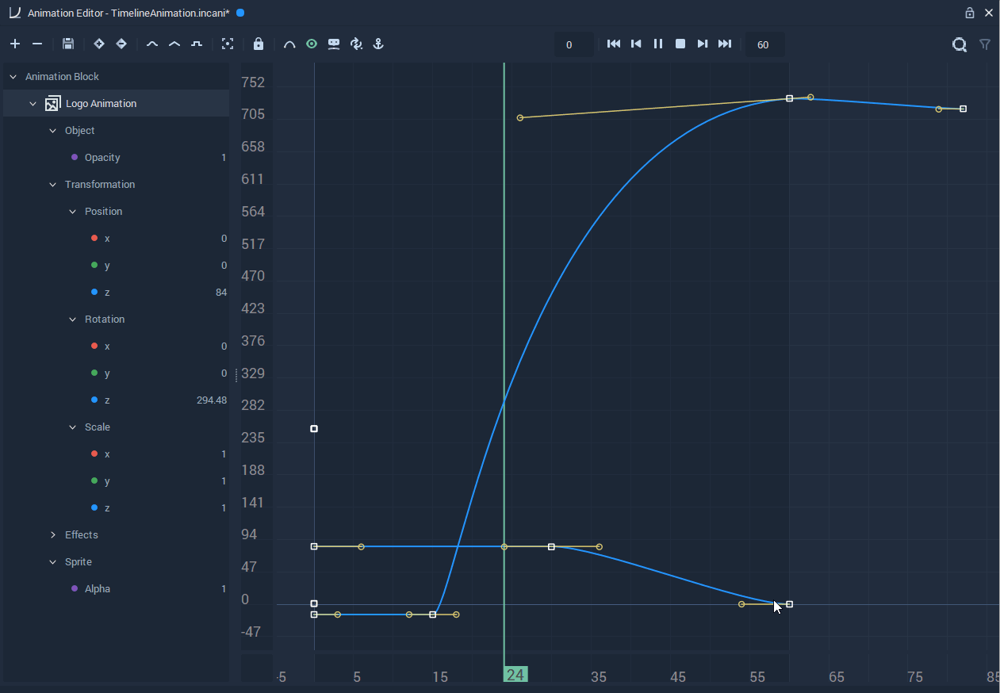
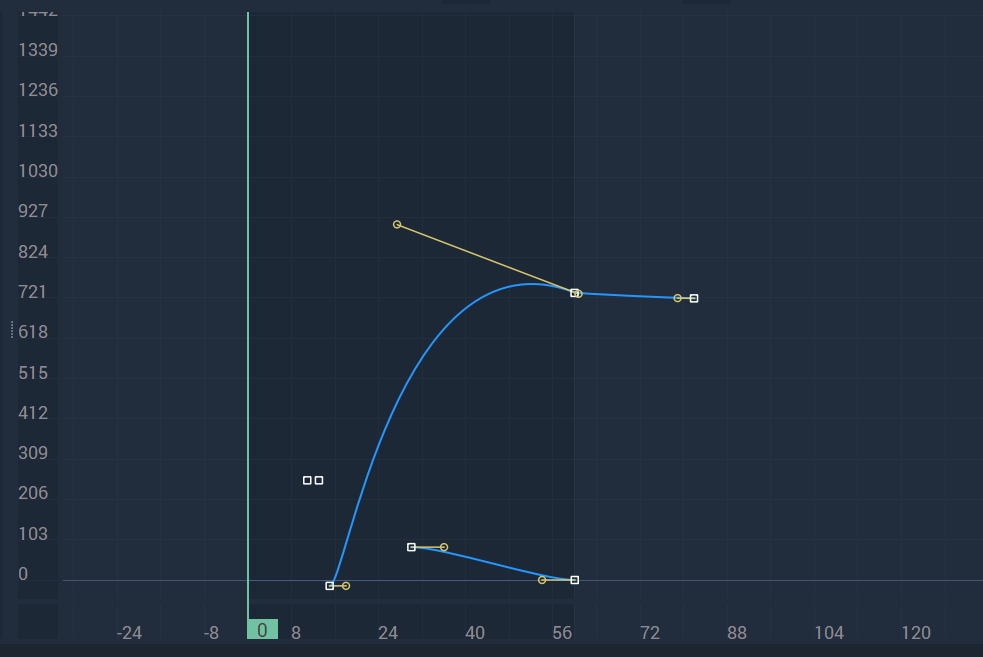

# Animation Editor

## Overview

The **Animation Editor** is used for creating and editing **Keyframe**-based timeline animations, which have the file extension `.incani`. It can either be opened from the `View` drop-down menu on the top panel of **Incari**, or by _right-clicking_ on the menu bar in **Incari** and _clicking_ on **Animation Editor** from the drop-down list, or simply by _double-clicking_ an **Animation** **Asset** in the **Asset Manager**.

## Animation Editor Window

**Animation Editor** - The main window, which contains all the options to create and edit an **Animation**. The specifics of its sections are described below.

## Toolbar

The **Toolbar** offers several options to modify an **Animation**, such as adding or deleting an Animation Block, adding or deleting a **Keyframe**, and modifying the type of interpolation used. It also provides options for a better visualization of the timeline, such as a focus on just the visible lines and a toggle for the visibility of the tangent lines. The rest of the options are for enabling the preview, playing and controlling of the **Animation**.

## Left Panel

The **Left Panel** shows the **Animation Blocks** with their **Transformation Attributes** and corresponding **Keyframes**, which are highlighted in blue.

A **Keyframe** consists of two parts:

* The **Keyframe** itself, which holds a value at a specific time.
* The curve handles, which control the easing and interpolation between frames.

To add a **Keyframe**, simply right click an Attribute and select `Add Keyframe` from the context menu. This will create a **Keyframe** at whatever time the playhead is currently on. The curve handles can then be adjusted to fine-tune the intermediate frames.

When a **Keyframe** is selected, its corresponding Bézier curve is shown in the **Animation Timeline**.

When the **Animation** is run, the **Left Panel** shows the evolving values of the **Transformation Attributes**.

## Animation Timeline

The **Animation Timeline** shows a graph with the Bézier curves of the **Transformation Attributes**.

## External Link

* [_Bézier Curve_](https://en.wikipedia.org/wiki/B%C3%A9zier_curve) on Wikipedia.

