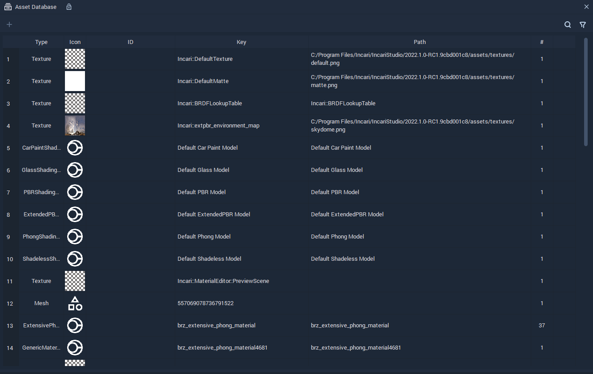
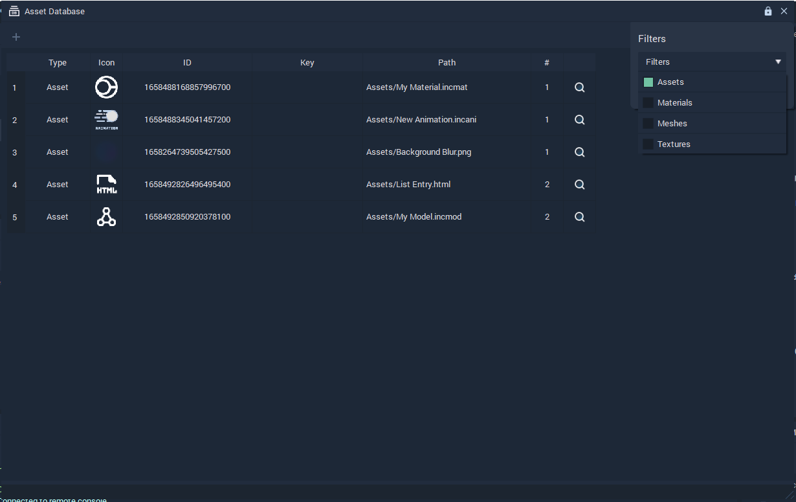
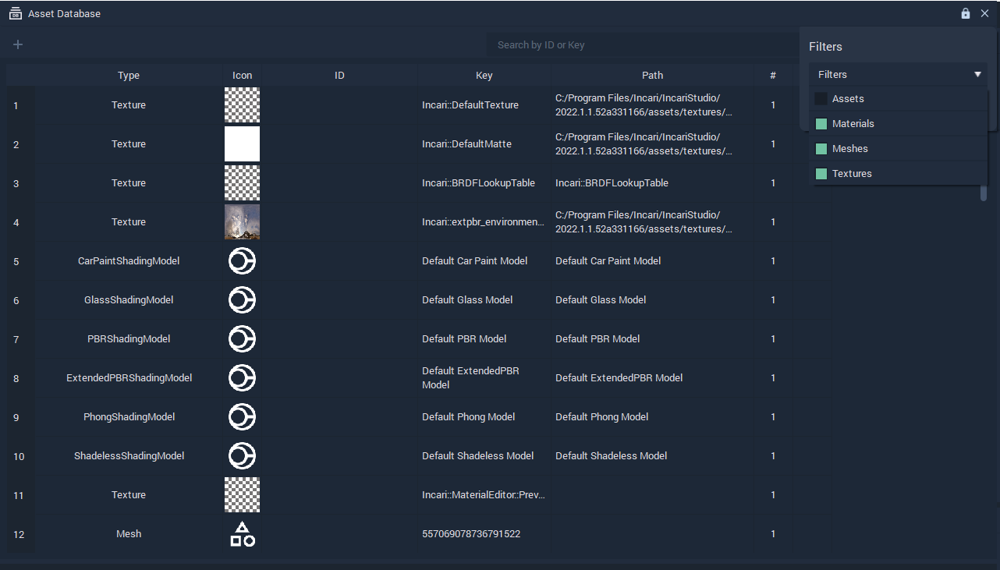

# Asset Database

## Overview

The **Asset Database** shows two sets of **Assets**:

* **Assets** that are currently used in the **Project**.
* Default **Materials**, **Textures**, and **Meshes** that are available for use.

For each **Asset**, the **Asset Database** displays the following information:

* `Type`: 
* `Icon`:
* `ID`:
* `Key`:
* `Path`:
* `#`:

## Assets used in the **Project**

The **Asset Database** shows the **Assets** that are currently used in the **Project**. 

Using the **Filters** and selecting `Assets`, it is possible to only see the **Assets** that are currently used in the **Project**:

## Default **Materials**, **Textures**, and **Meshes**

The **Asset Database** shows the default **Materials**, **Textures**, and **Meshes** that are available for use.

 