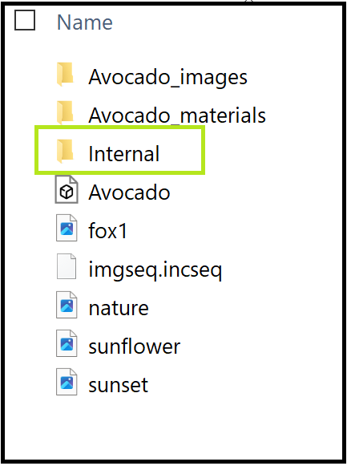
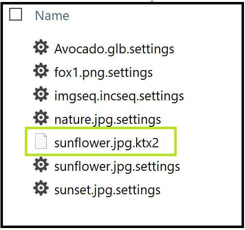
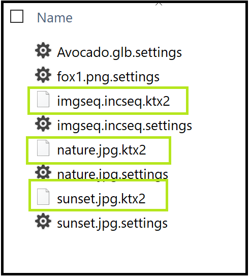
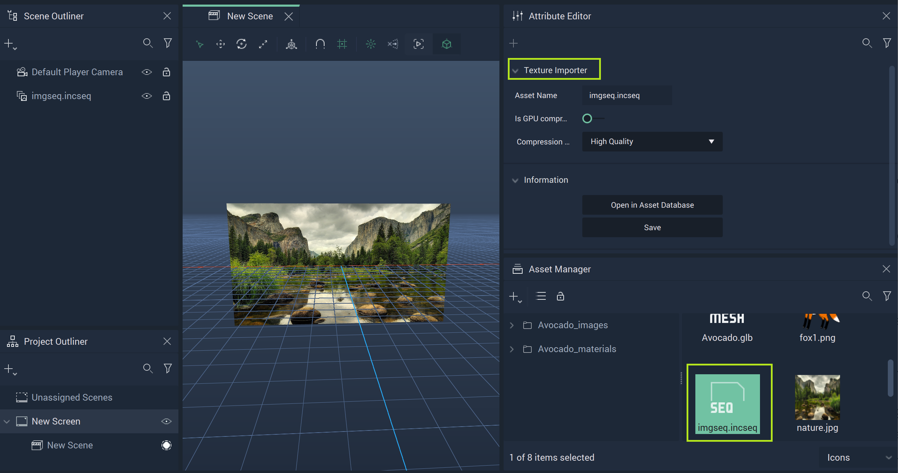
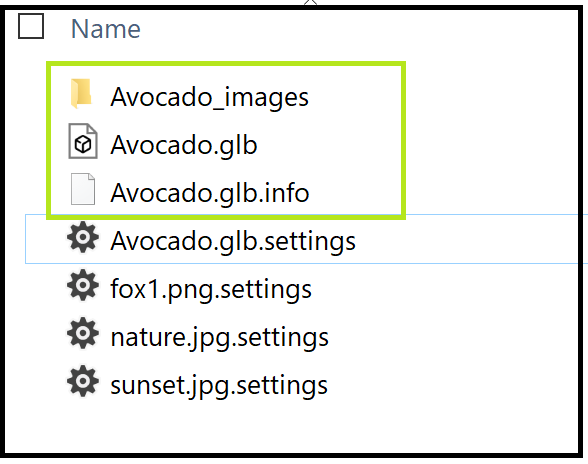
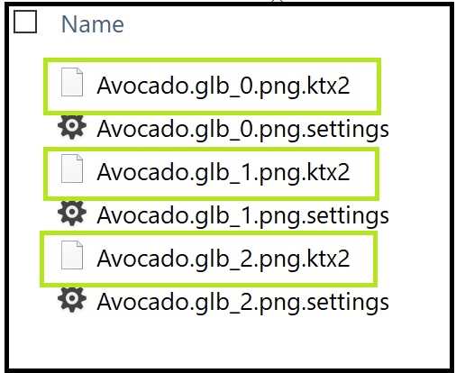
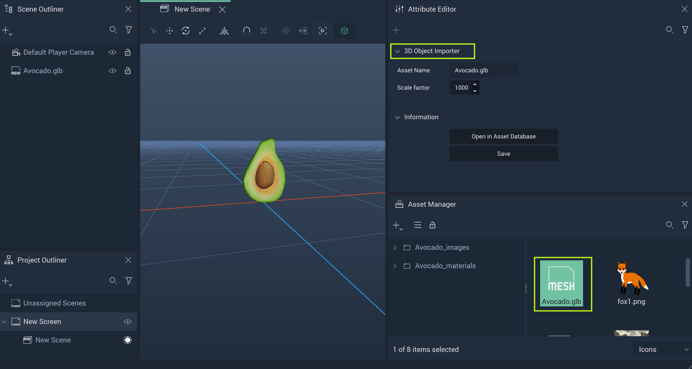

# Asset Manager

## Overview

**Assets** are the files in the **Project Asset** folder. They can be used for creating or modifying **Objects**. The **Asset Manager** shows all the available **Assets** and allows the user to organize, manage, and create them.

## Importing

**Assets** can be imported by clicking on the plus  (4) (4) (4) (4) (4) (4) (4) (1) (1) (1) (1).PNG>) icon at the top left of the **Asset Manager**, selecting `Import Assets`, and finding the files to import to the **Asset Manager**.

## Creating

To create an **Asset**, right-click on the **Asset Manager**, select `Create Asset`, and choose which kind of **Asset** to create.

## Views

The **Asset Manager** offers different views of the files in the **Assets** folder. The general view can be switched on the top left between flat and folder tree view and the files can be seen as either icons or in a list, which is chosen in the bottom right corner.

## Deleting

**Assets** can be deleted in the following ways:

* Right-click the **Asset** and select the `Delete` button from the pop-up.
* Select an **Asset** and press `del`.

## Renaming

**Assets** can be renamed by right-clicking an item and selecting `Rename`. You can then type a new name and press **`⏎`**/`Return` to confirm the change.

## Texture Importer

The **Texture Importer** appears in an **Asset's** **Attribute Editor** when the **Asset** has been imported in the **Asset Manager**. 

This is only possible for images (files such as *PNGs*, *JPGs*, etc. ) and **Incari** [**Image Sequences**](image-sequence-editor.md). 

### Images

Images are files that contain only one file type. When `sunflower.jpg` file is used, a new `.ktx2` file is created (ex: `sunflower.ktx2`) and stored in an `/internal` folder of the **Project**. This folder is not accessible within **Incari Studio**, but can be seen in the **Project** folder on the user's local machine. 

To reiterate, the first generation of the `.ktx2` file is on instantiation, meaning that when it is dragged and dropped into the viewport or put into the reference field of an **Object**, the `.ktx2` file is created. This is to significantly speed up the loading time of the **Project** once this conversion is done.

Deleting the `.jgp` also deletes the generated `.ktx2` and removes the generated files. 

Overwriting (changes to the file and its **Attributes**) will detect the changed file and regenerate the `.ktx2` if it was already generated. This can be something simple, like changing the name of the file. It also could be something a little more high-stakes, like saving a new version of the file over an existing file and replacing it.  

To get the **Texture Importer** to show, one simply needs to click on the imported **Asset** (in this case `sunflower.jpg`). This shows the many **Attributes**:

* `Asset Name`: The file name of the **Asset**. This cannot be changed within **Incari Studio**.
* `Is GPU compressed (ETC1S)`: Determines if it is in *GPU*-compressed format or not. More on *GPU Compression* in reference to *KTX* can be found [here](https://github.com/KhronosGroup/3D-Formats-Guidelines/blob/main/KTXDeveloperGuide.md#etc1s--basislz-codec).
* `Compression Level`: What type of compression to use. The lower the number, the higher the compression but the lower the quality. This can be `High Quality` (255), `Balanced` (128), or `High Compression` (64).
* `Information`
  * `Open in Asset Database`: Opens the file in the [**Asset Database**](../modules/asset-database.md)
  * `Save`: Lets the user save the new settings applied to the **Asset** in the **Texture Importer**. 

### Image Sequences

**Image Sequences** are treated similarly to **Images** and the above explanation can be used to describe the process here as well. However, when an **Image Sequence** is used, a `.ktx2` file is created not just for the **Image Sequence**, but for all **Assets** used in it. 

The example **Image Sequence** contains two **Images** called `nature.jpg` and `sunset.jpg`. These both get there own `.ktx2` files as well as the **Image Sequence** `imgseq.incseq`. 

To get the **Texture Importer** to show, one simply needs to click on the imported **Asset** (in this case `imgseq.incseq`). This shows the many **Attributes**:

* `Asset Name`: The file name of the **Asset**. This cannot be changed within **Incari Studio**.
* `Is GPU compressed (ETC1S)`: Determines if it is in *GPU*-compressed format or not. More on *GPU Compression* in reference to *KTX* can be found [here](https://github.com/KhronosGroup/3D-Formats-Guidelines/blob/main/KTXDeveloperGuide.md#etc1s--basislz-codec).
* `Compression Level`: What type of compression to use. The lower the number, the higher the compression but the lower the quality. This can be `High Quality` (255), `Balanced` (128), or `High Compression` (64).
* `Information`
  * `Open in Asset Database`: Opens the file in the [**Asset Database**](../modules/asset-database.md)
  * `Save`: Lets the user save the new settings applied to the **Asset** in the **Texture Importer**. 

## 3D Object Importer

The **3D Object Importer** appears in an **Asset's** **Attribute Editor** when the **Asset** has been imported in the **Asset Manager**. 

This is only for [**Meshes**](../objects-and-types/scene-objects/mesh.md).
### Meshes

**Meshes** are *3D* format files such as `.fbx`, `.obj`, `.gltf`, etc. These can contain several different components like **Meshes**, **Materials**, **Textures**, and so on (**Animations** are currently not supported). When the base file is used in a **Project**, a `.glb` file is generated and saved in the `/internal` folder, much like the .`.ktx2` file for **Images** and **Image Sequences**. 

There is also an `.glb.info` file and a folder containing all the associated images and their new `.ktx2` files. Each converted image also has a `.settings` file where the conversion settings are stored. The user can change these in the **Attribute Editor** for each image.

The first generation of the `.glb` file is on instantiation, meaning that when the base file is dragged and dropped into the **Viewport** or put into the reference field of an **Object**, the `.glb` file is created. 

Deleting a base file would delete the `.glb` file as well as everything associated with it. 

Any changes to the base file will update the `.glb` files. 

Overwriting in this case means that when a change is made in some **Asset** or **Object**, it is added on top of the original data. So if the original data specifies that a **Material** is orange, the user can overwrite the original **Material** to make the material blue.

To get the **3D Object Importer** to show, one simply needs to click on the imported **Asset** (in this case `Avocado.glb`). This shows the many **Attributes**:

* `Asset Name`: The file name of the **Asset**. This cannot be changed within **Incari Studio**.
* `Scale Factor`: This allows the user to scale the **Mesh's** size up or down.
* `Information`
  * `Open in Asset Database`: Opens the file in the [**Asset Database**](../modules/asset-database.md)
  * `Save`: Lets the user save the new settings applied to the **Asset** in the **3D Object Importer**. 

