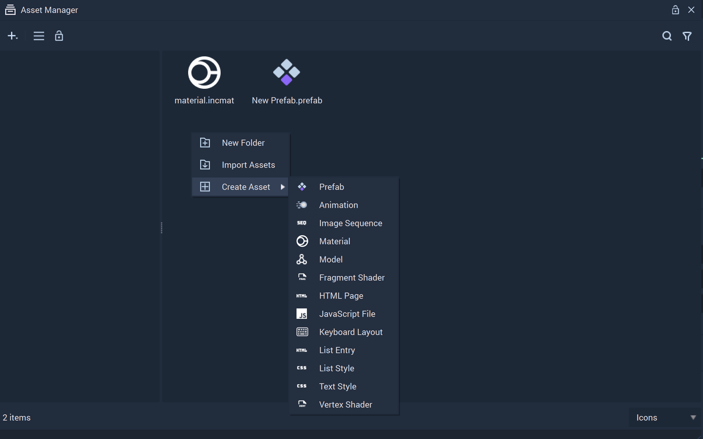
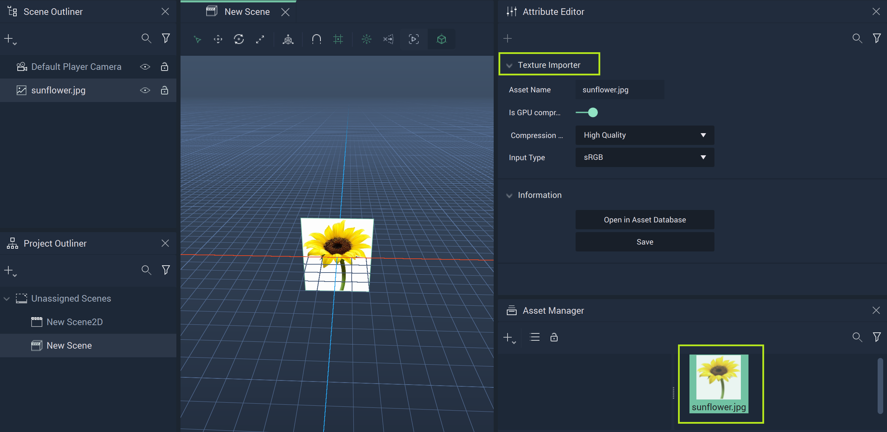

# Asset Manager

## Overview

**Assets** are the files in the **Project Asset** folder. They can be used for creating or modifying **Objects**. The **Asset Manager** shows all the available **Assets** and allows the user to organize, manage, and create them.

## Importing

**Assets** can be imported by clicking on the plus  (4) (4) (4) (4) (4) (4) (4) (1) (1) (1) (1).PNG>) icon at the top left of the **Asset Manager**, selecting `Import Assets`, and finding the files to import to the **Asset Manager**.

## Creating

To create an **Asset**, right-click on the **Asset Manager**, select `Create Asset`, and choose which kind of **Asset** to create.

## Views

The **Asset Manager** offers different views of the files in the **Assets** folder. The general view can be switched on the top left between flat and folder tree view and the files can be seen as either icons or in a list, which is chosen in the bottom right corner.

## Deleting

**Assets** can be deleted in the following ways:

* Right-click the **Asset** and select the `Delete` button from the pop-up.
* Select an **Asset** and press `del`.

## Renaming

**Assets** can be renamed by right-clicking an item and selecting `Rename`. You can then type a new name and press **`⏎`**/`Return` to confirm the change.

## Texture Importer

The **Texture Importer** appears in an **Asset's** **Attribute Editor** when the **Asset** is in use somewhere in the **Project** and the user has clicked on the **Asset** in the **Asset Manager**. 

This is only possible for images (files such as *PNGs*, *JPGs*, etc. ), **Incari** [**Image Sequences**](image-sequence-editor.md), and [**Meshes**](../objects-and-types/scene-objects/mesh.md).

### Images

Images are files that contain only one file type. When `sunflower.jpg` file is used, a new `.ktx` file is created (ex: `sunflower.ktx`) and stored in an `/internal` folder of the **Project**. This folder is not accessible within **Incari Studio**. 

To reiterate, the first generation of the `.ktx` file would be on instantiation, meaning that when it is dragged and dropped into the viewport or put into the reference field of an **Object**, the `.ktx` file is created. This is to significantly speed up the loading time of the **Project** once this conversion is done.

Deleting the `.jgp` also deletes the generated `.ktx` and removes the generated files. 

Overwriting (changes to the file and its **Attributes**) will detect the changed file and regenerate the `.ktx` if it was already generated. This can be something simple, like changing the name of the file. It also could be something a little more high-stakes, like saving a new version of the file over an existing file and replacing it.  

To get the **Texture Importer** to show above, the file `sunflower.jgp` was dragged into `New Scene` and then clicked on in the **Asset Manager**. This shows the many **Attributes**:

* `Asset Name`: The file name of the **Asset**. This cannot be changed within **Incari Studio**.
* `Is GPU compressed (ETC1S)`: Determines if it is in *GPU*-compressed format or not. More on *GPU Compression* in reference to *KTX* can be found [here](https://github.com/KhronosGroup/3D-Formats-Guidelines/blob/main/KTXDeveloperGuide.md#etc1s--basislz-codec).
* `Compression Level`: What type of compression to use. The lower the number, the higher the compression but the lower the quality. This can be `High Quality` (255), `Balanced` (128), or `High Compression` (64).
* `Information`
  * `Open in Asset Database`: Opens the file in the [**Asset Database**](../modules/asset-database.md)
  * `Save`: Lets the user save the new settings applied to the **Asset** in the **Texture Importer**. 

### Image Sequences

### Meshes