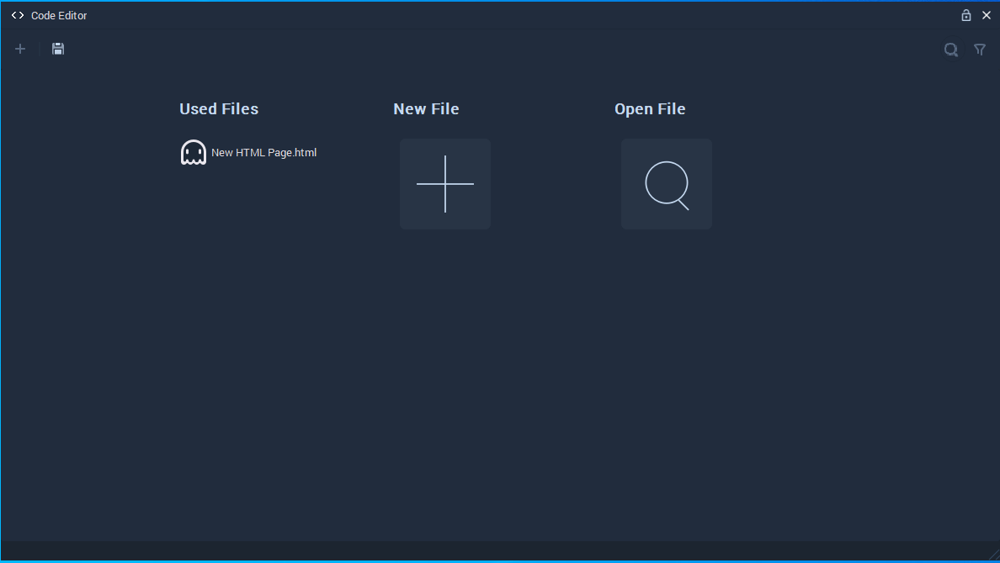
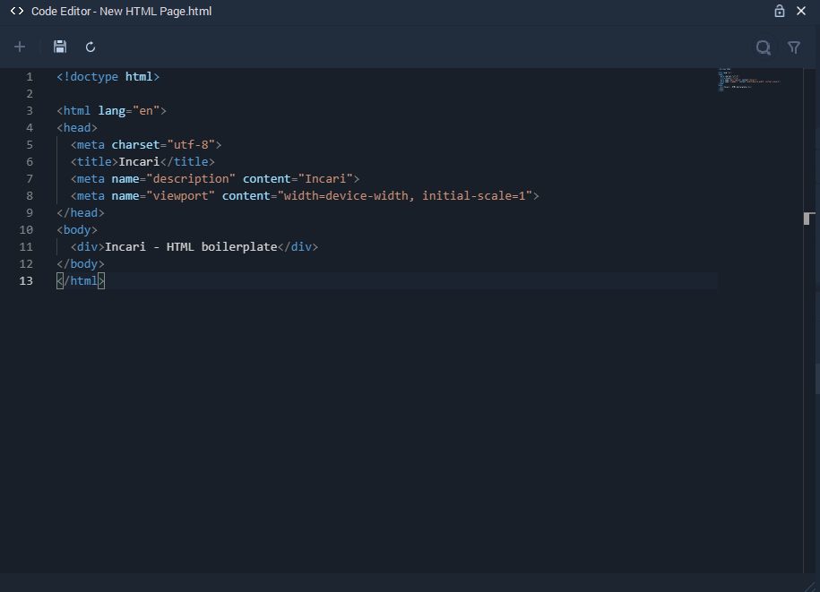

# Code Editor

The **Code Editor** allows to edit the code of HTML, CSS and JS files. The top panel has the options of saving and reloading the file.

When first opened, it offers the options of selecting a file used in the **Scene**, creating a new file, or selecting an existing file from the **Assets** folder.

It can also be opened by directly double clicking an HTML, CSS or JS file.

