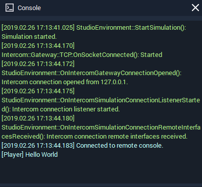

# Console

The **Console** displays all messages regarding the status of the software processes and the messages created by the **Nodes** in the **Logic**.

On the top left, there is the option to clear the **Console**.

