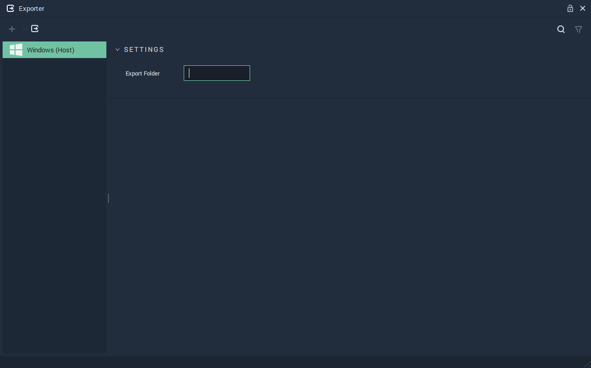

# Exporter

The **Exporter** **Module** allows to export a **Project** to a chosen export folder. Along with exporting the **Project**, **Exporter** creates a copy of _Incari Player_ in the same folder.

After exporting a **Project**, the target folder will have:

* A folder with a copy of _Incari Player_.
* A folder with the exported **Project**.
* A `run.bat` file.

The **Project** can then be started by launching `run.bat`.

It is also possible to export a **Project** from the command line with the command `IncariCLI.exe /p="<project-path>" /export /output="<export-folder-path>"`.

