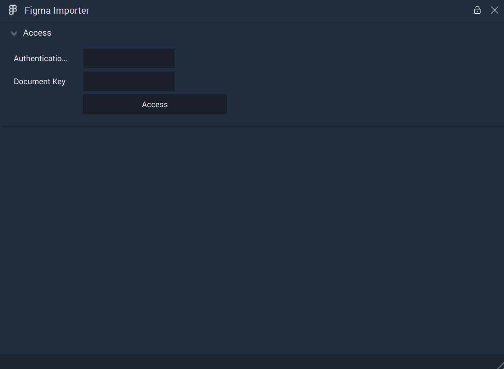
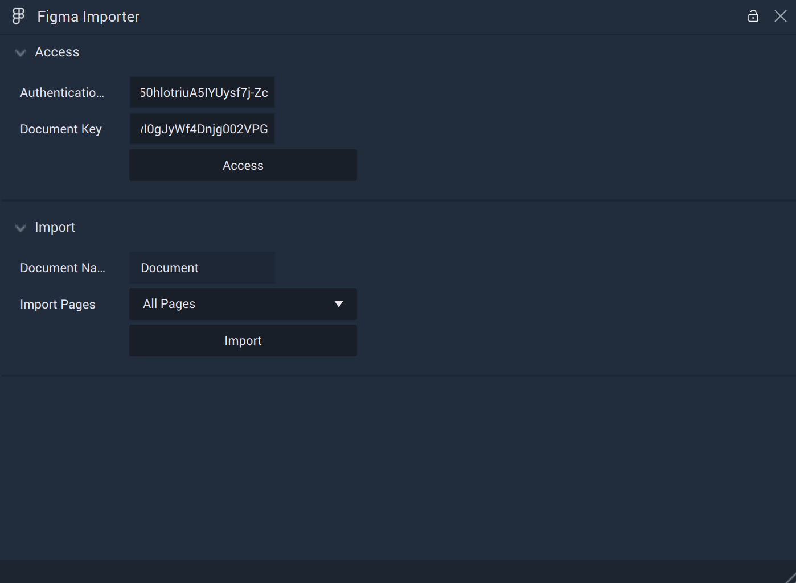
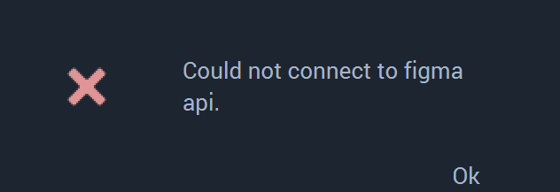
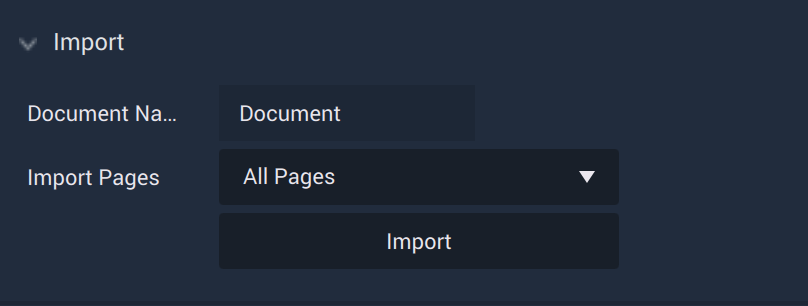
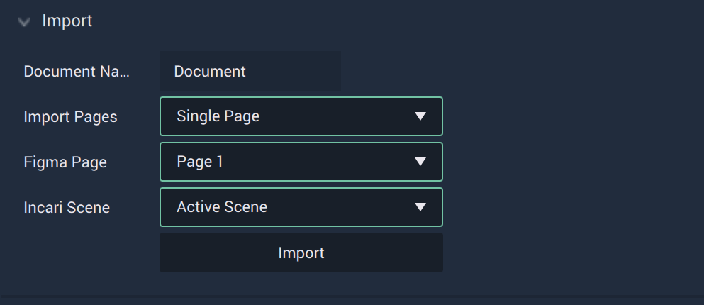
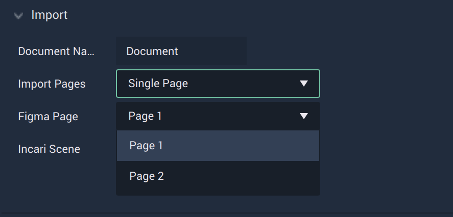
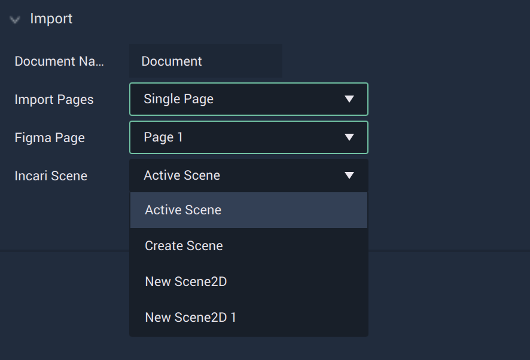

# Figma Importer 

The **Figma Importer** allows the user to import their projects (or parts of their projects) from *Figma* and render them in **Incari Studio** with comparable retention of designs using **Scene2Ds**. As of 2023.2, there are some exceptions to this which are described in greater detail [here](currentlimitations.md).

All *Figma* components are imported as **Prefabs**. More specifically, a component will become a [**Frame**](../../objects-and-types/scene2d-objects/frame.md) and its variants become **Prefabs** under that **Frame**. 

Even if only one page of a *Figma* project is imported, *all* components and their variants from the entire project will be imported into **Incari Studio**. If there are any images in the *Figma* project, the images are added like a normal **Asset** and appear in both the [**Asset Manager**](../../modules/asset-manager.md) and [**Asset Database**](../asset-database.md). 

For nested structures, if a *Figma* component has multiple variants, these variants will be imported as individual **Prefabs**, requiring separate **Logic** for each. This defeats the purpose of **Prefabs** so it is highly suggested to create only one variant per component in *Figma*. This variant would have all possible objects and properties, which the user can cluster into groups if necessary, and will be imported into **Incari** as one **Prefab**. This preserves the structure of the **Prefab**, especially concerning any subsequent **Logic**. 

*Figma* pages are different from **Scenes** in **Incari**. Large *Figma* pages take a long time to render, so it's recommended to split these into multiple pages before importing. It's also highly suggested to flatten any objects used in *Figma* projects so that everything runs smoothly in **Incari**. 

## Access

Before any options for importing can become available, the user must locate the necessary information to access the *Figma* project. These are the `Authentication Token` and the `Document Key`.

The `Authentication Token` can be generated in a *Figma* user's account settings, the process of which is described [here](https://www.figma.com/developers/api#authentication). 

The `Document Key` is located in the *url* of the project, after `file` such as in:

`https://www.figma.com/file/jCFQWXBJWk6LtqsI4wLi4j/project_example_name`

Here, the `Document Key` is `jCFQWXBJWk6LtqsI4wLi4j`

Inputting these two into their respective text boxes will result in the user gaining access. 

In the event that this attempt is unsuccessful, a warning will be given. 

## Import 

There are initially two **Attributes**, `Document Name` and `Import Pages`.  

### All Pages

Selecting `All Pages` will import each *Figma Page* into a new and separate **Scene2D**. For example, if a *Figma* project has two *Pages* called `Page 1` and `Page 2`, this will result in two new **Scene2Ds** in `Unassigned Scenes` in the **Project Outliner** labeled `Page 1` and `Page 2`. 

### Single Page

Selecting `Single Page` will make the `Figma Page` and `Incari Scene` **Attributes** visible. 

`Figma Page` gives a dropdown of all the possible *Figma Pages* available in the accessed *Figma* project. 

`Incari Scene` gives a dropdown of all the possible **Scene2Ds** to import into as well as the options `Active Scene` (the **Scene2D** that is currently open) and `Create Scene` (creates a new **Scene2D** on import). 

If there is not an `Active Scene`, one will be created. If one imports into a **Scene2D** where there is already a populated **Scene2D**, it will override what is currently there (this applies to **Objects** and not to **Logic**). Please note that all references in the **Logic** will break as all **Objects**, except the **Camera** and any **Prefab** instances, are deleted! 

