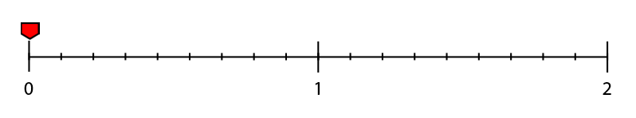
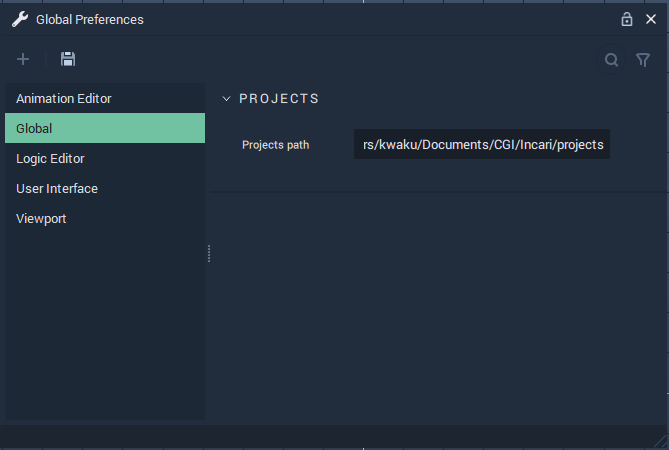
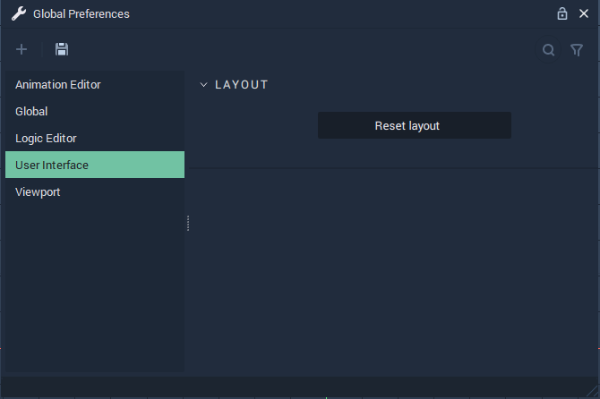
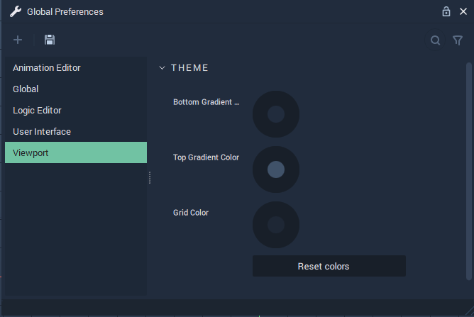
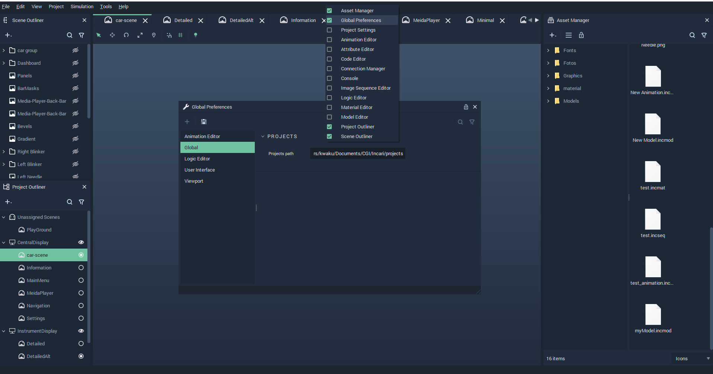

# Global Preferences

**Global Preferences** allow us to apply default settings to aspects of *Incari*. These aspects are discussed below:




## Playback

### Loop Mode

`Loop Mode` determines if an **Animation** should play forward or alternate between playing forward and backward in a **Scene**. It can be set in the following ways:

* `Alternate`: The **Animation** is played forward and backward in each animation cycle.

* `None`: The **Animation** is played forward once in each animation cycle.

* `Repeat`: The **Animation** is played forward in repeated cycles without reversing direction.





## Projects

### Projects Path

The default directory on a user's computer where *Incari* **Projects** are saved.




## Theme

### Grid Color

The `Grid Color` of the **Logic Editor** can be set here. The *color* can be set by manually adjusting the the **HSB** / **RGBA** values or inserting a **Hex Code**, using their corresponding [**Color Attribute**](color-../getting-started/attributes/attribute-types/color-attributes.md).

Additionally, the `Reset color` button sets the `Grid Color` back to its default value.




## Layout

### Reset layout

The `Reset Layout` button resets all **Modules** found in *Incari* to their default positions.




## Theme

### Bottom and Top Gradient Color

`Bottom` and `Top Gradient Color` set a _color gradient_ that starts at the _bottom_ and _top_ positions of the **Viewport**, respectively. The _color gradient_ can be set by manually adjusting the the **HSB** / **RGBA** values or inserting a **Hex Code**, using their corresponding [**Color Attribute**](color-../getting-started/attributes/attribute-types/color-attributes.md).

### Grid Color

`Grid Color` sets the color of the _grid_ found in the **Viewport**. The *color* is set in the same way as the `Bottom` and `Top Gradient Color` **Attributes**.

`Reset colors` sets the `Bottom` and `Top Gradient Color` as well as the `Grid Color` of the **Viewport** back to their default *colors*.



In order to open the **Global Preferences** **Module**, _right-click_ on the _menu bar_ in *Incari* and _click_ on **Global Preferences** from the drop-down list. Please see the illustration below:

