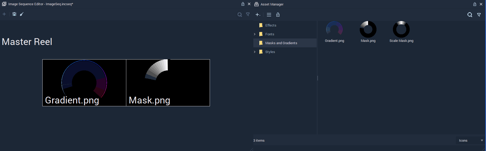
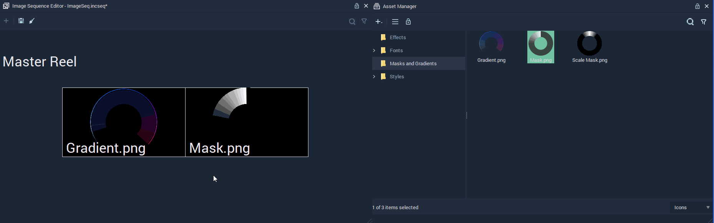

# Image Sequence Editor

## Overview

The **Image Sequence Editor** allows to create and edit **Image Sequences**, which have the extension `.incseq` in the **Asset Manager**.

To open the **Image Sequence Editor**, either open it from `View` in the top panel of _Incari_, _right-click_ on the _Menu bar_ in _Incari_ and _click_ on **Image Sequence Editor** from the drop-down list, or simply double click on the **Image Sequence** to edit in the **Asset Manager**.

Once an **Image Sequence** is open in the **Image Sequence Editor**, images can be added or removed from the sequence and their order can be changed.

The top panel gives the options to save or clear the **Image Sequence**.

## Adding

To add an image to the **Image Sequence**, drag it from the **Asset Manager**.

## Removing

To remove an image from the sequence, select it and either right-click it and choose `delete` or press `del`.

## Changing Order

To move an image within the sequence, drag it and drop it in the desired position.

## See Also

* [**ImageSequence Nodes**](../toolbox/incari/imagesequence/)
* [**4 Methods of Animation - Image Sequence**](https://github.com/cgi-studio-gmbh/incari-doc/tree/04f5eb486773debf7252a51f0cbc18a7ef29df51/demo-projects/4-methods-of-animation.md#3-image-sequence)

