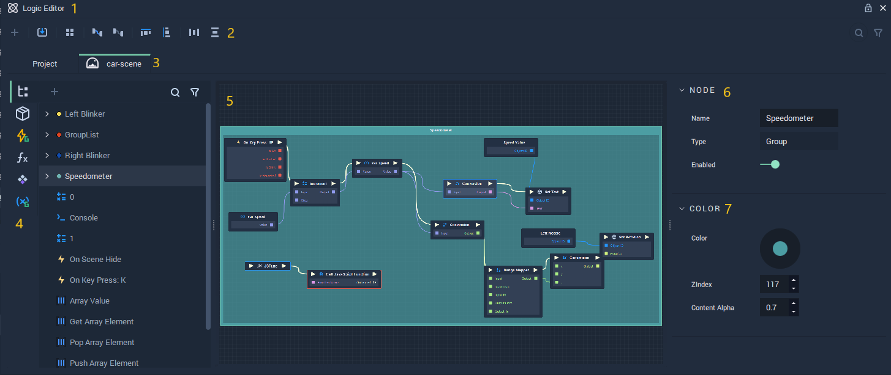
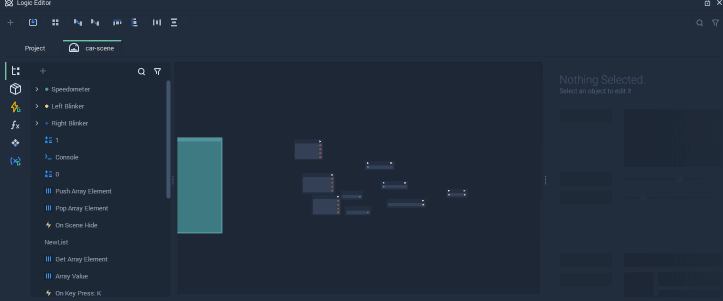
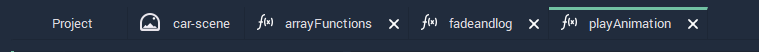
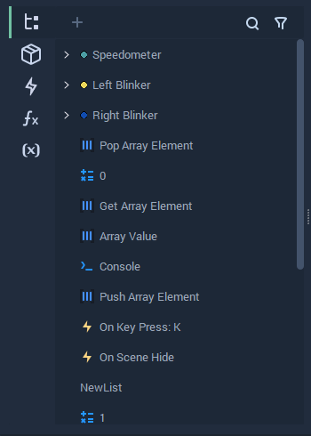
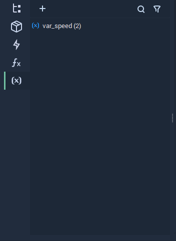
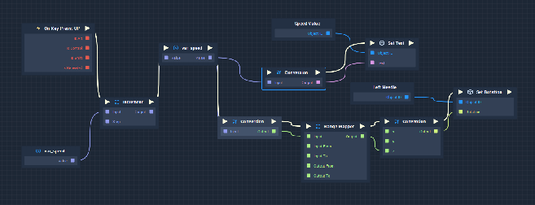
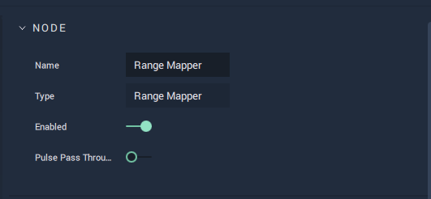
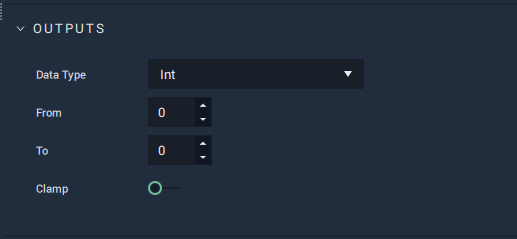
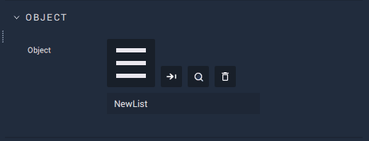
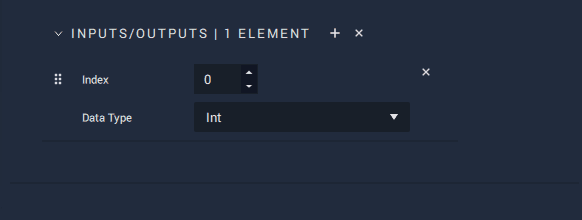

# Logic Editor

**Logic** in **Incari** is what allows us to take our **2D/3D** **Assets** and turn them into fully interactive *User* *Interfaces*. Traditionally, building this kind of complex system was only achievable by writing _a lot_ of code. However, by utilizing **Incari's** powerful visual scripting tools, we can build these systems without writing a single line. This section introduces you to some of the core concepts and terminologies of **Incari's** **Logic Editor**.

## 1 - Logic Editor Window

**Logic Editor** - The main window which contains all things **Logic**-related. It is compartmentalized into several different sections discussed below.

## 2 - Toolbar

The **Toolbar** shows a list of icons that are used to visualize certain features in the **Logic Graph**. Definitions of the icons are as follows:

 The **Import blueprint** icon allows you to import a **Logic Graph** saved on your computer into the **Logic Editor**.

 The **Group** icon clusters **Logic Graphs** into distinct groupings. See a usage example below:

 The **Highlight** icon applies a distinct color to sections of a **Logic Graph** that are connected together. **Remove highlight** reverses the action performed by clicking the **Highlight** icon. See a usage example below:

 The **Align horizontally** and **Align vertically** icons will align a **Node Graph** horizontally and vertically, respectively, in the **Logic Editor**. See a usage example below:

 The **Arrange horizontally** and **Arrange vertically** icons will arrange a **Node Graph** horizontally and vertically, respectively, in the **Logic Editor**. See a usage example below:

## 3 - Top Panel

The top panel represents **Logic Graphs** that are implemented for different **Incari** items, such as the current opened **Project**, the selected **Scene** in the **Project Outliner**, and **Functions** added to the **Logic Editor**. Each **Logic Graph** can be accessed by using the tabs on the top panel.

## 4 - Left Panel

The left panel contains **Nodes** that can be added to the **Logic Editor** and is divided into five sections. These are **Explorer**, **Toolbox**, **Events**, **Functions**, and **Variables**.

Each section is described below:




All **Nodes** and **Groups** that are added to the **Logic Graph** will be listed in this section. When an item is picked in this section, the corresponding **Node** is selected in the **Logic Graph**.




The **Toolbox** contains all of the individual tools you will need to create your **Logic**. The function and purpose of all **Nodes** are covered in depth in the **Toolbox** section and it is _highly_ recommended that you refer to it to understand how each **Node** functions. In short, the **Toolbox** contains a categorized list of all **Nodes** available at your disposal, which can be added to your **Logic** by double-clicking or dragging and dropping an item into your **Logic Graph**.




An **Event** **Node** can be added to the **Events** tab by clicking on the add icon  located at the top of the panel, then the desired name for the **Event Node** is inserted. You can add the **Event Node** to your **Logic** by dragging and dropping it into your **Logic Graph**. The illustration below describes briefly how **Events** are created in the **Logic Editor**. For a detailed introduction to **Events**, please see [toolbox/events](../toolbox/events/).





Custom-built **Node Graphs** can be packaged as a **Function** and added to your **Scene** **Logic** in a modular manner. To add a **Function** to the **Functions** tab, click on the add icon  located at the top of the panel and type in the desired name of the **Function**. The illustration below describes briefly how **Functions** are created in the **Logic** **Editor**. For a detailed discussion of **Functions**, please see [toolbox/functions](../toolbox/functions/).





The **Variables** tab allows us to add **Variables** to the **Logic Editor**. To add a **Variable** to your **Logic Graph**, click on the add icon  located at the top of the panel and type in the desired **Variable** name. The illustration below describes briefly how **Variables** are created in the **Logic Editor**. For a detailed discussion of **Variables**, please see [toolbox/variables](../toolbox/events/variables/).




## 5 - The Logic Graph / Node Graph

This is the most important section of the **Logic Editor**. If the **Nodes** and **Variables** are the paints and materials at your disposal, then the **Logic Graph** is the canvas. This is where we build our systems from the ground up and where you will spend most of your time while using **Incari**.

Fundamentally, it is comprised of a combination of two entities: **Nodes** and **Connections**.

### **Nodes**

**Nodes** are components that each have a specific, singular function. The majority of **Nodes** evaluate data values based on input parameters, but they can also represent **Variables**, **Events**, and **Objects**.

#### Sockets

**Sockets** are like the ports on an electronic device. Along with **Connections**, they allow us to link **Nodes** to each other. In **Incari**, **Sockets** are either:

* **Input** \(receiving an instruction or data value\). **Sockets** on the left-hand side of a **Node** are **Input Sockets.**
* **Output** \(sending an instruction or data value\). **Sockets** on the right-hand side of a **Node** are **Output Sockets**.

Beyond that, we have **Pulse** and **Data Sockets** denoted by white triangles \(►\) and colored squares \(■\), respectively. For example, when we refer to an "Input Pulse Socket", we are normally referring to the white triangle in the top-left-hand side of a **Node**.

The concept of **Sockets** makes much more sense in the context of **Connections**.

#### **Connections**

**Connections** are the "wires" that link our components together. This is how we pass data between **Nodes** and how we determine the execution order of our **Logic**. **Connections** come in two categories and are related to the type of **Socket** they are plugged into. The two categories are **Pulse** and **Data**.

#### Pulse

These **Connections** do not carry any data between **Nodes**. What they _do_ is tell **Nodes** that it is time for them to execute. Once a **Node** has finished its execution and its purpose has been fulfilled, the next **Node** connected via the **Pulse Connection** will then begin _its_ task. **Pulse Connections** are represented by a white "wire" linking two **Pulse Sockets**, represented by white triangles \(►\). Multiple **Connections** can be plugged into a single **Pulse Input Socket**, however only one **Connection** can come out of a **Pulse Output Socket**. **Pulse Connections** are also referred to as **Pulses**.

#### Data

These **Connections** pass data values between **Nodes**. We do this by connecting the **Data Output Socket** of one **Node** into a **Data Input Socket** of another **Node**. Both the input and output **Sockets** must be of the same **Data Type**. **Data Sockets** are represented by a colored square \(⬛\), the color of which corresponds to the **Data Type**. Conversely to **Pulse Connections**, **Data Input Sockets** can take only one **Input Connection**, whereas **Data Output Sockets** can have multiple **Output Connections**. Unlike **Pulse Connections**, **Data Connections** do not initiate the execution of a **Node**.

## 6 & 7 - Node Attribute Editor

The **Node Attribute Editor** \(referred to simply as **Editor** from here on\) is similar to the **Attribute Editor**, except rather than adjusting the **Attributes** of **Objects**, we can adjust the **Attributes** of **Nodes**. **Node Attributes** are specific to that particular **Node** and are documented in their corresponding entry in the **Toolbox** section. Oftentimes, **Node** **Attributes** are simply an alternative to using **Input Connections** and can define a default value if there is no **Connection** attached to that particular **Input Socket**. There are exceptions, however, where **Attributes** can be set only in the **Editor** and there is no equivalent **Socket** available. These are discussed below in the **Node-Specific Attributes** section.

### General Attributes

Coming under the "Node" heading of the **Editor**, these **Attributes** are available on nearly all **Nodes** and can only be set in the **Editor**.

All **Nodes** have the following **Attributes**:

* `Name` - The name of the **Node**. This isn't editable unless it is a **Function**.
* `Type` - The type of **Node**. This isn't editable and will often be the same as the name, unless the **Node** represents something which the user defines, like **Functions**, **Variables**, and **Objects**.
* `Enabled` - Allows the entire **Node** to be ignored by enabling/disabling it. This is useful when you want to test and debug a specific part of your **Logic**, as you can disable entire **Node Trees** temporarily. All subsequent **Nodes** linked via **Pulse Connections** _will not_ be executed.

Most **Nodes** also have an additional **Attribute**:

* `Pulse Pass Through` - Similar to the `Enabled` **Attribute** above, it disables the evaluation of a **Node**. The difference with this option, however, is that subsequent **Nodes** linked via **Pulse Connections** _will_ be executed. This is useful when you only want to disable part of a **Node Tree**, rather than the entire thing.

### Node-Specific Attributes

As stated above, most **Node Attributes** are an alternative to **Data Input Connections** and allow us to set default values, in the absence of such a **Connection**. There are cases, though, where **Attributes** can only be set in the **Editor**, which modifies the way that the **Node** functions.

#### Data Types

Some **Nodes** work with different **Data Types**. However, these need to be explicitly defined in the **Editor**, so that the **Node** knows which **Type** it will receive \(**Input**\) and/or the **Type** of data it will return \(**Output**\). Where multiple **Data Types** are available, there will be a drop-down Menu in the **Editor**. Changing the **Type** will also change the color of the corresponding **Socket**.

#### Linked Objects

Some **Node Attributes** correspond to something outside of the **Logic Editor**, such as a **Scene**, **Screen**, **Object**, **Text Object**, or **File**. In this case, you will see a small square, which will either have a thumbnail, related to that **Type** of **File** or **Object**, or the text "drag here". To assign something to the **Attribute**, simply drag and drop it onto the square.

#### Adding Removing Sockets

There are a few **Nodes** in **Incari** that allow you to customize the number of **Input**/**Output Sockets**. The purpose for this is very specific to that particular **Node**, but the process of adding/removing parameters is the same.

By clicking the plus button \(**+**\) you can add additional elements, which will be added to the bottom of the list.

By clicking the cross button \(**x**\) you can remove elements. If you click the cross on the list _header_, it will remove _all_ of the elements, whereas if you click the cross on a list _item_, you only remove that _single_ element.

You can also rearrange the order of the elements by clicking and dragging elements using the rearrange button \(**⠿**\).

