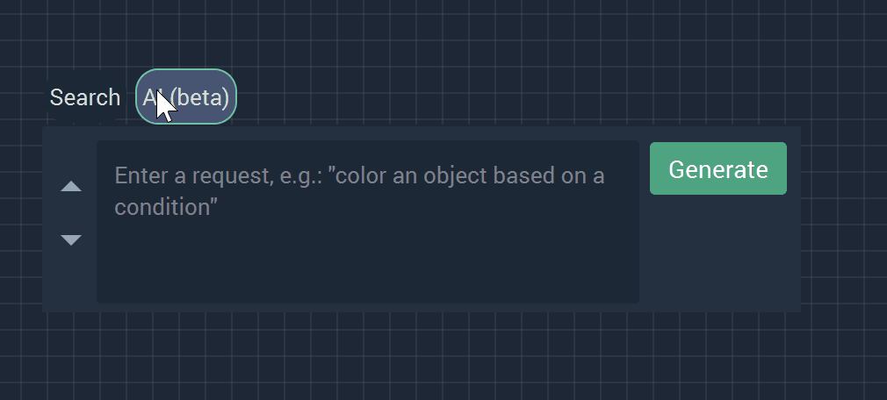
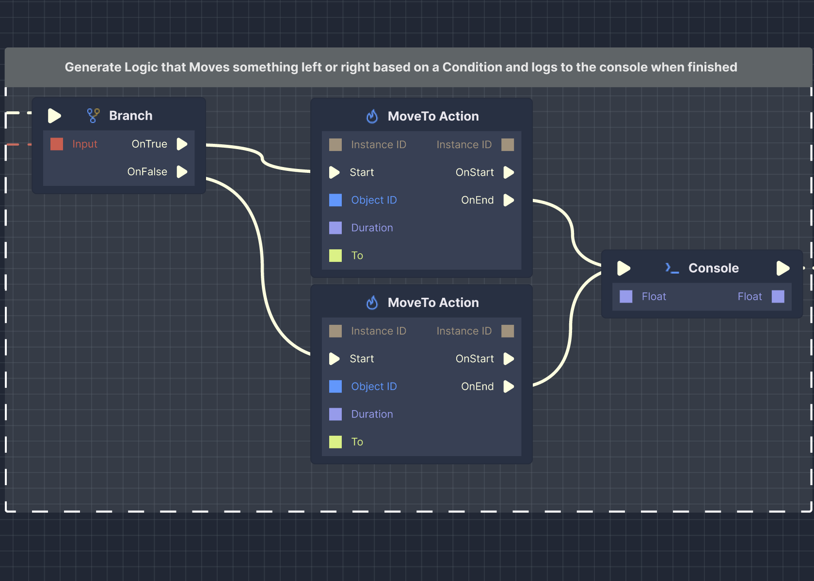
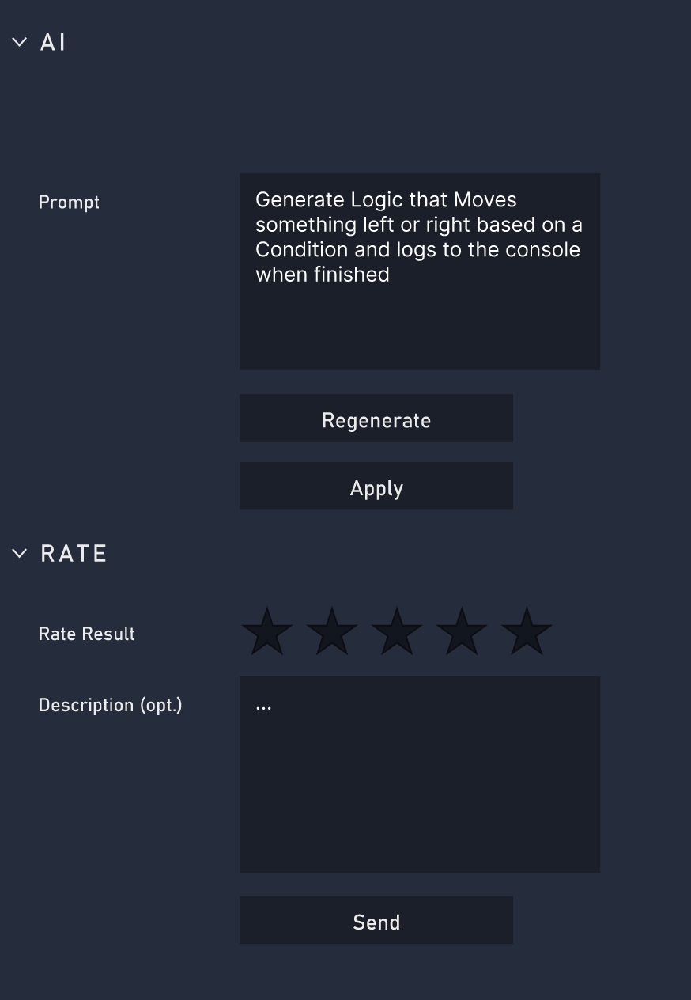
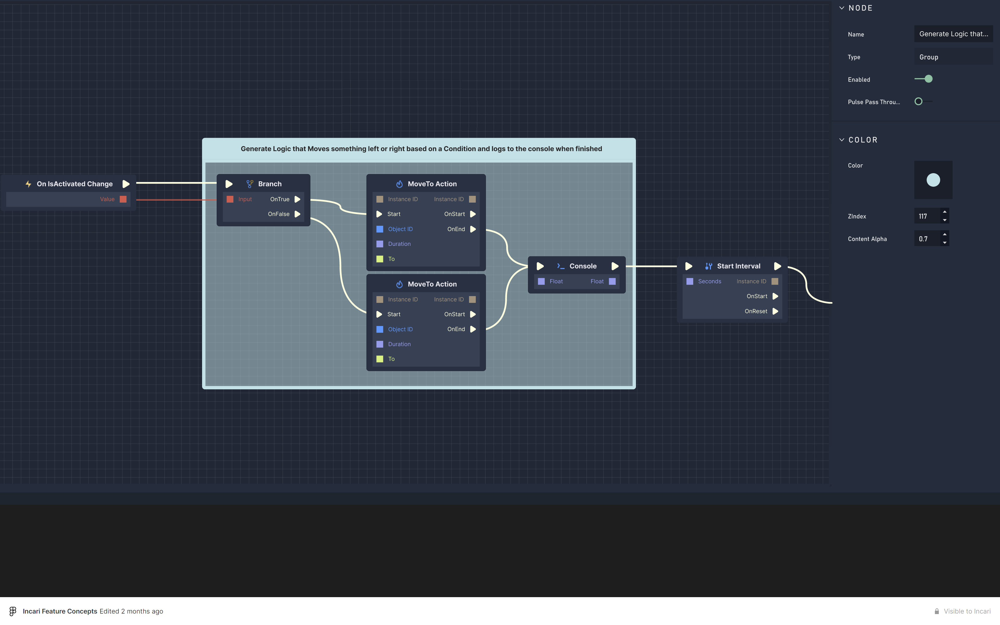

# AI Logic Generation

The **Logic Editor's** **AI Generator** may be in *beta*, but it still offers to transform the user's workflow. 

## Open

There are several ways to open the `AI (beta)` section of the **Logic Editor**:

* Right-clicking in the **Logic Editor** and selecting `AI (beta)`.
* Right-clicking and scrolling up (one can switch between `Search` and `AI (beta)` in this manner as well).
* Right-clicking and using the right arrow.
* Pressing `Tab` and selecting, scrolling, or pressing the right arrow. 
* Pressing `Shift + Tab`.
* Pressing `Shift + Right Click`

## Use

Once the user has successfully accessed `AI (beta)`, all they need to do is type their request into the prompt box and click `Generate`.

This will result in an **AI Logic Group** and some associated **Attributes**. 

The above image shows **Logic Branches** made up of four **Nodes** which were created based on the example prompt. 

It is possible to remove **Nodes** from the **AI Logic Group** if desired or rewire their configuration. This allows the user further flexibility and creativity. 

## Attributes

The main **Attributes** fall under the `AI` and `Rate` categories.

With `AI`, the user can see the prompt they inputted previously. `Reconfigure` generates a different **AI Logic Group** if the user was not initially satisfied with the original result. It is also possible to update the prompt in order to add or remove information.

When the user is finally pleased with the outcome, they can click `Apply`, which confirms the **AI Logic Group**, removes the dashed lines around it, and turns it into a regular **Logic Group**.

Under `Rate`, the user can give a rating for the result they are given. This helps our team at **Incari** pinpoint weak spots and improve the **AI Generator** for all users. Specific feedback can be given in the `Description` box. Simply click `Send` to submit.  

# Result 

Once the user clicks `Apply`, the **AI Logic Group** is confirmed and turned into a regular ** Logic Group**. 

Here, the user can change the color of the **Group**, its `Zindex`, and `Content Alpha`. 

