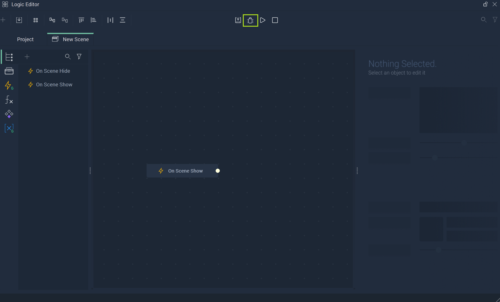
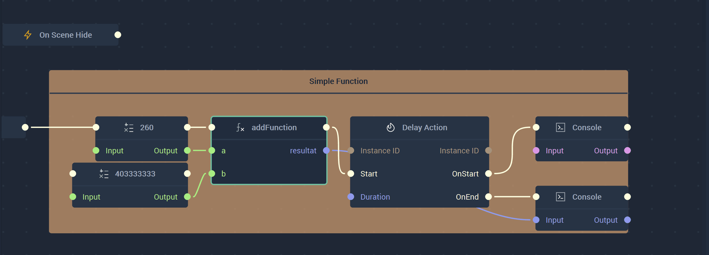
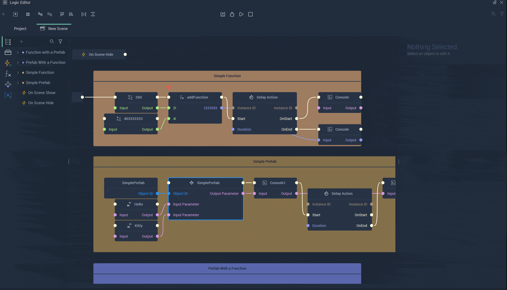

Debugging in **Incari** allows the user to follow the path of their **Logic's** execution. This not only connects **Incari Studio** with **Incari Player** in a visual way, but can show all evaluated values as each **Node** is stepped through.  

## Debug Simulation

To enter **Debug Simulation**, simply locate the icon at the top of the **Logic Editor**. The image below references this with the green square. It is to the left of the normal **Play** icon, which would simply start the simulation and open the **Player** without providing the debugging features. 

### Debug Toolbar

Once **Debug Simulation** has been selected, a new toolbar will appear. This is the **Debug Toolbar** and it has several useful icons which allow the user to maximize their debugging experience in **Incari**. 

The icons from left to right are: `Pause/Resume Simulation`, `Call next node`, `Step into a function or prefab`, `Step out of a function or prefab`, and `Focus on error`. 

* `Pause/Resume Simulation` allows the user to pause and play the debugging visualization. 
* `Call next node` is very useful. When the simulation has been paused in some way, or stopped by a [**Breakpoint**](logic-debugging.md#breakpoints), the user can use the `Call next node` to continue through the flow of execution. When a **Node** has been evaluated completely, a horizonal line will flash brightly beneath its name. When a **Node** is currently being inspected, a pale horizontal line will be displayed constantly. 
* `Step into a function or prefab` can only be used on **Function** and **Prefab** **Nodes**. This lets the user access the **Function** or **Prefab** **Logic** represented by their **Nodes** in the **Scene Logic**. The debugging simulation will continue in a separate tab of the **Logic Editor** and the user can inspect any issues related to **Functions** or **Prefabs**.
* `Step out of a function or prefab` exits the **Function** or **Prefab Logic** during the debugging simulation and returns to the **Scene Logic**. 
* `Focus on error` highlights the error by navigating to the broken **Node** and centering it in the **Logic Editor's** view. 

With these features, the user has heightened control over the debugging process. 

### Flow of Execution

The user can see the flow of the debugging simulation by following the dot that passes along the connections between **Nodes**. This can be controlled with the processes maintained by the **Debug Toolbar**, which are described in the section above. 

#### Breakpoints

The flow can be manually stopped by setting **Breakpoints**. Simply right-click the **Node** that the flow of execution should be stopped at (i.e., will not continue into or past this **Node**), and select `Set Breakpoint`. This will add a red triangle just before the start of the **Node**. Alternatively, it can also be removed by doing the same thing once a **Breakpoint** has been set, and selecting `Remove Breakpoint`. 

#### Show Values

In **Debug Simulation**, it is possible to have a **Node's** values displayed during the flow of execution. Please note that this is not possible outside of **Debug Simulation** and the values will only appear once that part of the **Node** has been evaluated. This means that output values will only show once the flow is ready to move onto the next **Node**. 

#### Example with Stepping into and out of a Function 

To better understand the possibilities of the **Debug Simulation**, an example incorporating a **Function** is displayed below:

