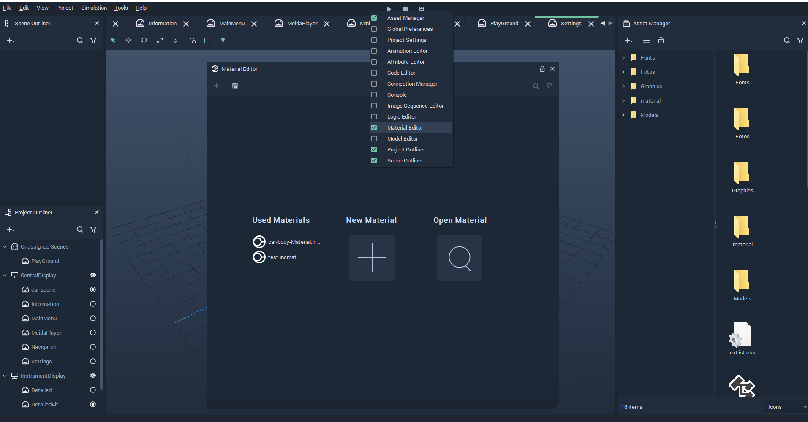
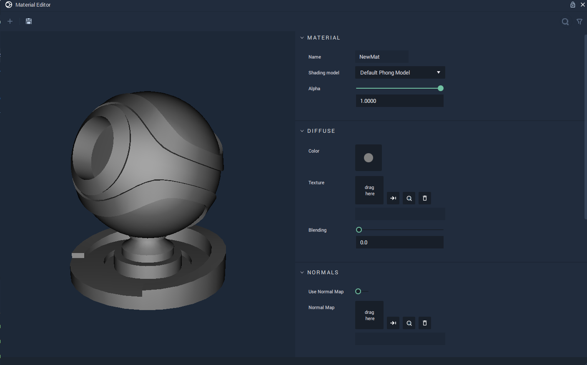
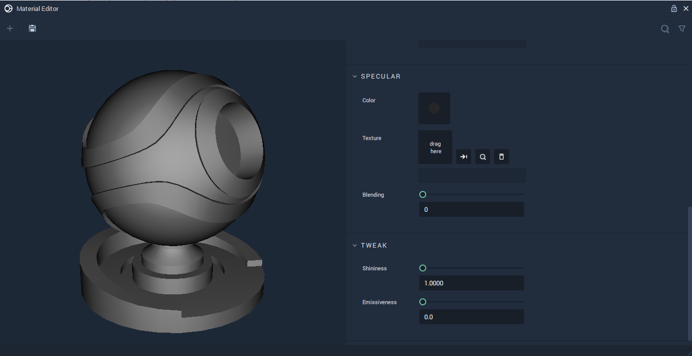

# Material Editor

The **Material Editor** allows us to create a **Material** that gives a **Mesh** a specific visual appearance when it comes into contact with **Light** in a **Scene**. The **Material** files have a _.incmat_ as their filename extension.

To open the **Material Editor**, _double-click_ on a **Material** file in the **Asset Manager** or _right-click_ on the _Menu bar_ in *Incari* and _click_ on **Material Editor** from the drop-down list. This can be seen in the illustration below:

The sections defined in the **Material Editor** are discussed below:

Note: These sections will not be opened if a **Material** file has already been opened in the **Material Editor**.

The `Used Materials` section has **Materials** that have been previously applied to a **Mesh** in a **Scene**. These **Materials** can be edited by _clicking_ on them.

`New Material`, as its name suggests, allows us to create new **Materials**. The illustration below depicts its behavior when _clicked_.

`Open Material` opens a window that allows us to select an existing **Material** file. An example of the window is shown below: 

Once a **Material** has been opened, the **Material** **Editor** allows the user to edit the **Material's** **Attributes**, as shown in the images below. Along with ways to edit **Shadow** and **Texture**, *Incari* now supports the use of *normal mapping* with the `Normal Maps` **Attribute**. This allows the user to upload a **Normal Map** file that, when applied, can improve the detail and complexity of a 3D object which is made up of a low number of polygons (simply put, less complex). This also helps streamline the rendering process. With this type of texture mapping, **3D Objects** in *Incari* can be just as detailed as complicated ones, while being more efficient. 

## See Also

* [**Mesh**](../getting-started/scene-objects/mesh.md)

# External Links

* More on [*normal mapping*](https://en.wikipedia.org/wiki/Normal_mapping) on Wikipedia.