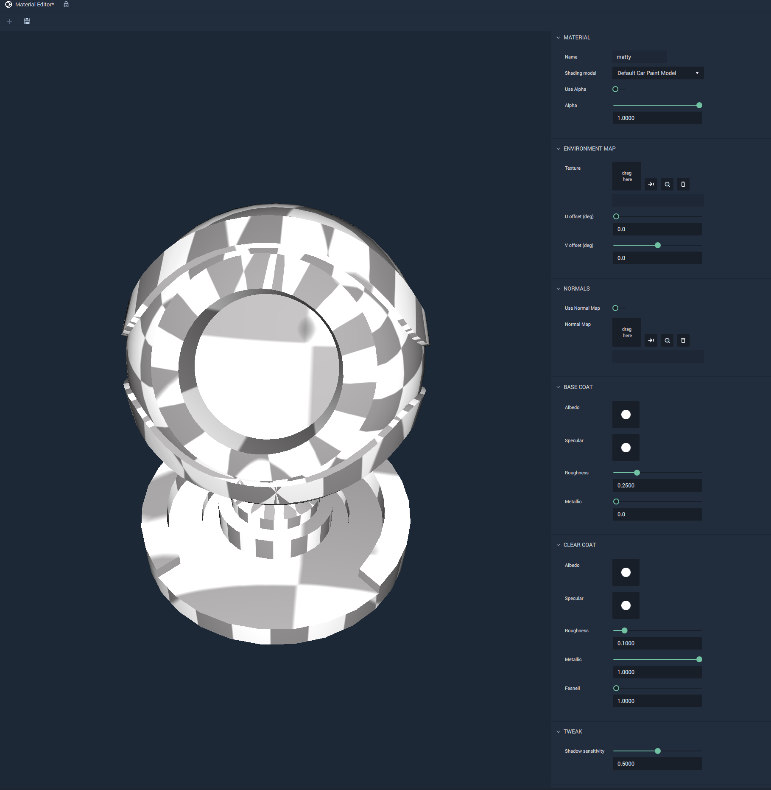
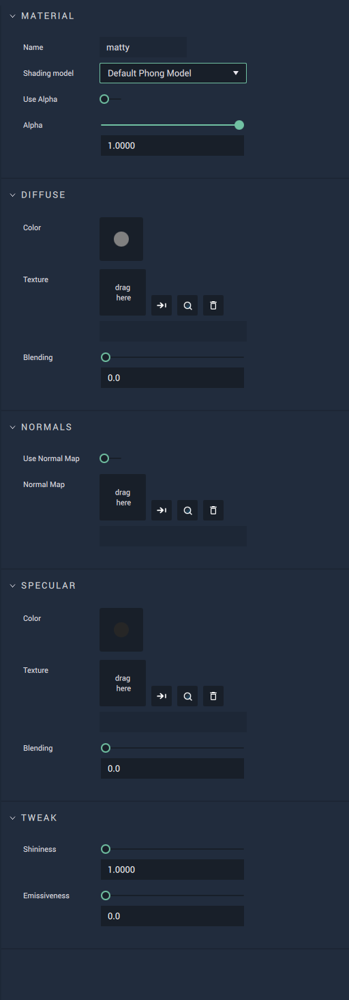
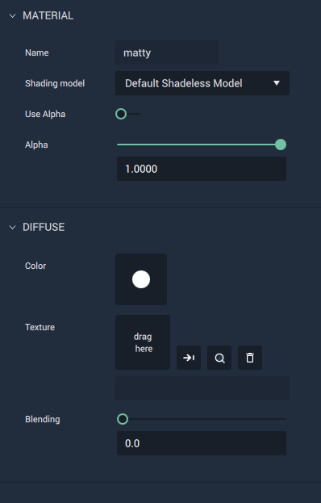

# Material Editor

The **Material Editor** allows us to create a **Material** that gives a **Mesh** a specific visual appearance when it comes into contact with **Light** in a **Scene**. The **Material** files have an `.incmat` as their filename extension.

To open the **Material Editor**, double-click on a **Material** file in the **Asset Manager** or right-click on the Menu bar in **Incari** and click on **Material Editor** from the drop-down list. This can be seen in the illustration below:

The sections defined in the **Material Editor** are discussed below:

Note: These sections will not be opened if a **Material** file has already been opened in the **Material Editor**.

The `Used Materials` section has **Materials** that have been previously applied to a **Mesh** in a **Scene**. These **Materials** can be edited by clicking on them.

`New Material`, as its name suggests, allows us to create new **Materials**. The illustration below depicts its behavior when clicked.

`Open Material` opens a window that allows us to select an existing **Material** file. An example of the window is shown below:

Once a **Material** has been opened, the **Material** **Editor** allows the user to edit the **Material's** **Attributes**, as shown in the images below.  <!-- Along with ways to edit **Shadow** and **Texture**, **Incari** now supports the use of _normal mapping_ with the `Normal Maps` **Attribute**. This allows the user to upload a **Normal Map** file that, when applied, can improve the detail and complexity of a **Mesh** which is made up of a low number of polygons \(simply put, less complex\). This also helps streamline the rendering process. With this type of texture mapping, **Meshes** in **Incari** will seem as detailed as complicated ones, while being more efficient. !-->

<!--

 !-->

There are several **Shading** **Models** available to edit when creating a new **Material**.

## Default Car Paint Model 

This model represents a material that provides the visual qualities to a car's paint job. It allows for selecting and editing environment and normal mapping, base coat color and roughness, clear coat color and roughness, as well as metallicness and shadow sensitivity.

## Default Phong Model 

This model represents the standard Phong model, characterized by a shiny surface marked by pinpointed highlights. It allows for selecting and editing diffuse or specular color, texture, and blending; normal mapping; as well as tweaking shininess and emissiveness.

## Default Glass Model

This model represents materials with a glass-like quality. It allows for selecting and editing environment and normal mapping; base texture, color, and blending; reflection color, roughness, and fresnel; as well as tweaking shadow sensitivity. 

## Default ExtendendedPBR Model

This model offers more attributes than the **Default PBR Model**. It allows for selecting and editing environment and normal mapping; albedo texture, color, and blending; specular color; as well as several aspects of occlusion metallic roughness.

## Default PBR Model

This model represents a material that provides a more realistic quality to objects, using physically based rendering. It allows for selecting and editing environment and normal mapping; albedo texture, color, and blending; specular color; as well as tweaking metalicness, shadow senstivity, and roughness. 

## Default Shadeless Model 

This model represents a material which displays a solid color and offers no response to light placement. It is rather simple, only allowing for selecting and editing diffuse color, texture, and blending. 

### See Also

* [**Mesh**](../getting-started/scene-objects/mesh.md)

## External Links

* More on [_normal mapping_](https://en.wikipedia.org/wiki/Normal_mapping) on Wikipedia.

