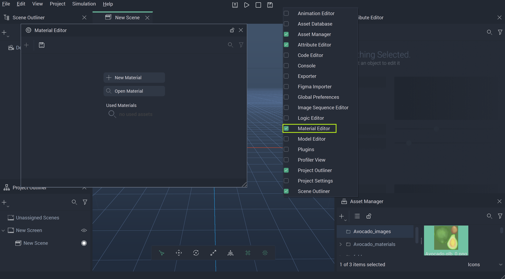
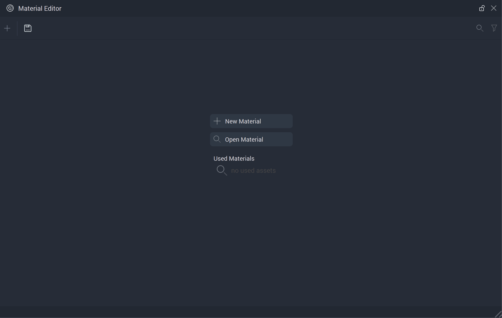
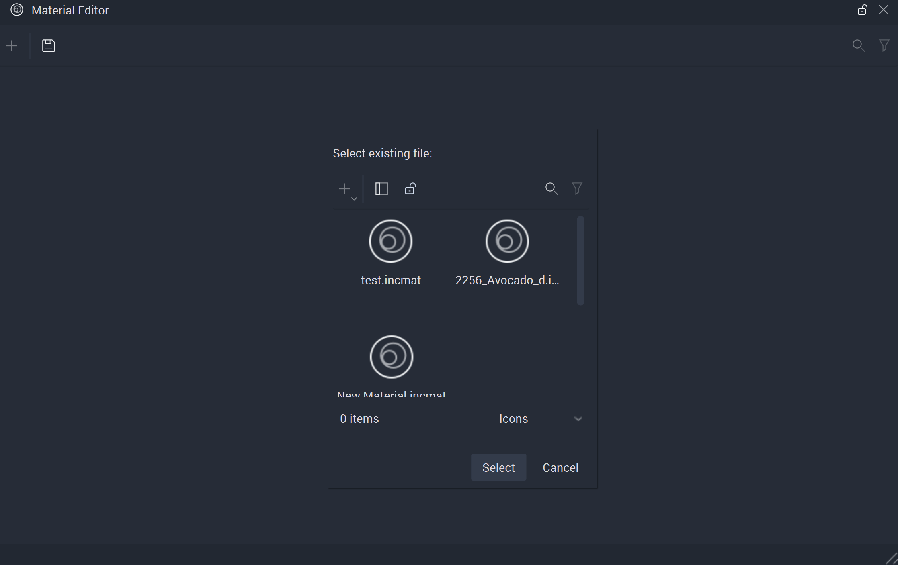
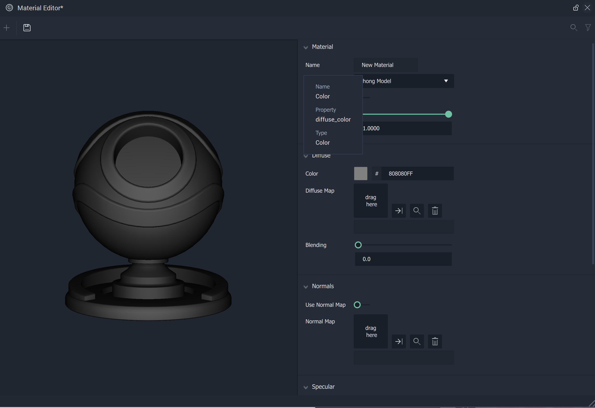
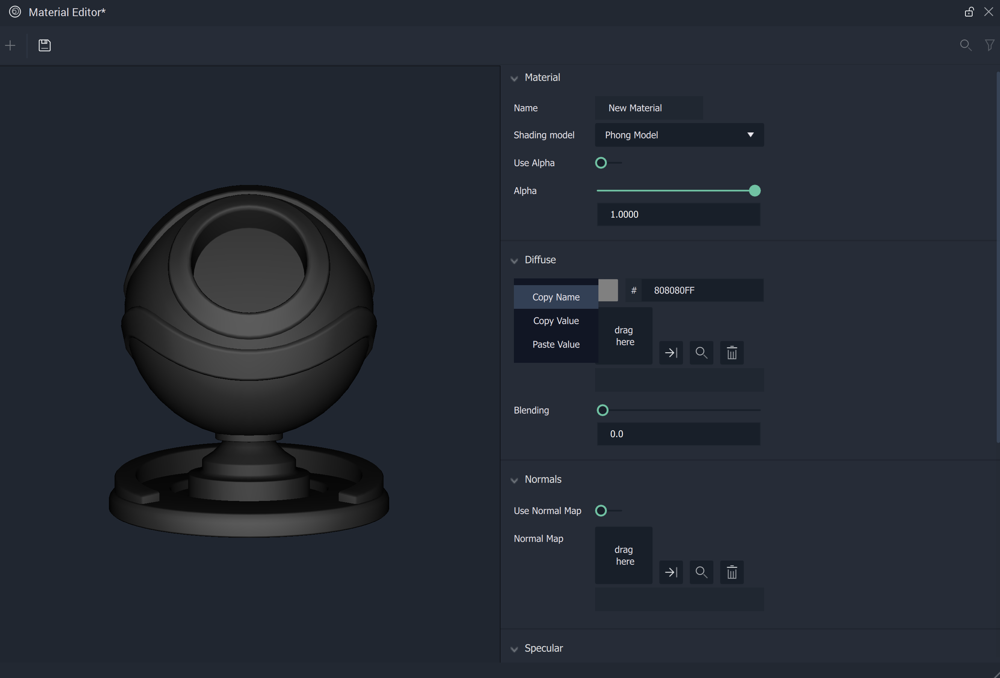

# Material Editor

The **Material Editor** allows us to create a **Material** that gives a **Mesh** a specific visual appearance when it comes into contact with **Light** in a **Scene**. The **Material** files have `.incmat` as their filename extension.

To open the **Material Editor**, double-click on a **Material** file in the **Asset Manager** or right-click on the Menu bar and click on **Material Editor** from the drop-down list. The latter option can be seen in the illustration below:

The sections defined in the **Material Editor** are discussed below. They will not be displayed in the **Material Editor** if a **Material** file has already been opened. 

The `Used Materials` section has **Materials** that have been previously applied to a **Mesh** in a **Scene**. These **Materials** can be edited by clicking on them.

`New Material`, as its name suggests, allows us to create new **Materials**. The illustration below depicts its behavior when clicked.

`Open Material` opens a window that allows us to select an existing **Material** file. An example of the window is shown below:

Once a **Material** has been opened, the **Material** **Editor** allows the user to edit the **Material's** **Attributes**. 

There are several **Shading** **Models** available to choose from when creating a new **Material**. The following sections give a brief description of each and list their available **Attributes**:

* [**Car Paint Model**](car-paint-model.md)
* [**Custom Shading Model**](customshadingmodel.md)
* [**Phong Model**](phong-model.md)
* [**Glass Model**](glass-model.md)
* [**Extended PBR Model**](extended-pbr-model.md)
* [**PBR Model**](pbr-model.md)
* [**Shadeless Model**](shadeless-model.md)

In each of these **Models**, it is possible to hover over each **Attribute** with the cursor and see their property names. Below, one can see the property name `diffuse_color` for the `Color` **Attribute** of a **Phong Model**.

These can then be copied and pasted by right-clicking on them, selecting either property `Name` or `Value`, and pasting where needed. This is particularly useful for accessing the names for the [**Set Material Property**](../../toolbox/incari/material/setmaterialproperty.md) and [**Get Material Property**](../../toolbox/incari/material/getmaterialproperty.md) **Nodes**.

<!-- Along with ways to edit **Shadow** and **Texture**, **Incari** now supports the use of _normal mapping_ with the `Normal Maps` **Attribute**. This allows the user to upload a **Normal Map** file that, when applied, can improve the detail and complexity of a **Mesh** which is made up of a low number of polygons \(simply put, less complex\). This also helps streamline the rendering process. With this type of texture mapping, **Meshes** in **Incari** will seem as detailed as complicated ones, while being more efficient. !-->

<!--

 !-->

## See Also

* [**Mesh**](../objects-and-types/scene-objects/mesh.md)

## External Links

* More on [_Normal Mapping_](https://en.wikipedia.org/wiki/Normal_mapping) on Wikipedia.
* More on [*Environment Mapping*](https://en.wikipedia.org/wiki/Reflection_mapping) on Wikipedia. 
* More on [*Specular Reflection*](https://en.wikipedia.org/wiki/Specular_reflection) on Wikipedia.
* More on [*Diffuse Reflection*](https://en.wikipedia.org/wiki/Diffuse_reflection) on Wikipedia. 
* More on [*Fresnel Shading*](http://kylehalladay.com/blog/tutorial/2014/02/18/Fresnel-Shaders-From-The-Ground-Up.html) on Kyle Halladay's blog. 
* More on [*Albedo Shading*](https://www.scratchapixel.com/lessons/3d-basic-rendering/introduction-to-shading/diffuse-lambertian-shading#:~:text=albedo%20%3D%20reflect%20light%20incident%20light.%20In%20computer,often%20denoted%20with%20the%20Greek%20letter%20%CF%81%20%28rho%29.) on Scratchapixel. 

