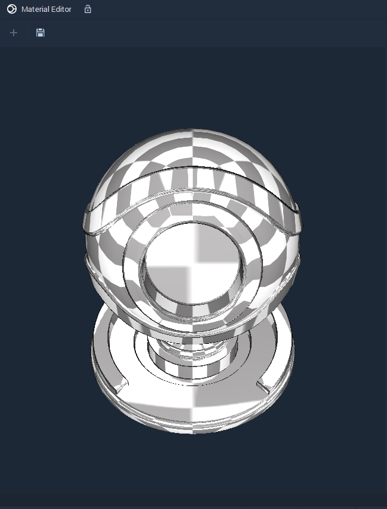
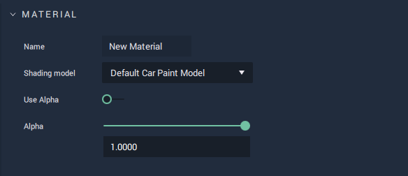
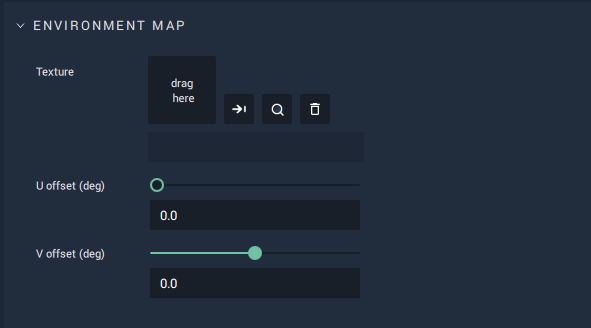
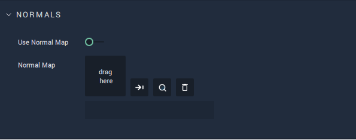
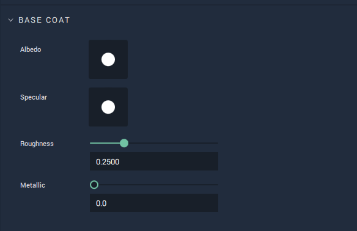
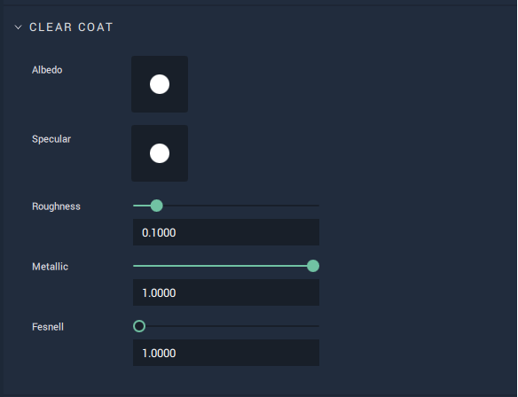
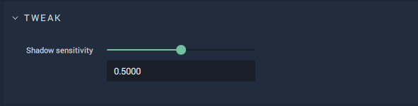

# Default Car Paint Model

This model represents a material that provides the visual qualities to a car's paint job. It allows for selecting and editing `Environment` and `Normal Mapping`, `Base Coat Color` and `Roughness`, `Clear Coat Color` and `Roughness`, as well as `Metallicness` and `Shadow` `Sensitivity`.

## Attributes

