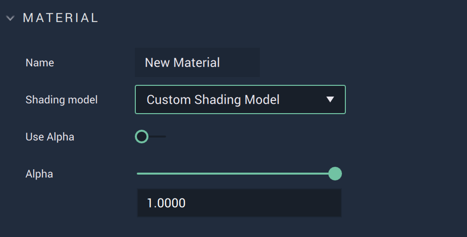
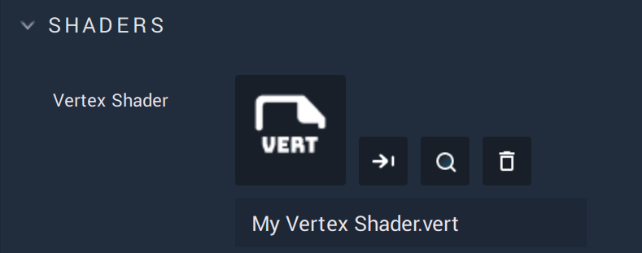
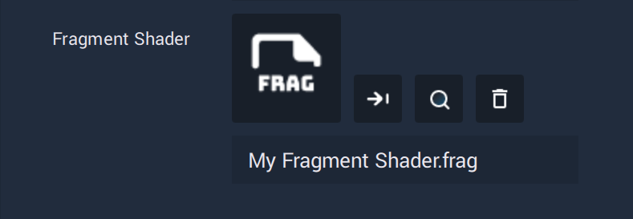

# Custom Shading Model

This model allows the user to create and customize their own **Shading Model**. The specifications are given via configuration files in the **Attributes**:

* [`Vertex Shader`](#vertex-shader)
* [`Fragment Shader`](#fragment-shader)

All these **Attributes** are described in greater detail below.


## Attributes

### Material



This **Attribute** provides the `Name` of the **Material** as well as the `Shading model` type. It also sets the `Alpha` value if it is toggled on.

The `Alpha` channel is additional to the RGB channels and adds a kind of transparency to the object by mixing the background and foreground colors. For example, if the `Alpha` value is set to 0.5, then this would result in a 50% mix of the object and its background, providing a semi-translucent quality.

### Shaders

There are two types of *shaders* that can be used for this model: [`Vertex Shader`](#vertex-shader) and [`Fragment Shader`](#fragment-shader).

Find below a detailed explanation of how to configure these *shaders*.

Across the configuration of both, two uniform variables can be used:

* `incTime`: **Float** that keeps the time from the start of the application.
* `incResolution`: **Vector2** containing the **Screen** resolution.


#### Vertex Shader

*Vertex Shaders* influence the rendering of the vertices of **Objects**.



The `Vertex Shader` is configured via an **Asset** with `.vert` extension. This **Asset** consists of code and can be edited in **Incari** with the [**Code Editor**](../code-editor.md).

Find below the code that is generated by default when creating a `.vert` **Asset** in the [**Asset Manager**](../asset-manager.md):


```
void mainPosition(in mat4 projectionMatrix, in mat4 modelMatrix, in vec3 viewPosition, in vec4 worldPosition)
{
    gl_Position = projectionMatrix * vec4(viewPosition, 1.0);
}
```


A *vertex shader* requires a main function called `mainPosition`, which is called once per vertex each time the **Scene** is rendered. This function receives as inputs:

* `projectionMatrix`: $$4x4$$ matrix that represents the perspective of the **Camera**.
* `modelMatrix`: $$4x4$$ matrix that represents where the vertex is.
* `viewPosition`: **Vector3** that contains the relative position of the vertex.
* `worldPosition`: **Vector4** that contains the absolute position of the vertex.

It is always necessary to calculate:

* `gl_Position`: **Vector4** that contains the position of the vertex in *clip space*.


#### Fragment Shader

*Fragment Shaders* influence the rendering of each *pixel* of **Objects**.



The `Fragment Shader` is configured via an **Asset** with `.frag` extension. This **Asset** consists of code and can be edited in **Incari** with the [**Code Editor**](../code-editor.md).

Find below the code that is generated by default when creating a `.frag` **Asset** in the [**Asset Manager**](../asset-manager.md):


```
‌void mainImage(out vec4 fragColor, in vec2 fragCoord)
{
 vec2 uv = (fragCoord * incResolution) / incResolution.xy;
 vec3 col = 0.5 + 0.5 * cos(incTime + uv.xyx + vec3(0, 2, 4));
 fragColor = vec4(col, 1.0);
}
```



A *fragment shader* requires a main function called `mainImage`, which is called once per pixel each time the **Scene** is rendered. The argument for this function is:

* `fragCoord`: **Vector2** that contains the 2-dimensional coordinates of the pixel.

And the output is:

* `fragColor`: **Vector4** that stores the color that the pixel will be set to.


The *uv coordinates* can be obtained by using:

`vec2 uv = (fragCoord * incResolution) / incResolution.xy;`

## External Links

*  [*Vertex Shader*](https://www.khronos.org/opengl/wiki/Vertex_Shader) on OpenGL Wiki.
*  [*Vertex Shader*](https://shader-tutorial.dev/basics/vertex-shader/) on GPU Shader Tutorial.
*  [*Fragment Shader*](https://www.khronos.org/opengl/wiki/Fragment_Shader) on OpenGL Wiki.
*  [*Fragment Shader*](https://shader-tutorial.dev/basics/fragment-shader/) on GPU Shader Tutorial.
*  [*Shaders*](https://learnopengl.com/Getting-started/Shaders) in Learn OpenGL.
*  