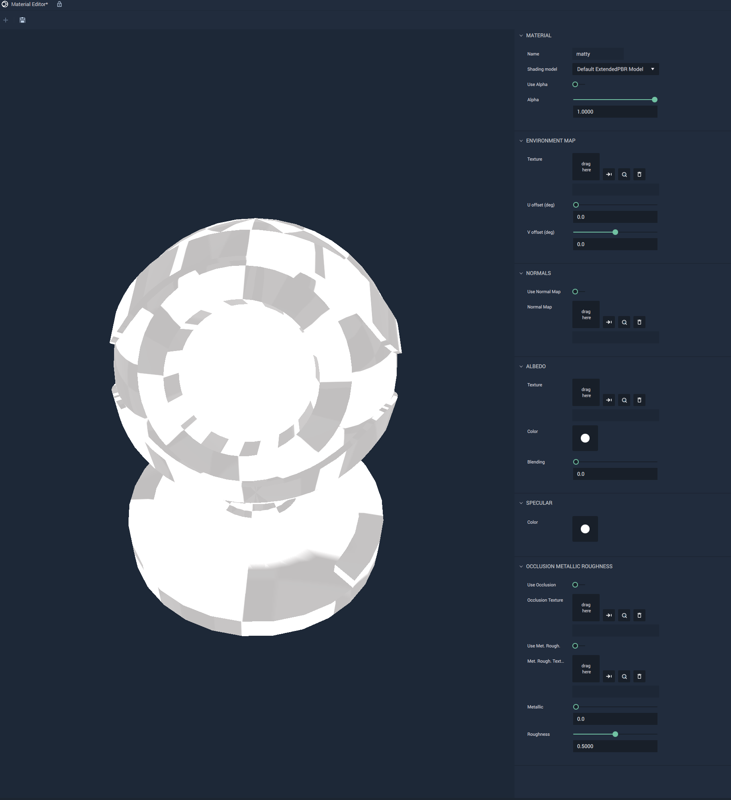

## Default ExtendendedPBR Model

This model offers more attributes than the **Default PBR Model**. It allows for selecting and editing `Environment` and `Normal Mapping`; `Albedo Texture`, `Color`, and `Blending`; `Specular Color`; as well as several aspects of `Occlusion Metallic Roughness`.

