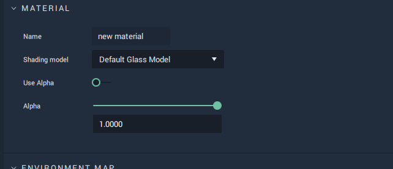
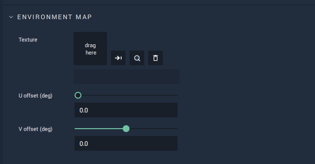
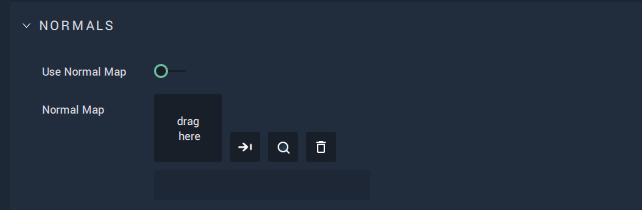
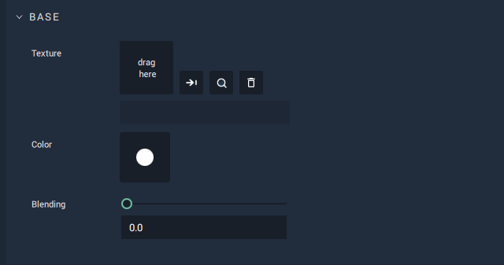
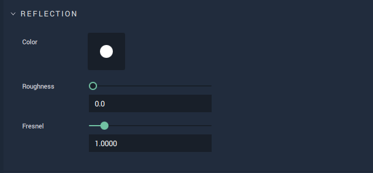
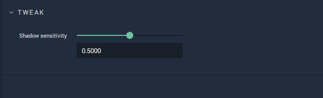

# Default Glass Model

This model represents materials with a glass-like quality. It allows for selecting and editing: 

* `Environment Mapping` 
* `Normal Mapping`
* `Base Texture`, `Color`, and `Blending`
* `Reflection Color`, `Roughness`, and `Fresnel`
* as well as tweaking `Shadow Sensitivity`. 

All these **Attributes** are described in greater detail below. 

## Attributes

### Material

This **Attribute** provides the `Name` of the **Material** as well as the `Shading model` type. It also sets the `Alpha` value if it is toggled on. 

The `Alpha` channel is additional to the RGB channels and adds a kind of transparency to the object by mixing the background a nd foreground colors. For example, if the `Alpha` value is set to 0.5, then this would result in a 50% mix of the object and its background, providing a somewhat see-through quality. 

### Environment Map

This enables the user to set a `Texture` which reflects the environment around an object, meaning that the object reflects the surface surrounding it (whether that be the background, another object, or both combined.). 

The two types of offset allow the beginning of the image on the provided `Texture` to be "delayed" in either the x or y direction. The resulting "cut off" piece wraps around to the start of the image. 

`U offset (deg)` moves the image from left to right (X-axis) and `V offset (deg)` moves the image from bottom to top (Y-axis).

### Normals

A normal is a line perpendicular to the surface of some object. Normal mapping distorts these normals and simulates a surface with light and shadow, even if the object surface itself is flat. This is only possible with a light source. The `Normal Map` sets this surface and `Use Normal Map` toggles it on and off. 

### Base

`Color` of `Base` sets the base diffuse color of the model. 

`Texture` takes any image to add any desired visual information. 

Using `Blending`, the `Texture` and `Color` are combined. If `Blending` is set to 1 then 100% of the `Texture` is displayed on the **Object**. If 0.5, then it displays a 50/50 ratio of `Texture` and `Color`. 

### Reflection

These **Attributes** simulate a reflective surface. `Roughness` determines how rough an object is, limiting or strengthening reflectivity. 

`Fresnel` encompasses the idea of the angle of incidence (the angle between the line of sight of the observer and the object being observed) influencing the perceived reflectivity of a surface. A wider angle creates less reflection and a smaller angle creates greater reflection. 

### Tweak

`Shadow sensitivity` determines the percentage of influence by the shadow. For example, a 1 would set an **Object's** surface to completely black. 0.5 would mean that even if the **Object** is in shadow, it would still have 50% of its color. 

