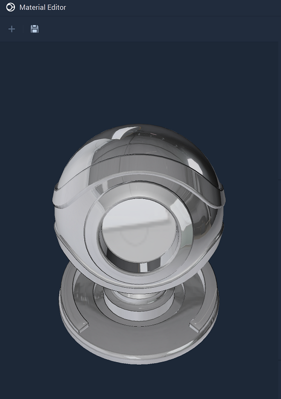
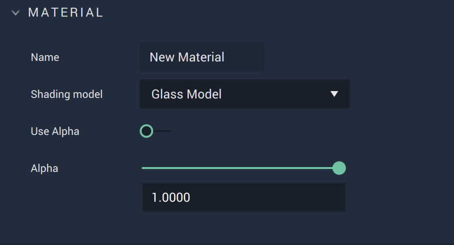
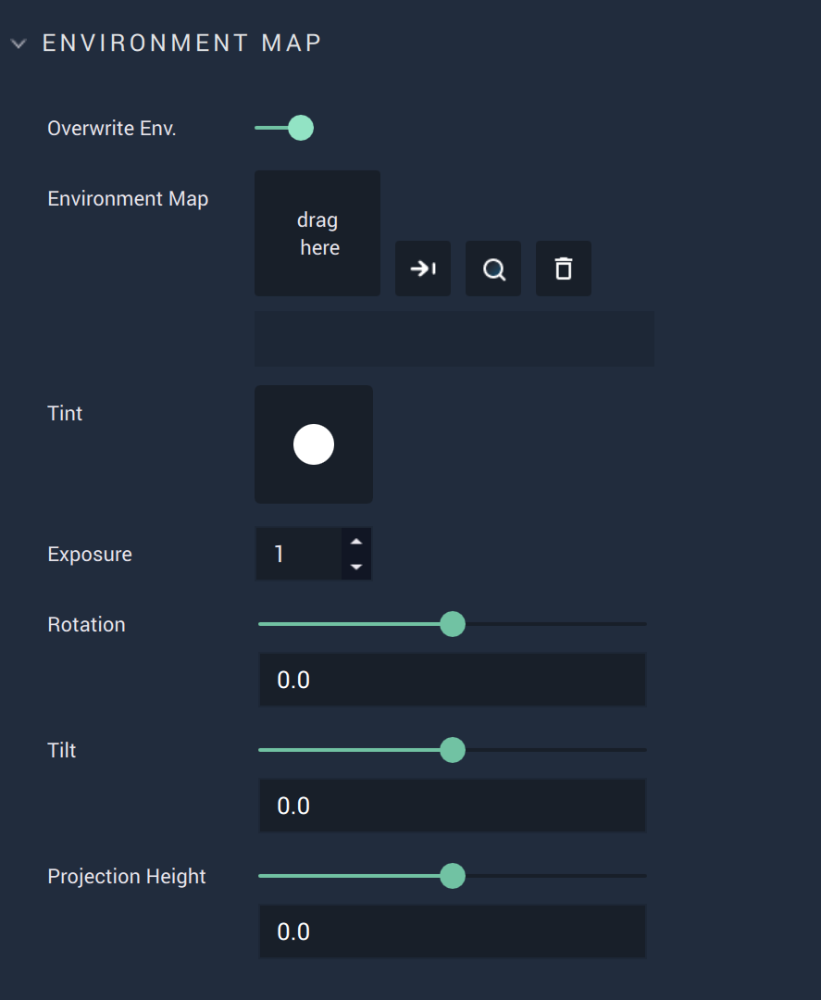
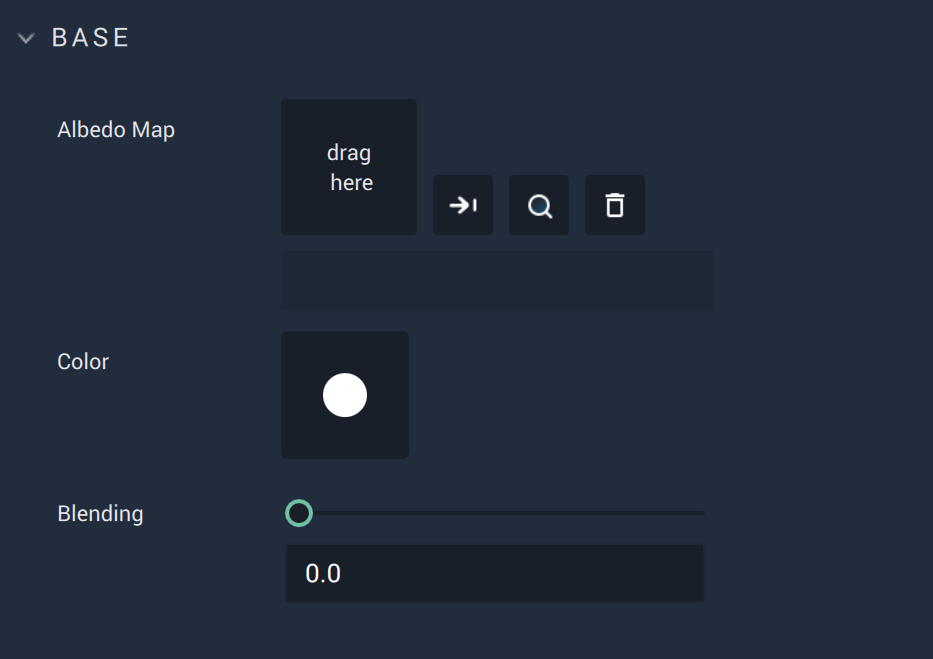
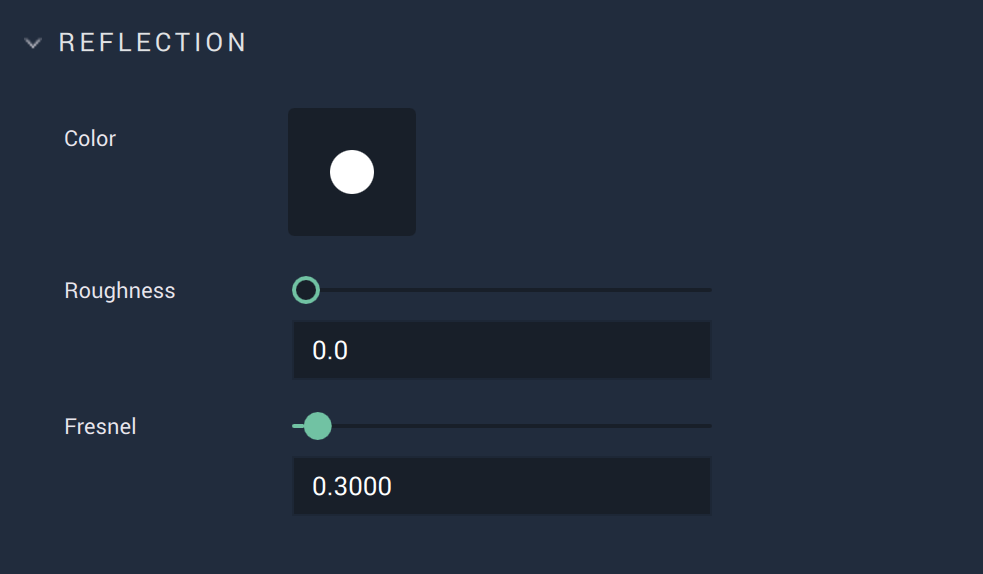
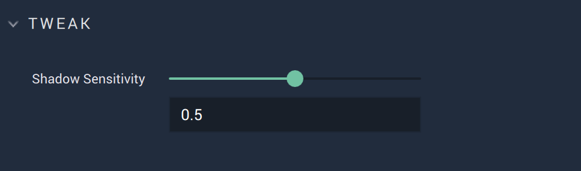

# Glass Model

This model represents materials with a glass-like quality. It allows for selecting and editing: 

* `Environment Mapping` 
* `Normal Mapping`
* `Base Texture`, `Color`, and `Blending`
* `Reflection Color`, `Roughness`, and `Fresnel`
* as well as adjusting `Shadow Sensitivity`. 

All these **Attributes** are described in greater detail below. 

## Attributes

### Material

This **Attribute** provides the `Name` of the **Material** as well as the `Shading model` type. It also sets the `Alpha` value if it is toggled on. 

The `Alpha` channel is additional to the RGB channels and adds a kind of transparency to the object by mixing the background and foreground colors. For example, if the `Alpha` value is set to 0.5, then this would result in a 50% mix of the object and its background, providing a somewhat see-through quality. 

### Environment Map

This enables the user to set a **Texture** which reflects the environment around an **Object**, meaning that the **Object** reflects the surface surrounding it (whether that be the background, another **Object**, or both combined.). 

Initially, there is only the **Attribute** `Overwrite Env.` which is toggled off by default. If it is toggled on, all of the other **Attributes** are revealed. 

`Environment Map` is the desired **Texture** to be used (a *equirectangular* or *cubemap* **Texture** of type *PNG*, *JPG*, *EXR*, or *HDR*). 

`Tint` provides the color of the tint. The **Texture’s** RGB channels (not alpha) are then multiplied by the chosen tint.

`Exposure` determines how bright the **Texture** should be with a value from 0 to infinity.  

`Rotation` sets the beginning of the image of the provided `Texture` to be "delayed" in the x or direction, moving it from left to right. The resulting "cut off" piece wraps around to the start of the image. Its range is from 0 degrees to 360 degrees. 

`Tilt` sets the beginning of the image of the provided `Texture` to be "delayed" in the y or direction, moving it from bottom to top. The resulting "cut off" piece wraps around to the start of the image. Its range is from -90 degrees to 90 degrees. 

`Projection Height` is where the ‘point of visualization’ starts. If set to 50%, this would be halfway from the bottom of the image and it would display upwards from there. To see a visual example of this, please refer to the video linked [here](https://www.youtube.com/watch?v=7axPpWTcFrw). 

### Normals

A normal is a line perpendicular to the surface of some object. *Normal mapping* distorts these normals and simulates a surface with light and shadow, even if the object surface itself is flat. This is only possible with a light source. The `Normal Map` sets this surface and `Use Normal Map` toggles it on and off. 

### Base

`Color` of `Base` sets the base diffuse color of the model. 

`Albedo Map` takes any image to add any desired visual information. 

Using `Blending`, the `Texture` and `Color` are combined. If `Blending` is set to 1 then 100% of the `Texture` is displayed on the **Object**. If 0.5, then it displays a 50/50 ratio of `Texture` and `Color`. 

### Reflection

These **Attributes** simulate a reflective surface. `Roughness` determines how rough an object is, limiting or strengthening reflectivity. 

`Fresnel` encompasses the idea of the angle of incidence (the angle between the line of sight of the observer and the object being observed) influencing the perceived reflectivity of a surface. A wider angle creates less reflection and a smaller angle creates greater reflection. 

### Tweak

`Shadow Sensitivity` determines the percentage of influence by the shadow. For example, a 1 would set an **Object's** surface to completely black. 0.5 would mean that even if the **Object** is in shadow, it would still have 50% of its color. 

### Property Names

It is possible to hover over each **Attribute** and access their property names to be used in code or **Nodes**. A complete list of these names is as follows:

* `Use Alpha`: use_alpha
* `Alpha`: alpha
* `Overwrite Env.`: env_overwrite
* `Environment Map`: environment_map
* `Tint`: env_tint
* `Exposure`: env_exposure
* `Rotation`: env_rotate
* `Tilt`: env_tilt
* `Projection Height`: env_projection_height
* `Use Normal Map`: use_normal_map
* `Normal Map`: normal_map
* `Albedo Map`: albedo_map
* `Color` (Base): albedo_color
* `Blending`: albedo_map_blending
* `Color` (Reflection): reflection_color
* `Roughness`: reflection_roughness
* `Fresnel`: reflection_fresnel
* `Shadow Sensitivity`: shadow_sensitivity