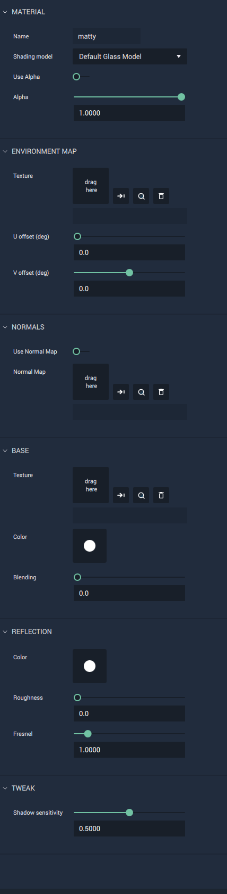

# Default Glass Model

This model represents materials with a glass-like quality. It allows for selecting and editing `Environment` and `Normal Mapping`; `Base Texture`, `Color`, and `Blending`; `Reflection Color`, `Roughness`, and `Fresnel`; as well as tweaking `Shadow Sensitivity`. 

