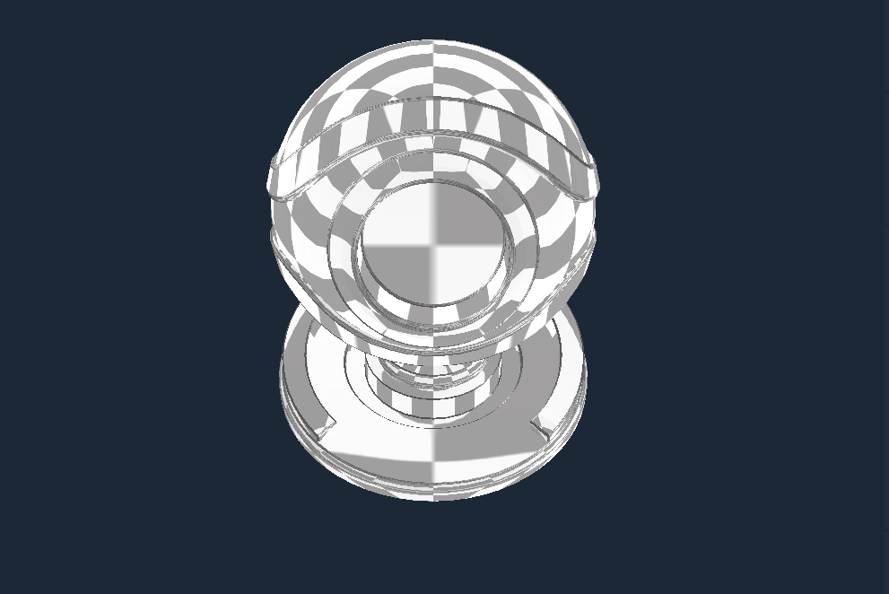
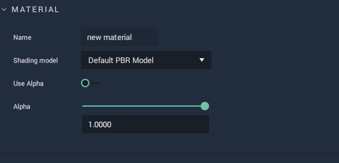
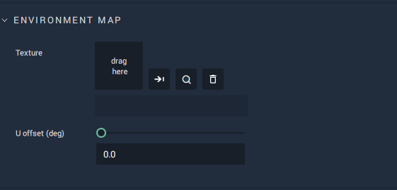
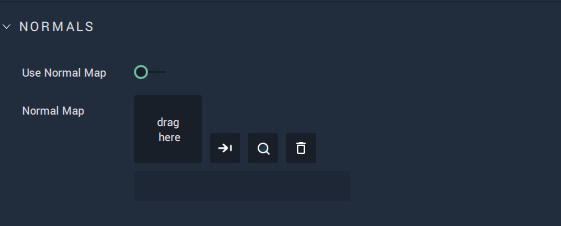
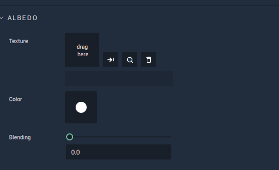
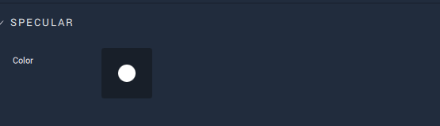
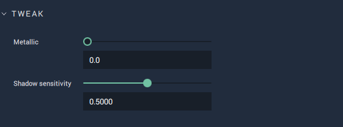
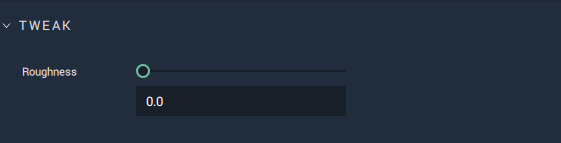

## Default PBR Model

This model represents a material that provides a more realistic quality to objects, using physically based rendering. It allows for selecting and editing `Environment` and `Normal Mapping`; `Albedo Texture`, `Color`, and `Blending`; `Specular Color`; as well as tweaking `Metalicness`, `Shadow Senstivity`, and `Roughness`. 

This **Attribute** provides the `Name` of the **Material** as well as the `Shading model` type. It also sets the `Alpha` value if it is toggled on. The `Alpha` channel is additional to the RGB channels and adds a kind of transparency to the object by mixing the background a nd foreground colors. For example, if the `Alpha` value is set to 0.5, then this would result in a 50% mix of the object and its background, providing a somewhat see-through quality. 

This enables the user to set a `Texture` which reflects the environment around an object, meaning that the object reflects the surface surrounding it (whether that be the background, another object, or both combined.). 

`U offset (deg)` sets the beginning of the image of the provided `Texture` to be "delayed" in the x or direction, moving it from left to right. The resulting "cut off" piece wraps around to the start of the image.

A normal is a line perpendicular to the surface of some object. Normal mapping distorts these normals and simulates a surface with light and shadow, even if the object surface itself is flat. This is only possible with a light source. The `Normal Map` sets this surface and `Use Normal Map` toggles it on and off. 

This enables the user to set a `Texture` which reflects the environment around an object, meaning that the object reflects the surface surrounding it (whether that be the background, another object, or both combined.). 

`V offset (deg)` sets the beginning of the image of the provided `Texture` to be "delayed" in the y or direction, moving it from bottom to top. The resulting "cut off" piece wraps around to the start of the image.

`Color` of `Albedo` sets the base diffuse color of the model. `Texture` takes any image to add any desired visual information. Using `Blending`, the `Texture` and `Color` are combined. If `Blending` is set to 1 then 100% of the `Texture` is displayed on the **Object**. If 0.5, then it displays a 50/50 ratio of `Texture` and `Color`. 

`Specular` is the point of reflection of the light source. `Color` sets the color of it. 

`Metallic` determines how much the surface simulates a metal-like quality, appearing shinier and harder or rougher and duller. `Shadow sensitivity` determines the percentage of influence by the shadow. For example, a 1 would set an **Object's** surface to completely black. 0.5 would mean that even if the **Object** is in shadow, it would still have 50% of its color. 

`Roughness` determines how rough an object is, limiting or strengthening reflectivity. 

