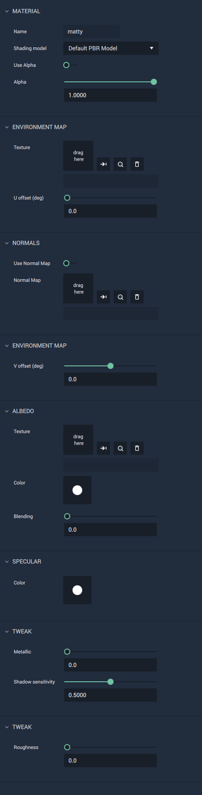

## Default PBR Model

This model represents a material that provides a more realistic quality to objects, using physically based rendering. It allows for selecting and editing `Environment` and `Normal Mapping`; `Albedo Texture`, `Color`, and `Blending`; `Specular Color`; as well as tweaking `Metalicness`, `Shadow Senstivity`, and `Roughness`. 

