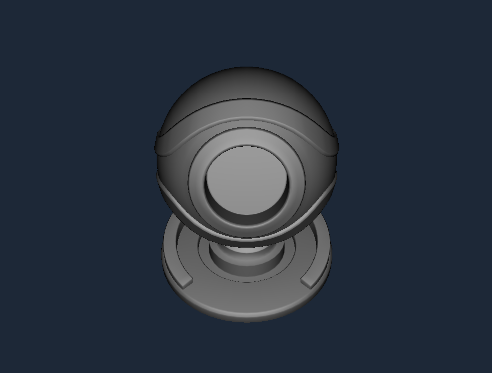
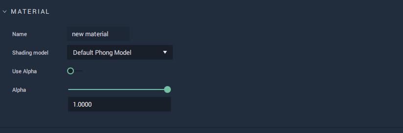
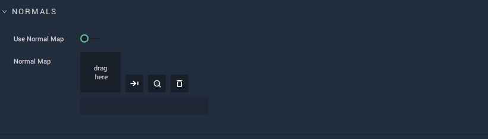
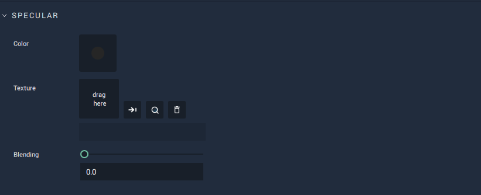
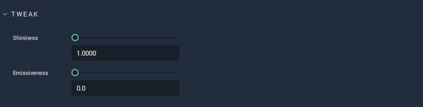

# Default Phong Model 

This model represents the standard Phong model, characterized by a shiny surface marked by pinpointed highlights. It allows for selecting and editing: 

* `Diffuse Color`, `Texture`, and `Blending`  
* `Specular Color`, `Texture`, and `Blending` 
* `Normal Mapping` 
* as well as tweaking `Shininess` and `Emissiveness`.

All these **Attributes** are described in greater detail below.

## Attributes

### Material

This **Attribute** provides the `Name` of the **Material** as well as the `Shading model` type. It also sets the `Alpha` value if it is toggled on. 

The `Alpha` channel is additional to the RGB channels and adds a kind of transparency to the object by mixing the background a nd foreground colors. For example, if the `Alpha` value is set to 0.5, then this would result in a 50% mix of the object and its background, providing a somewhat see-through quality. 

### Diffuse

`Color` of `Diffuse` sets the base diffuse color of the model. 

`Texture` takes any image to add any desired visual information. 

Using `Blending`, the `Texture` and `Color` are combined. If `Blending` is set to 1 then 100% of the `Texture` is displayed on the **Object**. If 0.5, then it displays a 50/50 ratio of `Texture` and `Color`. 

### Normals

A normal is a line perpendicular to the surface of some object. Normal mapping distorts these normals and simulates a surface with light and shadow, even if the object surface itself is flat. This is only possible with a light source. The `Normal Map` sets this surface and `Use Normal Map` toggles it on and off. 

### Specular

`Specular` is the point of reflection of the light source. 

`Color` sets the color of it. 

`Texture` takes any image to add any desired visual information.

 Using `Blending`, the `Texture` and `Color` are combined. If `Blending` is set to 1 then 100% of the `Texture` is displayed on the **Object**. If 0.5, then it displays a 50/50 ratio of `Texture` and `Color`. 

### Tweak

`Shininess` determines how 'shiny' a **Material** will be. This means that the higher the value, the 'harder' the surface looks at the smaller the reflection of light. 

`Emissiveness` influences the  color of items around an **Object**, simulating a light source. For example, the lights of a car combined with higher emissiveness will show a stronger glow on the surrounding car parts, with th car light's color interacting with its surroundings as well. 