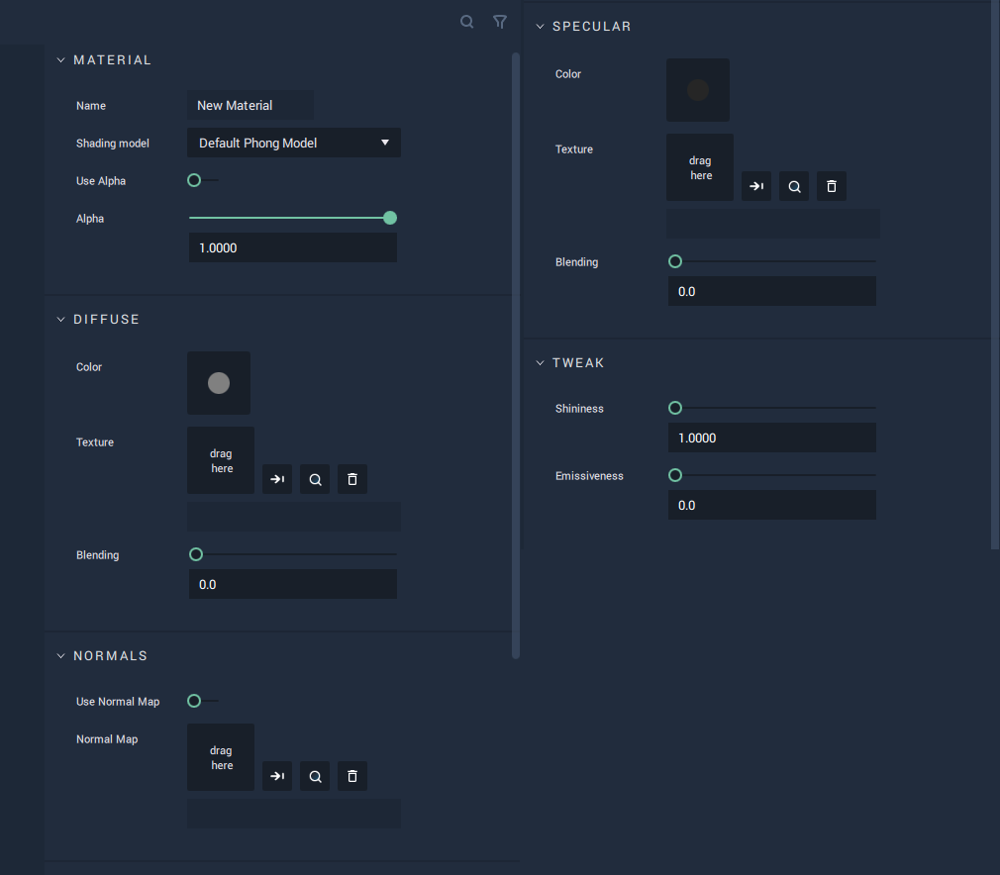

# Default Phong Model 

This model represents the standard Phong model, characterized by a shiny surface marked by pinpointed highlights. It allows for selecting and editing `Diffuse` or `Specular Color`, `Texture`, and `Blending`; `Normal Mapping`; as well as tweaking `Shininess` and `Emissiveness`.

