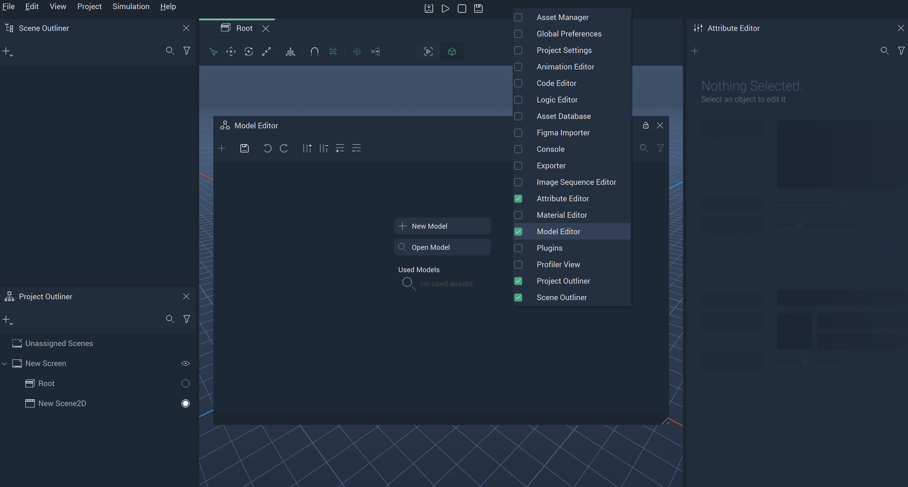
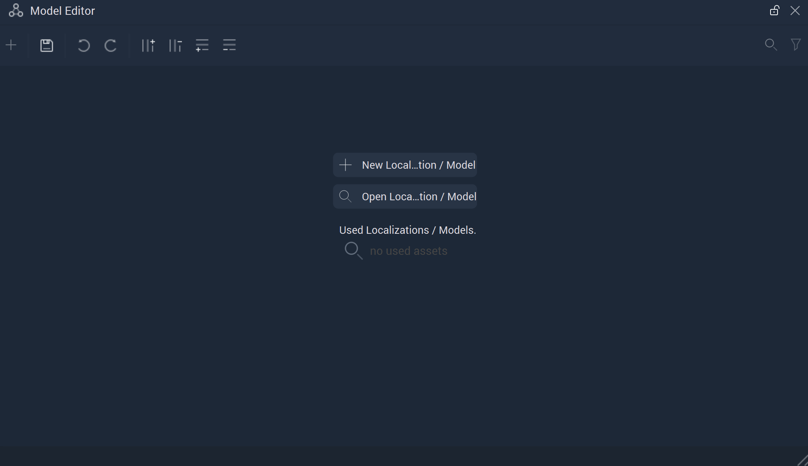
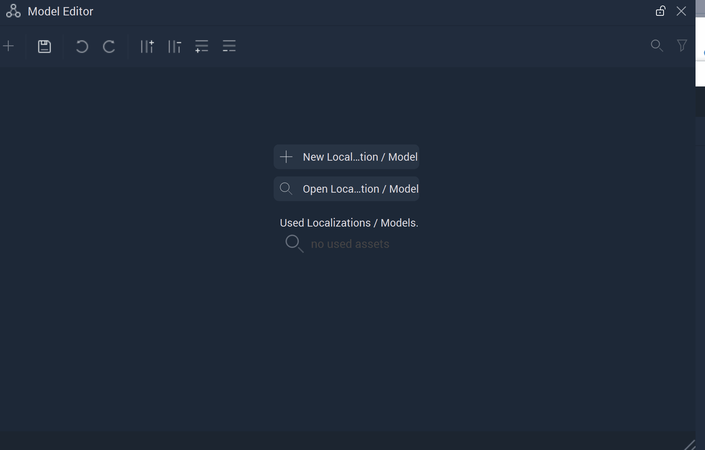
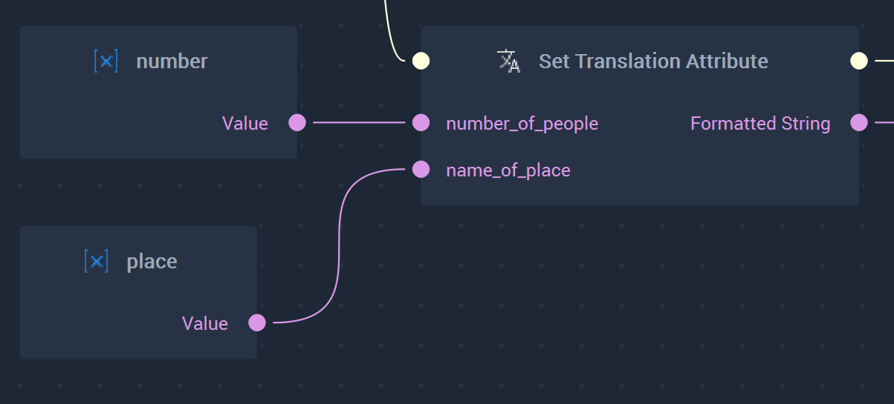
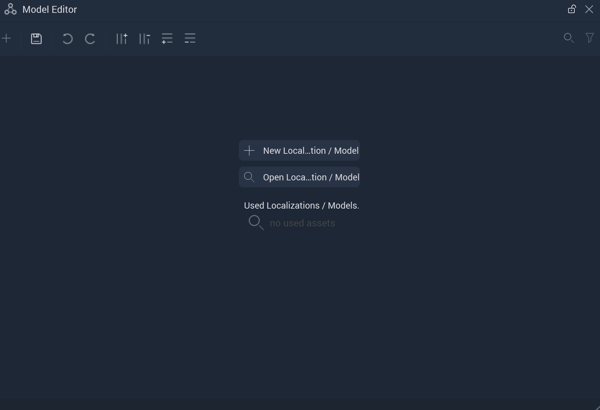

# Model Editor

The **Model Editor** allows the user to create **Localizations** and **Models**. 

To open the **Model Editor**, double-click on a **Localization** or **Model** file in the **Asset Manager** or right-click on the Menu bar in **Incari** and click on **Model Editor** from the drop-down list. This can be seen in the illustration below:

When opened for the first time, the **Model Editor** appears like this:

Note: These sections will not be opened if a **Model**  or **Localization** file has already been opened in the **Model Editor**.

`New Localization/Model` lets the user create a new file of the desired type.

`Open Localization/Model` allows the user to open an already created **Localization** or **Model**. 

The `Used Localizations/Models` section contains **Localizations** and **Models** that have been previously applied. These **Localizations** or **Models** can be edited by clicking on them.

## Localizations

A **Localization** consists of **Keys**, **Languages**, and **Translations**. The keys \(rows\) act as a sort of base token which can be a specific word or descriptor. Languages encompass *columns* and their respective cells are populated with the translation for what the key describes. The **Localization** files have `.local` as their filename extension. These are added in the [**Project Settings**](project-settings/localization.md) and only one `.local` file can be added at a time. 

It is also possible to add phrases/sentences as a translation. Within these phrases, the user can plant `Translation Attributes` by using curly braces around the important words like so: {{word}}. These make the sentences dynamic and editable within the **Project's Logic**. 

For example, if the phrase has two `Translation Attributes` like in the image below:

The terms {{number_of_people}} and {{name_of_place}} can be filled in with **Strings** using the [**Set Translation Attribute Node**](../toolbox/localization/settranslationattribute.md).

Which, when attached to a **Console Node**, leads to the output in the **Console**:

## Models 

A **Model** sets up data in **Fields** \(columns\) and **Records** \(rows\) that will be used later with a **List Object**. The **Model** files have `.incmod` as their filename extension.

To create a new **Model**, simply select `Create Model`, name it, and populate the rows and columns with the appropriate information. 

## See Also

* [**Incari Model File**](https://docs.incari.com/incari-studio/v/2021.3-unreleased/objects-and-types/scene-objects/list-widget#incari-model-file)
* [**List**](../toolbox/events/list/)

