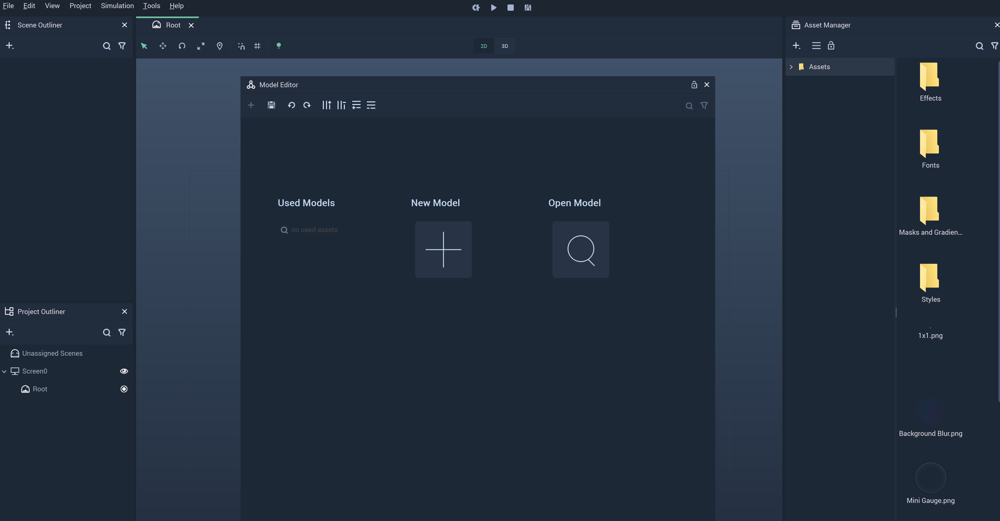
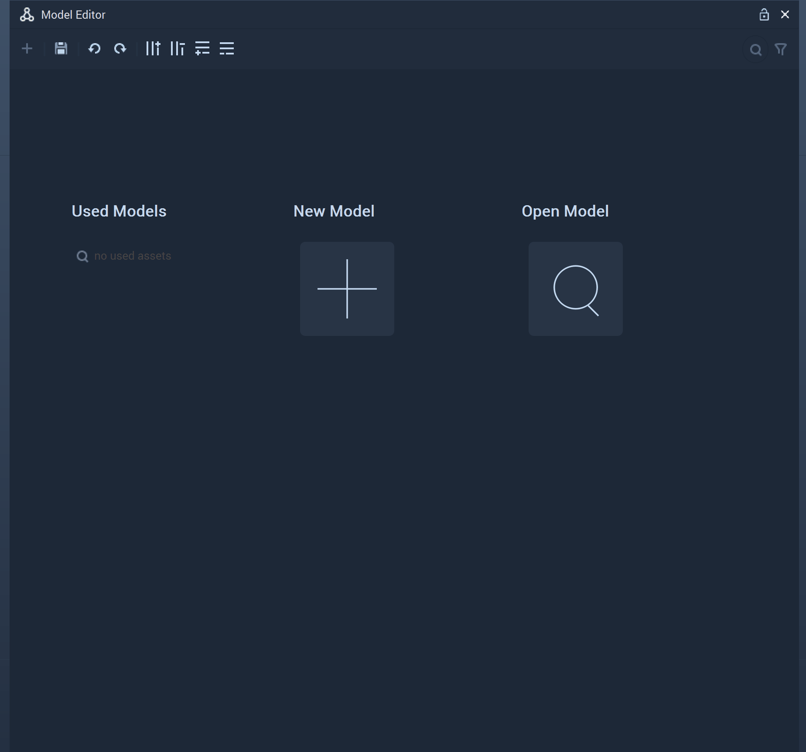
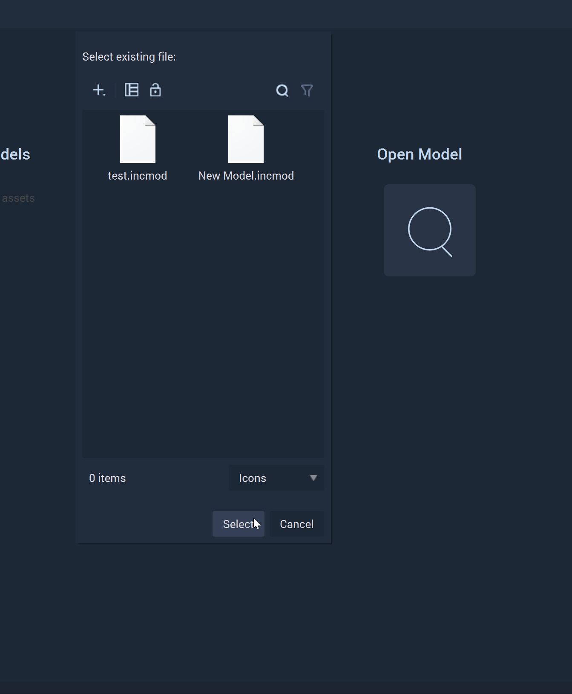

# Model Editor

The **Model Editor** allows the user to set up data in **Fields** (columns) and **Records** (rows) to be used later in a **List Object**. The **Model** files have _.incmod_ as their filename extension.

To open the **Model Editor**, _double-click_ on a **Model** file in the **Asset Manager** or _right-click_ on the _Menu bar_ in *Incari* and _click_ on **Model Editor** from the drop-down list. This can be seen in the illustration below:

The sections defined in the **Model Editor** are discussed below:

Note: These sections will not be opened if a **Model** file has already been opened in the **Model Editor**.

The `Used Models` section has **Models** that have been previously applied. These **Models** can be edited by _clicking_ on them.

`New Model`, as its name suggests, allows us to create new **Models**. The illustration below depicts its behavior when _clicked_.

`Open Model` opens a window that allows us to select an existing **Model** file. An example of the window is shown below:

## See Also

* [**List**](../toolbox/events/list/README.md)